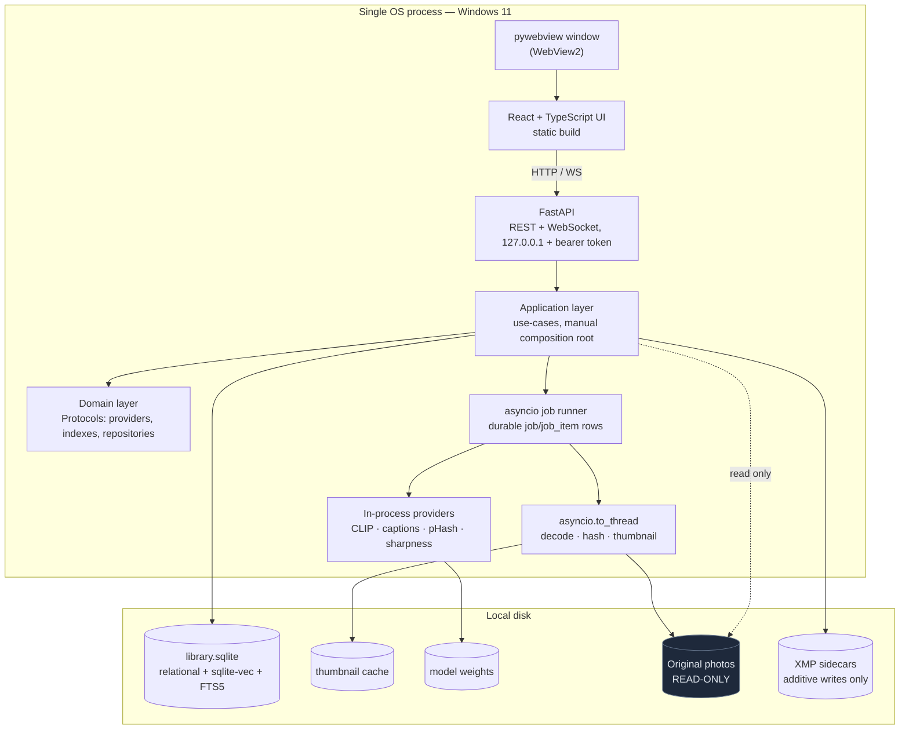

# Architecture Audit & MVP Revision

Version: 1.0
Date: 2026-07-29
Author role: Chief Software Architect
Reviewed documents: `Local_AI_Photo_Intelligence_PRD_v2.md`, `Local_AI_Photo_Intelligence_SDD_v1.md`, `Local_AI_Photo_Intelligence_Implementation_Plan_v1.md`
Companion outputs produced by this audit: `Architecture_Decision_Records_v1.md`, `AI_Development_Guide_v1.md`, and applied revisions to the three documents above (PRD → v2.1, SDD → v1.1, Plan → v1.1).

---

## 0. Verdict in one page

The approved architecture is **directionally right and structurally sound**. The domain model (photos stay on disk; the database is a derived, rebuildable AI index), the append-only AI-result versioning, the `Protocol`-based provider abstraction, the read-only-originals safety stance, and the offline-first posture are all correct and should not change. I am not recommending a redesign.

What the design *does* have is a **scope and topology problem for the stated first milestone**. The SDD was written to answer "what architecture serves this product for five years," and it answers that well. The Implementation Plan then treated that five-year architecture as v1 scope. The result is an MVP carrying machinery whose benefit only arrives later:

| Over-built for MVP | Cost carried today | When it's actually needed |
|---|---|---|
| Three-language / three-process topology (Rust shell + Python core + TS UI) | An entire toolchain, a process-supervision epic, a port/token handshake, cross-runtime debugging | When a polished small installer matters (v1.1+) |
| gRPC + protobuf plugin transport | `.proto` codegen, subprocess host, health checks, idle recycling | When *third-party* plugins exist (v2) |
| Three storage engines (SQLite + LanceDB + FTS5) | Two backup stories, two rebuild paths, a vendor name baked into the schema | Above ~1M vectors (v2) |
| GPU slot scheduler, process pools, write-queue actor | Concurrency machinery ahead of measured contention | When profiling shows contention (v2) |
| Six AI capabilities, five connectors, full file-operation + undo engine | Roughly 40 tasks and the project's single highest-risk epic | Progressively, v1.1 → v2 |

Removing that machinery from v1 cuts the plan from **101 tasks to 61** and — more importantly — removes Rust, gRPC, protobuf, LanceDB, `dependency-injector`, `ProcessPoolExecutor`, and destructive file operations from the critical path to a working Windows application, while leaving every one of them reachable later behind interfaces that already exist.

The one thing I am *adding* is genuinely missing architecture, not more layers: Windows path/data-directory conventions, an EXIF timezone policy, a failure-and-retry model, and first-run behaviour when models are not yet downloaded. These are small, and each one will otherwise surface as a rewrite during Phase 2–4.

**Single most valuable change in this audit:** v1 does not move, rename, or delete files at all. The PRD only ever said the app must never do so *without confirmation*; making v1 strictly additive (virtual collections + copy-to-folder + XMP sidecars) removes the highest-risk epic in the project from the first release at almost no loss of user value.

---

## 1. Architecture Audit

### 1.1 Strengths (keep, no change required)

These decisions are correct and this audit explicitly recommends **no change**:

| Strength | Why it holds |
|---|---|
| **Database is a derived index, not a system of record** | This single framing legitimately weakens every durability requirement in the system. Backup, corruption recovery, and migration risk all collapse to "worst case, re-scan." It is the best decision in the SDD and everything else should keep leaning on it. |
| **Original files are read-only except on explicit user action** | Correct, and the audit strengthens it further (§2, ADR-0007). |
| **Append-only AI results with `is_current`** | Directly satisfies the PRD's "multiple providers and versions coexist" without needing a schema change per model. Cheap now, valuable immediately when the first model upgrade lands. |
| **`Protocol`-based capability interfaces** | This is the abstraction that earns its keep. It is what makes removing gRPC from v1 *safe* — the seam survives even when the transport behind it is deleted. |
| **XMP is export/interop only, never the primary store** | Avoids an entire class of sync-of-truth bugs. |
| **Python for the core** | Ratified without reservation (ADR-0001). For an AI-first app whose value is model integration velocity, no alternative is close. |
| **SQLite + SQLAlchemy + Alembic** | Right for a single-user desktop app. No server process, file-copy backups, and the schema is small enough that Alembic is comfortable. |
| **FastAPI for the core API** | Keep. It costs nothing over a plainer framework and it is exactly what makes the future web/remote path free. |
| **Offline-first, network-optional** | Non-negotiable and well specified. |
| **`file_operation_log` design (staged → confirmed → executed → undoable)** | The design is right. It is being deferred, not weakened — when file operations arrive in v2, build exactly this. |

### 1.2 Weaknesses

| # | Weakness | Severity | Where |
|---|---|---|---|
| W1 | **Three languages and three processes before a single feature exists.** The Tauri shell contributes process supervision, a stdin port/token handshake, and a Rust build to a milestone whose entire content is "a window opens." | High | SDD §2.2, §3.2; Plan TASK-007 |
| W2 | **gRPC/protobuf plugin transport is unused in v1.** Every v1 provider is first-party and trusted, so the `process` host, health checks, and idle recycling are dead code paths guarded by a rule (SDD §8.3's "third-party plugins always run out-of-process") that no v1 plugin triggers. | High | SDD §8.3–8.5; Plan TASK-038/039 |
| W3 | **Three storage engines.** SQLite, LanceDB, and FTS5 mean three consistency stories, two "rebuild the index" paths, and a schema column literally named `lancedb_key` — a vendor name inside the domain schema, contradicting the pluggable-index principle the SDD argues for elsewhere. | High | SDD §3.5, §5.2 |
| W4 | **Configurable-implementation smell in three places.** SDD offers LanceDB *or* sqlite-vec ("selectable in Settings"), FTS5 *or* Tantivy, ExifTool *or* pyexiv2 fast-path with fallback. Each doubles the test matrix for a benefit no v1 user has asked for. | Medium | SDD §3.5, §3.6, §3.8 |
| W5 | **An unresolved decision left inside an approved design.** SDD §3.12 says the DI-framework choice "is a close call and manual composition is an acceptable equivalent." An approved SDD must not leave a coin-flip for the implementer; two agents will choose differently. | Medium | SDD §3.12 |
| W6 | **The Implementation Plan contradicts its own stated principles.** It declares "prefer vertical slices over horizontal layers" and "each milestone should produce a usable application," then schedules all UI work in Phase 6 — making milestones M2, M3, M4 and M5 observable only by querying the database. Four of eight milestones are not usable applications. | High | Plan §1, §6 |
| W7 | **Concurrency machinery precedes measured contention.** A write-queue actor with future-resolution, a `ProcessPoolExecutor`, and a GPU slot scheduler are all specified before a single photo has been processed. On Windows specifically, `ProcessPoolExecutor` uses spawn semantics (module re-import, picklable arguments, no shared DB connections) and is materially harder to debug than threads — while Pillow, rawpy, and OpenCV all release the GIL, so threads capture most of the benefit. | Medium–High | SDD §3.1, §5.5, §6.3 |
| W8 | **PRD features silently absent from SDD/Plan.** Colour analysis, scene classification, landmark recognition, and the entire "Optional Photographer AI Assistant" (composition, lighting, long-exposure detection, improvement suggestions, best-shot selection) appear in the PRD but have no corresponding task. They were dropped by omission rather than by decision. | Medium | PRD vs Plan |
| W9 | **A soft dependency in a plan that forbids them.** TASK-050 lists "EPIC-14 (soft — can stub until it lands)" while Plan §11.3 instructs agents to treat dependencies as a hard gate and never stub around them. | Low | Plan TASK-050 |
| W10 | **Terminology drift.** `file` / `photo` / `PhotoID` / `FileRef` are used interchangeably for the same entity; "AI Pipeline" (PRD) vs "AI Analysis Pipeline" (SDD §4.4) vs "Analysis Pipeline" (SDD §6.2). Minor for humans, a real source of invented duplicate classes for AI agents. | Medium (for agents) | All documents |
| W11 | **Six AI capabilities in v1, two of which need their own model downloads for marginal added value.** Tagging in particular ships a second model when CLIP — already required for semantic search — can produce tags zero-shot against a label vocabulary. | Medium | Plan EPIC-12 |
| W12 | **Phase 9 benchmarks at 1M–5M photos before a single real library has been indexed.** Optimising against synthetic data, ahead of any real-world profile, is the textbook definition of premature. | Medium | Plan EPIC-23 |

### 1.3 Risks

| # | Risk | Likelihood | Impact | Mitigation adopted by this audit |
|---|---|---|---|---|
| R1 | **Windows long-path failure (>260 chars) mid-scan.** Real photo libraries with deep folder nesting and long camera-generated names hit `MAX_PATH`. Python handles this only with `\\?\` prefixing or the OS long-path opt-in. Not addressed anywhere in the SDD. | High | High — scanner crashes or silently skips files | New SDD §16.1; ADR-0010; scanner task acceptance criteria updated |
| R2 | **EXIF timestamps have no timezone.** `DateTimeOriginal` is naive local time at capture. Storing it as UTC or as naive-with-implied-local both produce wrong date-range search results for travel photos — precisely the library this product targets. | High | Medium–High — silently wrong search results, expensive to fix after data is stored | New SDD §16.2; ADR-0011; store naive local + optional offset |
| R3 | **First-run is unusable while models download.** Multi-GB downloads before the app does anything reads as a broken install. | High | Medium | New SDD §16.4: app is fully functional for scan/browse/metadata/duplicates with zero models present; AI capabilities activate as models arrive |
| R4 | **Per-photo AI failures have no user-visible path.** `job_item.error_message` is stored, but nothing surfaces or retries it. At 100k photos a 0.5% failure rate is 500 invisible gaps. | High | Medium | New SDD §16.3: failure taxonomy, retry policy, and a "problems" surface |
| R5 | **HEIC/RAW codec redistribution.** libheif/HEVC patent licensing and per-vendor RAW support are real distribution constraints for a shipped Windows installer. | Medium | Medium | ADR-0012: HEIC via optional component; document the constraint before packaging, not during |
| R6 | **Caption quality on CPU-only machines is slow enough to look broken.** A VLM on CPU can take seconds per photo; 100k photos is days. | Medium | Medium | Captioning is opt-in and per-photo-on-demand-capable in v1; embeddings (fast) carry the headline feature |
| R7 | **Deferred file operations get re-implemented ad hoc under pressure.** The staged-confirm-undo design exists; a v2 implementer under time pressure may shortcut it. | Medium | **Very High** — irreversible user data loss | SDD retains the full design as normative for v2; ADR-0007 records the constraint as permanent, not a v1 convenience |
| R8 | **pywebview is a smaller project than Tauri or Electron.** Adopting it accepts a smaller maintainer base for the window shell. | Low–Medium | Low | The shell is ~30 lines and swappable; the UI is already plain web + HTTP, so moving to Tauri/Electron later is a packaging change, not a rewrite (ADR-0002) |

### 1.4 Missing components

| # | Missing | Why it matters | Resolution |
|---|---|---|---|
| M1 | **The AI Development Guide does not exist.** The review brief assumes it is in the repository; the repository contains only three documents. | The plan explicitly targets AI-agent execution, and there is no document stating conventions, working agreement, or the "don't invent architecture" rules. | Created: `AI_Development_Guide_v1.md` |
| M2 | **No ADRs and no ADR location.** Decisions live inside a 90KB SDD, so reversing one (as this audit does five times) has nowhere to be recorded. | Traceability of *why* a decision changed is the main defence against re-litigating it every few months. | Created: `Architecture_Decision_Records_v1.md` |
| M3 | **Windows path and data-directory conventions.** Long paths, UNC/network paths, case-insensitivity, reparse points/symlinks, `%LOCALAPPDATA%` vs portable mode. | The scanner and cache touch all of these on day one. | New SDD §16.1 |
| M4 | **Timezone/date policy.** | Affects search correctness and the schema. | New SDD §16.2 |
| M5 | **Failure taxonomy, retry policy, and error surfacing.** | Required for any long-running unattended pipeline. | New SDD §16.3 |
| M6 | **Degraded-mode / first-run behaviour without models.** | Determines whether the first five minutes feel broken. | New SDD §16.4 |
| M7 | **Diagnostics bundle ("export logs for a bug report").** | Offline desktop software with no telemetry has no other way to receive a useful bug report. | New SDD §16.5 |
| M8 | **Cancellation semantics for in-flight inference.** SDD calls the granularity "acceptable" but never states the policy; with in-process providers a long call cannot be interrupted at all. | An agent will otherwise invent a thread-kill mechanism. | New SDD §16.6 |
| M9 | **Thumbnail delivery contract to the UI.** With a web UI this becomes an HTTP endpoint with caching semantics — previously unspecified because the SDD assumed direct file access. | Core screen of the app depends on it. | New SDD §16.7 |

---

## 2. MVP Scope Review

Scope decision rule applied throughout: **a feature stays in v1 only if removing it would make the application fail to demonstrate "local AI photo intelligence" to a user on a Windows PC.** Everything else moves out — not deleted from the roadmap, deferred with a named release.

### 2.1 Keep in v1

| Area | In v1 | Rationale |
|---|---|---|
| Library | Recursive scan, format allowlist, content hashing, change/move detection, missing-file reconciliation, scan progress + cancel | Without this there is no library |
| Metadata | ExifTool single persistent process, canonical normalisation, existing-XMP read | Metadata search and date browsing depend on it |
| Thumbnails | Raster + RAW + HEIC decode, on-disk cache with size cap, HTTP delivery endpoint | The primary screen |
| AI | **CLIP embeddings** (image+text), **captions**, **tags derived zero-shot from CLIP**, **pHash duplicate grouping**, **Laplacian sharpness score** | Delivers semantic search, natural-language search, similar-image, duplicate review, and "blurry" filtering with **one** model download plus two pure-compute metrics |
| Pipeline | Provider `Protocol`s, in-process provider registry, model cache + acquisition, resumable batch jobs, single global inference semaphore | The AI spine |
| Search | Metadata filters, FTS5 keyword, semantic (CLIP text), similar-image, RRF hybrid fusion, incremental indexing | The headline capability |
| Curation | Virtual collections, smart collections (saved query), built-in filters (screenshots / blurry / duplicates / similar), recommendation review UI, duplicate review UI | All pure-database; high value, near-zero risk |
| Export | XMP sidecar write, **copy/export selected to a folder** | Interop; both strictly additive to the filesystem |
| UI | App shell, virtualised grid, detail view, search UI, settings, first-run wizard, job progress, problems/retry surface | Pulled forward so every milestone is visible in-app |
| Platform | Windows-only packaging (PyInstaller + Inno Setup), `%LOCALAPPDATA%` data layout, long-path handling | The stated milestone |

### 2.2 Postpone

| Deferred to | Items |
|---|---|
| **v1.1** (fast follow, low risk) | Immich connector; OCR provider; scene classification; Tauri or Electron shell swap for a smaller signed installer; macOS/Linux packaging; directory watcher (v1 uses on-demand rescan); scheduled backup rotation |
| **v2** (needs the deferred machinery) | **File operations: move / rename / delete / archive, with staged confirmation and undo** (design retained verbatim, see ADR-0007); out-of-process plugin host + gRPC/protobuf + third-party plugin permissions; PhotoPrism / digiKam / Lightroom connectors; inbound sync + conflict resolution; aesthetic-scoring model; landmark recognition; colour analysis; Photographer AI Assistant (composition, lighting, long-exposure, improvement suggestions, best-shot selection); `SearchProvider` plugin point; NL→structured-filter query parsing; GPU slot scheduler; LanceDB migration; Tantivy migration; 1M/5M benchmark suite + CI trend tracking |
| **Future** (architecture already supports; build on demand) | Cloud inference provider; distributed indexing; remote workers; NAS/server deployment with PostgreSQL; web interface; mobile companion; face recognition/search |

### 2.3 Remove outright

| Removed | Reason |
|---|---|
| **Rust / Tauri from v1** | Removes a third language and toolchain, the process-supervision epic, and the stdin port/token handshake. Re-adoptable later as pure packaging work (ADR-0002). |
| **gRPC + protobuf from v1** | Zero v1 consumers. The `Protocol` seam preserves the future path (ADR-0004). |
| **LanceDB from v1** | Replaced by `sqlite-vec` in the same database file. Same `EmbeddingIndex` interface (ADR-0003). |
| **`dependency-injector`** | Replaced by explicit manual composition in one module. Resolves W5 (ADR-0008). |
| **`ProcessPoolExecutor` for image work** | Replaced by `asyncio.to_thread`; the GIL is released by Pillow/rawpy/OpenCV anyway, and spawn semantics on Windows are a debugging tax (ADR-0005). |
| **Write-queue actor with future resolution** | Replaced by "all writes on one asyncio connection + `busy_timeout`" — same guarantee, no queue machinery. Revisit only on measured contention. |
| **Composite `model_version` hash** (weights hash + runtime version + prompt version) | Replaced by a provider-declared version string, e.g. `clip-vit-b32@1`. Same coexistence guarantee, no hashing pipeline. |
| **Dedicated tagging model** | Tags derived zero-shot from the CLIP embedding already computed (ADR-0006). One fewer model, one fewer download, one fewer provider. |
| **Dual implementations** (LanceDB↔sqlite-vec toggle, FTS5↔Tantivy, pyexiv2 fast-path↔ExifTool fallback) | One implementation each. Resolves W4. |

### 2.4 Effect on the plan

| | Original | Revised v1 | Δ |
|---|---|---|---|
| Phases | 11 | 8 (0–7) | −3 |
| Epics | 24 | 15 | −9 |
| Tasks | 101 | 61 | **−40 (−40%)** |
| Languages | 3 (Python, TypeScript, Rust) | 2 (Python, TypeScript) | −1 |
| Processes at runtime | 3+ (shell, core, N plugin processes) | 1 | −2+ |
| Storage engines | 3 (SQLite, LanceDB, FTS5) | 1 file (SQLite + sqlite-vec + FTS5, all in-process extensions) | −2 |
| Models to download for v1 | ≥4 (CLIP, captioner, tagger, OCR, aesthetic) | 2 (CLIP, captioner) | −2+ |
| Milestones that are usable applications | 4 of 8 | 7 of 7 | fixed |

---

## 3. Updated Recommendations

Priority: **P0** = required before implementation starts; **P1** = required before the phase it affects; **P2** = do when convenient.

| # | Recommendation | Reason | Impact | Priority | Affected documents |
|---|---|---|---|---|---|
| **REC-01** | Single process for v1: FastAPI + static React build, displayed in a `pywebview` window. Delete the Rust/Tauri shell. | Removes a language, a toolchain, process supervision, and a handshake protocol from the path to "a window opens." Keeps one UI codebase for the future web/mobile path. | −1 language, −1 epic, −3 tasks; faster debugging (one Python debugger + WebView2 devtools) | **P0** | SDD §2.2, §3.2, §3.14; Plan Phase 0; ADR-0002 |
| **REC-02** | One database file: SQLite + `sqlite-vec` + FTS5. Rename `lancedb_key` → `vector_key`. | Removes a storage engine, a backup story, and a vendor name from the schema. `sqlite-vec` is comfortable to ~1M vectors — the entire v1 target range. | −1 dependency, −1 rebuild path; single-file backup restored | **P0** | SDD §3.5, §5.2, §7; Plan EPIC-14; ADR-0003 |
| **REC-03** | v1 providers are plain in-process Python classes implementing `Protocol`s. No gRPC, no protobuf, no subprocess host. | No v1 plugin is untrusted, so isolation buys nothing yet. The `Protocol` seam is what preserves extensibility, and it survives. | −2 dependencies, −4 tasks, −1 high-risk epic | **P0** | SDD §8; Plan EPIC-11; ADR-0004 |
| **REC-04** | **v1 never moves, renames, or deletes original files.** Additive operations only: XMP sidecars and copy-to-folder. Retain the staged-confirm-undo design verbatim as normative for v2. | Removes the project's highest-risk epic from the first release while keeping ~90% of curation value (virtual collections, review, export). Aligns v1 with the PRD's strongest guarantee rather than merely complying with it. | −8 tasks; removes the only irreversible-data-loss surface in v1 | **P0** | PRD Curation; SDD §10; Plan EPIC-20; ADR-0007 |
| **REC-05** | Derive tags zero-shot from CLIP against a curated label vocabulary instead of shipping a tagging model. | One model instead of two; tags and semantic search share one inference pass. | −1 provider, −1 model download, −1 task | **P0** | SDD §6.1; Plan FEAT-041; ADR-0006 |
| **REC-06** | Reorder the plan into vertical slices: a minimal grid UI lands in Phase 2–3, before AI. Every milestone must be observable in the running application. | Fixes W6 — the plan's own principles were violated by its phase order. Also front-loads discovery of real-library edge cases (odd RAW files, long paths, huge folders) while they are cheap to fix. | 7 of 7 milestones become demonstrable; earlier risk discovery | **P0** | Plan §1, §5, §6, §10 |
| **REC-07** | Replace `ProcessPoolExecutor` with `asyncio.to_thread` for image/hash work; replace the write-actor with one asyncio write connection + `busy_timeout`; replace the GPU slot scheduler with a single global inference semaphore. | Same behaviour at v1 scale with far less machinery, and avoids Windows spawn semantics. All three are re-expandable when profiling justifies it. | −2 tasks, materially simpler debugging | **P0** | SDD §3.1, §5.5, §6.3, §11.5; ADR-0005, ADR-0009 |
| **REC-08** | Adopt manual composition in a single `composition.py`. Drop `dependency-injector`. | Resolves an unresolved decision (W5) that would otherwise be settled differently by different agents. | −1 dependency, −1 concept | **P0** | SDD §3.12; ADR-0008 |
| **REC-09** | One implementation per concern. Delete the LanceDB↔sqlite-vec toggle, the FTS5↔Tantivy dual path, and the pyexiv2↔ExifTool fallback. | Each toggle doubles a test matrix for a benefit no v1 user requested. | Smaller test matrix; no config-dependent behaviour | **P0** | SDD §3.5, §3.6, §3.8 |
| **REC-10** | Add the four missing design sections: Windows path & data-directory conventions; EXIF timezone policy; failure taxonomy + retry + error surfacing; degraded-mode/first-run without models. | These are not layers — they are unwritten decisions that will otherwise be improvised inconsistently, and two of them (paths, timezones) corrupt stored data if got wrong. | Prevents R1–R4; small additive spec | **P0** | New SDD §16; ADR-0010, ADR-0011 |
| **REC-11** | Simplify `model_version` to a provider-declared string. Keep append-only result rows. | Preserves the PRD's coexistence requirement; drops the hashing pipeline. | −1 task | **P1** | SDD §6.4; Plan TASK-048 |
| **REC-12** | Single persistent ExifTool process in `-stay_open` mode, not a pool. | A pool is an optimisation; one persistent process already removes the per-file spawn cost. | Simpler; −0 tasks, less code | **P1** | SDD §3.8; Plan TASK-023 |
| **REC-13** | Replace Phase 9 with one manual scale check at ~100k real photos. Defer the synthetic 1M/5M benchmark suite and the four tuning passes to v2. | Optimising against synthetic data before any real library is indexed is premature by definition. | −5 tasks | **P1** | Plan EPIC-23 |
| **REC-14** | Defer the directory watcher; v1 offers on-demand and on-startup rescan. | The OS-native watch APIs are the most platform-specific code in the project and the only cross-platform-risky part of Phase 2. Rescan covers the need. | −1 L task, −1 platform risk | **P1** | SDD §4.1, §12; Plan TASK-020 |
| **REC-15** | Fix terminology: one entity name (**Photo**, keyed by `photo_id`, stored in table `photo`), one pipeline name (**Analysis Pipeline**). Publish a glossary as normative. | AI agents invent duplicate classes when the same concept has three names. Cheapest possible fix, applied before code exists. | Prevents duplicate models/classes | **P0** | All documents; AI Development Guide |
| **REC-16** | Record explicit deferral for every PRD feature not in v1 (colour analysis, scene, landmark, Photographer AI Assistant, OCR). | Closes W8 — features currently dropped by omission rather than decision. | Restores PRD↔Plan traceability | **P1** | PRD; Plan |
| **REC-17** | Remove the soft dependency on TASK-050; sequence it after the vector index. | Closes W9 — the plan contradicted its own hard-gate rule. | Consistency | **P2** | Plan TASK-050 |
| **REC-18** | Add a diagnostics-bundle action (zip logs + config + schema version, redacted paths optional). | Offline software with no telemetry has no other route to an actionable bug report. | +1 small task, large support benefit | **P2** | New SDD §16.5 |
| **REC-19** | Create the AI Development Guide and the ADR register. | Both were assumed to exist; neither did. | Working agreement + decision traceability | **P0** | New documents |
| **REC-20** | Keep the full deferred design in the SDD rather than deleting it, clearly marked with its target release. | The v2 material is good work and re-deriving it later costs more than carrying it as clearly-labelled non-v1 design. | Zero implementation cost | **P1** | SDD (labels only) |

### 3.1 Explicitly no change required

To be unambiguous, these were reviewed and are **correct as written**: Python 3.12+ core; FastAPI; SQLite + SQLAlchemy 2.0 + Alembic; `structlog`; `pydantic-settings` + TOML; pytest/Hypothesis/Playwright; Pillow + rawpy/LibRaw + pillow-heif + OpenCV; ExifTool as the metadata authority; the append-only AI-result model; `Protocol`-based provider interfaces; RRF for hybrid ranking; the derived-index/rebuildable-database framing; XMP-as-export-only; secrets in the OS credential store; the read-only-originals principle; the `file_operation_log` staged-confirmation design (deferred, not changed); and the entire §15 future-architecture path.

---

## 4. Required Document Changes

Rewritten section text is provided in full below and **has been applied to the source documents** (PRD → v2.1, SDD → v1.1, Plan → v1.1). Section numbers refer to the originals.

### 4.1 PRD changes (`Local_AI_Photo_Intelligence_PRD_v2.md` → v2.1)

**Change P-1 — add a scope-tiering section** (new, inserted after "Design Principles"). Rationale: the PRD currently reads as one undifferentiated feature set, which is what allowed the Plan to treat all of it as v1.

> ## Release Scope
>
> This document describes the full product vision. Features are tiered by release so that scope is explicit rather than inferred.
>
> **v1 — Local Windows desktop application.** Library scanning; metadata extraction; thumbnails; CLIP embeddings; AI captions; tags derived from embeddings; duplicate detection; sharpness/blur scoring; metadata, keyword, semantic, natural-language and similar-image search; virtual and smart collections; built-in smart filters; duplicate and recommendation review; XMP sidecar export; copy-to-folder export.
>
> **v1.1** — Immich connector; OCR; scene classification; cross-platform packaging; live directory watching.
>
> **v2** — File operations (move, rename, delete, archive) with staged confirmation and undo; third-party plugin support with process isolation; PhotoPrism, digiKam and Lightroom connectors; inbound synchronisation; aesthetic scoring; landmark recognition; colour analysis; the Photographer AI Assistant.
>
> **Future** — Cloud inference; distributed indexing; remote workers; NAS deployment; web interface; mobile companion.
>
> A feature's tier may be brought forward, but no feature may be added to v1 without a corresponding removal.

**Change P-2 — replace the "File Operations" subsection** under Photo Curation. Rationale: v1 is strictly additive; the previous wording implied move/rename/delete are v1 capabilities.

> ## File Operations
>
> **v1 performs no destructive file operations.** The application does not move, rename, or delete original files in v1. The only filesystem writes v1 performs are additive: XMP sidecar files, and copying selected photos into a user-chosen folder.
>
> **v2 introduces** move, rename, archive, and optional delete, each requiring two-stage explicit user confirmation (accept the suggested set, then confirm the operation with exact source and destination paths shown) and each reversible through a logged undo. Operations support batch execution.
>
> This constraint is permanent for v1, not a scheduling convenience: the application's guarantee is that a user's original files are exactly where the user left them.

**Change P-3 — annotate the AI Analysis provider list** with tiers, closing W8/REC-16:

> Support pluggable providers for:
>
> - Embeddings — **v1**
> - Caption generation — **v1**
> - Tag generation — **v1** (derived from embeddings; a dedicated tagging model is not required)
> - Duplicate detection — **v1**
> - Technical quality (sharpness, exposure) — **v1**
> - OCR — **v1.1**
> - Scene classification — **v1.1**
> - Landmark recognition — **v2**
> - Colour analysis — **v2**
> - Aesthetic scoring and photography analysis — **v2**
>
> Multiple providers and versions coexist in all tiers.

**Change P-4 — mark the Photographer AI Assistant as v2** (heading change only): "# Optional Photographer AI Assistant (v2)", with an added line: "Deferred from v1 in full. The AI result schema stores these outputs without modification when the capability arrives."

### 4.2 SDD changes (`Local_AI_Photo_Intelligence_SDD_v1.md` → v1.1)

**Change S-1 — rewrite §2.2 (Process topology).**

> ### 2.2 Process topology
>
> **v1 runs as a single OS process.** A `pywebview` window (backed by WebView2 on Windows) displays the React UI, which is served as a static build by the same FastAPI application that owns the domain logic. Uvicorn runs on a background thread within that process, bound to `127.0.0.1` on a fixed port, and every request carries a per-launch bearer token held in memory — the token prevents other local processes or visited web pages from reaching the API, and because UI and API share a process it never needs to be written to disk or passed through stdin.
>
> This is deliberately one process rather than three. The UI is nonetheless a plain web client talking HTTP to a plain HTTP server, so the split into separate processes — and ultimately into a remote client and a server on another machine — remains a deployment change rather than a rewrite.
>
> **Deferred process topology (v1.1+):** replacing `pywebview` with Tauri or Electron for a smaller signed installer changes only the window host, because the UI is already web technology over HTTP.
>
> **Deferred process topology (v2):** third-party plugins run as isolated child processes (§8). No v1 plugin is third-party, so v1 spawns no child processes.

**Change S-2 — rewrite §3.2 (Desktop UI framework), reversing the Tauri decision.**

> ### 3.2 Desktop UI framework
>
> **Recommendation: React + TypeScript, served by the core service and displayed in a `pywebview` window.**
>
> | | |
> |---|---|
> | Advantages | Removes Rust and its toolchain from the project entirely — v1 has two languages instead of three, and no process-supervision or handshake code. The window host is roughly thirty lines. Debugging is a single Python debugger plus WebView2 devtools. React remains the UI stack with the deepest ecosystem for data-dense views and the highest AI-agent fluency, which matters directly given that implementation is primarily AI-agent-driven. One UI codebase serves the desktop window today and the future web/mobile clients unchanged. |
> | Disadvantages | Thumbnails are delivered over local HTTP rather than read directly from disk, so a caching endpoint is required (§16.7) — this is the same approach Immich and PhotoPrism take and is a single small module. `pywebview` has a smaller maintainer base than Tauri or Electron; mitigated by the shell being trivially small and swappable. |
> | Alternatives considered | **Tauri** — the original recommendation, reversed for v1 (ADR-0002): its benefits are installer size and a native shell, both release-polish concerns, and its cost is a third language plus supervision code on the path to the first milestone. It remains the recommended v1.1 packaging upgrade. **Electron** — same reasoning, with a larger footprint. **PySide6/Qt** — genuinely the strongest single-language alternative, and the better choice for a team that will never want a web or mobile client: one process, one language, no HTTP, and `QListView` in icon mode is purpose-built for a very large thumbnail grid. Rejected because it would require a second UI implementation for the web/mobile paths the PRD anticipates, and because AI-agent output quality is materially higher for React. |
> | Trade-off accepted | Thumbnails travel over loopback HTTP instead of direct file reads, and the v1 installer is larger than a Tauri build would be — in exchange for deleting an entire language and toolchain from the critical path, with a clean upgrade route to Tauri when installer polish matters. |

**Change S-3 — rewrite §3.5 (Vector search).**

> ### 3.5 Vector search
>
> **Recommendation: `sqlite-vec`, in the same database file as all other data.**
>
> | | |
> |---|---|
> | Advantages | Vectors live in the application's single SQLite file, so there is one storage engine, one backup (a file copy), one integrity check, and one rebuild path. Vector similarity can be combined with metadata filters in a single SQL statement instead of intersecting result sets across two engines. Comfortable to roughly a million vectors — the entire v1 target range. |
> | Disadvantages | Brute-force or lightly-indexed search degrades beyond a few million vectors. Accepted for v1 and addressed by the deferred migration below. |
> | Alternatives considered | **LanceDB** — the original recommendation, reversed for v1 (ADR-0003). It is the correct choice above roughly a million vectors and remains the planned v2 migration, implemented behind the same `EmbeddingIndex` interface. Rejected for v1 because a second storage engine costs a second consistency and backup story before any user has a library large enough to need it. **Qdrant/Milvus/Chroma/FAISS** — rejected as before (server processes, or index-only with no persistence story). |
> | Trade-off accepted | A known ceiling around one million vectors, reached only by libraries larger than v1 targets, in exchange for a genuinely single-file database. |
>
> The `EmbeddingIndex` interface — not `sqlite-vec` — is what application code depends on. The schema column recording a vector's key is named `vector_key`, deliberately vendor-neutral.

**Change S-4 — rewrite §3.6 (Full-text search)** — delete the Tantivy dual path from v1:

> **Recommendation: SQLite FTS5.** Built into SQLite, kept current by triggers, BM25 ranking included, no additional dependency. Sufficient for hundreds of thousands of caption/tag/filename documents. **Tantivy is a deferred v2 migration** behind the same `TextSearchIndex` interface, to be undertaken only if profiling against a real library shows FTS5 is the bottleneck — not preemptively. v1 ships exactly one full-text implementation.

**Change S-5 — rewrite §3.8's alternatives paragraph** — delete the dual metadata path:

> **ExifTool is the single metadata implementation.** v1 runs one persistent ExifTool process in `-stay_open` mode; a pool is an optimisation to add only if measurement justifies it. The previously-suggested pyexiv2 fast-path with ExifTool fallback is removed: two metadata paths double the surface on which format-specific bugs can differ, for a startup cost a single persistent process already eliminates.

**Change S-6 — rewrite §3.9 (Background jobs)** — simplify concurrency:

> **Recommendation: `asyncio` with a SQLite-backed durable job table; `asyncio.to_thread` for CPU-bound work.**
>
> Jobs persist as `job`/`job_item` rows so an interrupted run resumes exactly where it stopped. CPU-bound work (hashing, decoding, thumbnailing) runs via `asyncio.to_thread`, **not** `ProcessPoolExecutor`: Pillow, rawpy, and OpenCV release the GIL during their native work, so threads capture nearly all of the parallelism, while on Windows a process pool brings spawn semantics — module re-import, picklable arguments, no shared database connection — and a materially harder debugging experience (ADR-0005). A process pool remains a contained change if a profile ever shows thread contention dominating.
>
> Brokered queues (Celery, Dramatiq, RQ, Huey) are rejected as before: all assume a server process this application must not require.

**Change S-7 — rewrite §3.12 (Dependency injection)** — resolve the open decision:

> **Recommendation: explicit manual composition in a single `composition.py`. No DI framework.**
>
> Modules depend on `Protocol` interfaces; exactly one module constructs concrete implementations and wires them together. Tests substitute fakes by calling the same constructors with different arguments. This satisfies Dependency Inversion with zero dependencies and zero new concepts.
>
> `dependency-injector` was the original recommendation and is withdrawn (ADR-0008). The original text described the choice as "a close call" and named manual composition an acceptable equivalent — an approved design document must not leave that open, because independent implementers will resolve it differently. The decision is now settled in favour of the simpler option.

**Change S-8 — rewrite §5.5 (Write concurrency strategy).**

> ### 5.5 Write concurrency strategy
>
> SQLite in WAL mode permits concurrent readers alongside a single writer. v1 satisfies the single-writer requirement structurally rather than with machinery: **all writes execute on the asyncio event loop through one write connection**, and `PRAGMA busy_timeout` is set so that any incidental contention waits rather than failing. Reads use separate pooled read-only connections, which WAL permits safely.
>
> Because every write already funnels through one event loop, no queue, actor, or future-resolution layer is required — that machinery was specified in v1.0 of this document ahead of any measured contention and has been removed. Writes are batched by transaction boundary at the use-case level (one transaction per scan chunk or per AI batch, rather than per row), which is where batching actually pays.
>
> **Deferred (v2):** if profiling under a real multi-worker AI load shows the single event-loop writer is a bottleneck, reintroduce an explicit write queue with request coalescing. Do not build it before that measurement exists.

**Change S-9 — rewrite §6.3 (Scheduling & GPU selection).**

> ### 6.3 Scheduling and device selection
>
> v1 selects a device once at startup: ONNX Runtime's available execution providers are enumerated and the best available (CUDA, then DirectML, then CPU) is chosen, overridable in Settings. **Concurrency control is a single global `asyncio.Semaphore(1)` around inference calls**, so at most one inference runs at a time regardless of device. CPU-bound preprocessing continues in threads alongside it.
>
> This is intentionally not a scheduler. A device-enumerating, per-device-slot resource manager with affinity rules was specified in v1.0 of this document; it is deferred to v2 (ADR-0009), because a single-user desktop application with one GPU derives no benefit from it and it is a substantial amount of code to test.
>
> CPU-only operation is not a fallback path in v1 — it is the same path with a different execution provider, so it is exercised by default in CI.
>
> **Deferred (v2):** multi-GPU awareness, per-device slots, resource classes (`gpu-required` vs `gpu-preferred`), and idle/AC-power scheduling policies.

**Change S-10 — rewrite §6.4's versioning paragraph.**

> Each provider declares its own version string (for example `clip-vit-b32@1` or `blip2-base@2`), recorded on every AI result row. A change of weights, runtime, or prompt template is a version-string change the provider author makes deliberately. The composite hash of weights, runtime version, and prompt version specified in v1.0 is removed: it computed a precise answer to a question ("exactly which artefacts produced this row") that a declared string answers well enough, and it required a hashing pipeline over multi-gigabyte model files at startup.
>
> Append-only result rows with `is_current` flipping are unchanged and remain the mechanism by which multiple providers and versions coexist.

**Change S-11 — rewrite §8 (Plugin System) scope.**

> ### 8.1 v1 scope
>
> **v1 has one plugin category and one loading mechanism.** AI capability providers are plain Python classes implementing the `Protocol`s in §6.1, discovered from a manifest (`plugin.toml`) and instantiated in-process by a small registry. All v1 providers are first-party and ship with the application.
>
> There is no gRPC, no protobuf, no subprocess host, no health-checking, no idle recycling, and no permission model in v1, because there is no untrusted code to isolate and nothing to negotiate permissions with (ADR-0004). A provider that raises is caught by the Analysis Pipeline, which marks the affected `job_item` failed and continues — that is the whole of v1's fault isolation, and it is adequate for first-party code.
>
> What v1 *does* keep is the seam: capability `Protocol`s, manifest-declared providers, and a registry that resolves a capability to a provider. Adding out-of-process execution later means adding a second host behind that registry, not restructuring callers.
>
> ### 8.2 Deferred extension points
>
> | Extension point | Tier | Note |
> |---|---|---|
> | AI capability providers (in-process) | **v1** | The only one built |
> | Exporters | v1.1 | v1 ships XMP and copy-to-folder as ordinary modules, not plugins |
> | Connectors | v1.1 (Immich) / v2 (others) | Interface defined when the second connector exists, not before |
> | Out-of-process provider host + gRPC/protobuf | v2 | Required only for third-party code |
> | Third-party plugin permission model and sandboxing | v2 | Ships together with out-of-process hosting; neither is useful alone |
> | Importers, Search providers, Metadata providers, File-operation extensions | v2 | No v1 consumer |
>
> Sections 8.3–8.5 of v1.0 (lifecycle state machine, gRPC contracts, process host, idle recycling) are retained below as **normative design for v2** and are not v1 scope.

**Change S-12 — rewrite §10 (Photo Curation) scope.**

> ### 10.0 v1 scope: additive operations only
>
> **v1 does not move, rename, or delete original files.** Curation in v1 consists of database-only organisation plus two additive filesystem writes:
>
> | v1 capability | Filesystem effect |
> |---|---|
> | Virtual collections | None — database rows |
> | Smart collections (saved queries) | None |
> | Built-in smart filters (screenshots, blurry, duplicates, similar) | None |
> | Recommendation review | None |
> | Duplicate review with suggested keeper | None — review and selection only |
> | XMP sidecar export | Writes new `.xmp` files; never modifies originals |
> | Copy/export selected to folder | Writes new copies; never modifies or removes sources |
>
> §10.2's staged-confirmation flow and §10.3's undo model remain the **normative v2 design** for move, rename, archive, and delete. They are deferred, not weakened. When implemented, they must be implemented exactly as specified: staging and execution in separate modules, a `file_operation_log` row at `status=confirmed` as the only route to execution, OS trash by default, and a tested undo path for every operation type (ADR-0007).
>
> The reason for deferral is that irreversible file mutation is the only place in this system where a defect destroys user data, and v1 delivers its core value — AI understanding, search, and organisation — without it.

**Change S-13 — insert a new §16 (Platform, Failure, and Runtime Concerns).** This is the missing architecture from §1.4.

> ## 16. Platform, Failure, and Runtime Concerns
>
> ### 16.1 Filesystem and data-directory conventions
>
> **Paths.** All paths are handled as `pathlib.Path` and stored in the database as UTF-8 text: `library_root.path` absolute, `photo.relative_path` relative to its root, always with `/` separators for portability. Windows specifics that must be handled from the first scanner commit:
>
> - **Long paths (>260 characters).** Enable long-path support in the application manifest and prefix paths with `\\?\` when opening files on Windows. Untested long-path handling is the most likely cause of a scanner that silently skips files.
> - **Case-insensitivity.** Windows and macOS are case-insensitive; Linux is not. Path comparison and the `(library_root_id, relative_path)` uniqueness check use a case-folded comparison key stored alongside the original-case path, so a library indexed on Windows behaves correctly if later opened on Linux.
> - **UNC and network paths.** Supported for reading. Content hashing over a network share is slow, so change detection on non-local roots defaults to size+mtime with content hashing available on demand.
> - **Reparse points, symlinks, and junctions.** Not followed by default, to prevent scan cycles and double-counting. Following them is an explicit per-root setting.
> - **Reserved names and trailing dots/spaces** (`CON`, `NUL`, `foo.`) are tolerated on read and never generated on write.
>
> **Data directories.** v1 uses `platformdirs` so the layout is correct on every OS without Windows-specific code:
>
> | Content | Location (Windows) | Rebuildable |
> |---|---|---|
> | `library.sqlite` (+ WAL) | `%LOCALAPPDATA%\PhotoIntelligence\` | Yes, from originals |
> | `config.toml` | `%APPDATA%\PhotoIntelligence\` | No — user settings |
> | Thumbnail/preview cache | `%LOCALAPPDATA%\PhotoIntelligence\cache\` | Yes |
> | Model weights | `%LOCALAPPDATA%\PhotoIntelligence\models\` | Yes, re-downloadable |
> | Logs | `%LOCALAPPDATA%\PhotoIntelligence\logs\` | Yes |
>
> A `--portable` flag places all of the above under the application directory, for USB-stick use. Only `config.toml` and the user-data tables inside the database are irreplaceable; everything else is derived.
>
> ### 16.2 Timestamp and timezone policy
>
> EXIF `DateTimeOriginal` carries no timezone. Storing it as UTC requires inventing an offset, and every invented offset is wrong for travel photography — the exact library this product targets.
>
> **Policy.** Store three columns: `captured_at_local` (naive local wall-clock time exactly as the camera recorded it, the authoritative value for all date display and date-range search), `captured_at_offset_minutes` (nullable; populated only when the source genuinely provides it — EXIF 2.31 `OffsetTimeOriginal`, GPS-derived time, or an XMP field), and `captured_at_utc` (nullable; computed only when an offset is known). Date-range search and "photos from June 2024" always use `captured_at_local`, which makes results match the user's memory of the trip rather than a server's clock. Sorting across timezones uses `captured_at_utc` where available and falls back to local.
>
> Files with no capture timestamp fall back to filesystem mtime, flagged with `captured_at_source = 'mtime'` so the UI can distinguish "taken then" from "we guessed."
>
> ### 16.3 Failure taxonomy, retry, and error surfacing
>
> | Class | Examples | Retry | User surface |
> |---|---|---|---|
> | **Transient** | File locked by another process, temporary I/O error, network share hiccup | Automatic, bounded (3 attempts, exponential backoff) | None unless retries exhaust |
> | **Item-permanent** | Corrupt JPEG, unsupported RAW variant, zero-byte file | None | Listed in the Problems view with the reason |
> | **Capability-permanent** | Model file missing or corrupt, unsupported execution provider | None; the capability is disabled and the reason recorded | Banner: "Captions unavailable — model not installed", with a fix action |
> | **Fatal** | Database corruption, schema version newer than the application | None | Blocking dialog with the recovery options from §13.3 |
>
> Every `job_item` failure records a machine-readable `error_code` alongside `error_message`. A **Problems view** lists affected photos grouped by `error_code`, with "retry these" and "ignore permanently" actions — without it, a 0.5% failure rate over 100,000 photos becomes 500 invisible gaps in the index. A partially-failed job completes as `PartiallyCompleted`, never silently as `Completed`.
>
> ### 16.4 Degraded mode and first run
>
> The application is **fully usable with zero AI models installed**: scanning, metadata, thumbnails, browsing, metadata and keyword search, duplicate detection, and sharpness scoring all work, because none of them requires a downloaded model. AI capabilities activate individually as their models become available.
>
> First run therefore starts a scan immediately and offers model acquisition as a background, non-blocking step. Model acquisition supports downloading from a configured source and importing from a local directory for machines with no internet access — both paths produce identical results. Capability availability is computed at startup and re-checked when models change; the UI shows each capability as available, downloading, or unavailable-with-reason, never as a silent no-op.
>
> ### 16.5 Diagnostics
>
> A "Create diagnostics bundle" action writes a zip containing recent logs, the effective configuration with secrets removed, schema and application versions, capability/provider status, host details (OS build, CPU, GPU, available execution providers), and aggregate library statistics. File paths are included only with explicit consent, since paths are personal data. Offline software with no telemetry has no other route to an actionable bug report.
>
> ### 16.6 Cancellation semantics
>
> Cancellation is cooperative and checked between work items, never inside a running inference call: v1 providers run in-process, so an in-flight call cannot be interrupted without unsafe thread termination. The contract is therefore explicit — **cancelling a job stops it within one item**, and a single item may take as long as one inference. Providers whose single-item latency could exceed a few seconds must accept a progress callback so the UI can distinguish "slow" from "hung." Already-completed items retain their results; cancellation never discards durable progress.
>
> ### 16.7 Thumbnail delivery
>
> Thumbnails and previews reach the UI over loopback HTTP: `GET /thumbnails/{photo_id}?size={bucket}`, authenticated by the same bearer token as the rest of the API, responding with a strong `ETag` derived from `content_hash + size_bucket` and `Cache-Control: immutable` (the key changes whenever the content does, so cached entries never go stale). A missing thumbnail is generated on demand and returned in the same request, so the grid needs no separate "generate first" round trip. Requests are coalesced per key so a fast scroll cannot queue the same generation twice.

**Change S-14 — retitle deferred sections.** §3.5's LanceDB material, §6.3's resource manager, §8.3–8.5, §10.2–10.3, and §12's 1M+ optimisations are retained under headings marked **"(deferred — v2 design)"** so no implementer mistakes them for v1 scope (REC-20).

### 4.3 Implementation Plan changes (`..._Implementation_Plan_v1.md` → v1.1)

**Change I-1 — replace §1 (Overall Roadmap) with the revised eight-phase plan.**

> | Phase | Name | Objective | Tasks |
> |---|---|---|---|
> | 0 | Walking Skeleton | One process: FastAPI serving a React build in a `pywebview` window, with lint/CI. The app opens and reports its own health. | 6 |
> | 1 | Core Infrastructure | Settings, structured logging, SQLite engine + Alembic, single-connection write discipline, durable job table, manual composition root. | 7 |
> | 2 | Library Vertical Slice | Scan → hash → metadata → thumbnails, with progress and cancellation, plus the thumbnail HTTP endpoint. | 11 |
> | 3 | Browse UI | Typed API client, progress stream, app shell, virtualised grid, detail view. The library becomes visible in the application. | 5 |
> | 4 | AI Analysis | Provider `Protocol`s and in-process registry, model acquisition, CLIP embeddings, zero-shot tags, captions, pHash duplicates, sharpness, append-only results, resumable pipeline job, inference semaphore. | 11 |
> | 5 | Search | FTS5 index, `sqlite-vec` index, metadata filters, query router, RRF fusion, semantic and similar-image search, incremental indexing, search UI. | 9 |
> | 6 | Curation (additive) | Collections, smart collections, built-in filters, recommendations, duplicate review, XMP sidecar export, copy-to-folder export. | 7 |
> | 7 | Ship on Windows | Settings and first-run UI, Problems view, diagnostics bundle, capability status, PyInstaller freeze, Inno Setup installer, scale check, docs. | 9 |
>
> **Total: 61 tasks.** Phases 8–10 of v1.0 (Integration, Performance, Release-hardening across three OSes) become the v1.1/v2 backlog. Every phase from 2 onward ends in something demonstrable in the running application.

**Change I-2 — replace §6 (Milestones).** Each milestone is now a usable application, fixing W6.

> | # | Milestone | Ends at | What a stakeholder can do |
> |---|---|---|---|
> | M1 | Application opens | Phase 0 | Launch the app; see an empty library and a healthy status |
> | M2 | Library visible | Phase 3 | Point at a real folder; watch thumbnails and metadata fill a scrollable grid; open a photo and read its EXIF |
> | M3 | AI understands photos | Phase 4 | See captions, tags, duplicate groups and sharpness scores on real photos; interrupt and resume the analysis run |
> | M4 | Semantic search works | Phase 5 | Type "dog on a beach" and find it; use "find similar" from any photo; combine with a date filter |
> | M5 | Curation works | Phase 6 | Build collections, review duplicates and recommendations, export XMP sidecars, copy a selection to a folder |
> | M6 | Installable Windows app | Phase 7 | Install from a single installer on a clean Windows 11 machine and complete scan → analyse → search → curate with no developer tools present |
>
> M6 is the stated first milestone: **a fully functional desktop application running locally on a Windows PC.** Cross-platform packaging, connectors, and file operations follow in v1.1 and v2.

**Change I-3 — add an MVP scope overlay** (new §12) mapping every original task to Keep / Revised / Deferred with its target release, so the 101-task plan remains traceable rather than being deleted. Applied in the revised document.

**Change I-4 — revise the dependency graph (§5)** for the new phase order: Phase 3 (Browse UI) now sits between Library and AI on the critical path, and the six-provider parallel cluster becomes a three-provider cluster (CLIP, captions, duplicates+sharpness).

**Change I-5 — delete TASK-007** (Tauri shell handshake), **TASK-038/039** (gRPC contracts, process host), **TASK-048** (composite version hash), **TASK-049** (GPU resource manager), **TASK-020** (directory watcher), **TASK-043** (tagging provider), **TASK-091–096** (benchmark suite and tuning passes), and **TASK-075–082's destructive-operation tasks**, each recorded in the overlay with its deferral tier. **Fix TASK-050's soft dependency** (REC-17).

### 4.4 AI Development Guide changes

The document did not exist. It has been created as `AI_Development_Guide_v1.md`, covering: the normative glossary (REC-15), the working agreement for agents, repository and naming conventions, the interface-first rule, testing requirements, the "do not invent architecture" rule with worked examples, Windows-specific pitfalls (paths, spawn semantics, file locking), how to read the ADR register, and the pull-request checklist. It supersedes §11 of the Implementation Plan, which is reduced to a pointer.

---

## 5. Technical Debt Register

Debt here means a deliberate, recorded shortcut — not a defect. Each entry names the trigger that should prompt payment.

| ID | Debt | Incurred by | Consequence if unpaid | Pay when | Est. |
|---|---|---|---|---|---|
| TD-01 | **`sqlite-vec` has a practical ceiling near 1M vectors** | REC-02 | Search latency degrades on very large libraries | A real library exceeds ~750k photos, or p95 semantic search exceeds 500 ms | M — migrate behind `EmbeddingIndex` |
| TD-02 | **No process isolation for providers** | REC-03 | A provider crash takes the application down; no third-party plugins possible | The first third-party plugin, or a native-library crash observed in the wild | L — build the deferred §8.3–8.5 design |
| TD-03 | **No live directory watching** | REC-14 | External changes appear only after a rescan | Users report stale libraries, or a v1.1 connector needs live sync | M |
| TD-04 | **Single global inference semaphore** | REC-07 | Multi-GPU machines use one GPU | A user with two GPUs, or batch throughput becomes the top complaint | M |
| TD-05 | **No write queue; writes serialise on the event loop** | REC-07 | Write throughput caps at one transaction chain | Profiling shows write wait dominating an AI run | S |
| TD-06 | **`pywebview` shell rather than a native installer host** | REC-01 | Larger installer, no code signing integration, smaller upstream project | Distribution to non-technical users at scale | M — swap to Tauri; UI unchanged |
| TD-07 | **`model_version` is a declared string, not a content hash** | REC-11 | A provider author who edits weights without bumping the string produces indistinguishable results | If provider authorship extends beyond the core team | S |
| TD-08 | **No benchmark suite or performance regression gate** | REC-13 | Performance regressions land unnoticed | Immediately after M6, before v1.1 features begin | M |
| TD-09 | **FTS5 tokenisation is basic** (no stemming, limited CJK) | Original SDD, retained | Keyword search misses morphological variants; poor CJK results | First non-English-primary user report | M — FTS5 tokeniser options first, Tantivy only if that fails |
| TD-10 | **No cross-platform CI** | REC-01/Phase 7 | Linux/macOS regressions accumulate invisibly | Before the first non-Windows release | S — add runners; the code is already portable |
| TD-11 | **Alembic migrations are loose pre-1.0** | Deliberate | Pre-release schema changes may require a rebuild rather than a migration | At 1.0, freeze and require reversible migrations | S |
| TD-12 | **Captioning throughput on CPU is unaddressed** | Scope | CPU-only users may never finish captioning a large library | If CPU-only usage proves common; consider a smaller captioner or on-demand-only captioning | M |

---

## 6. Architecture Decision Records

Twelve ADRs have been written to `Architecture_Decision_Records_v1.md`. Five of them reverse decisions in SDD v1.0 — recorded as reversals with the original reasoning intact, because a decision changed without a written reason gets re-litigated.

| ADR | Decision | Status |
|---|---|---|
| 0001 | Python 3.12+ for the core | Accepted (ratifies SDD) |
| 0002 | Single process; React served by FastAPI in a `pywebview` window; no Rust | **Supersedes SDD §3.2** |
| 0003 | One SQLite file for relational, vector (`sqlite-vec`), and full-text data | **Supersedes SDD §3.5** |
| 0004 | v1 providers are in-process Python classes; no gRPC until third-party plugins | **Supersedes SDD §8.3–8.5 for v1** |
| 0005 | Threads (`asyncio.to_thread`), not process pools, for CPU-bound image work | **Supersedes SDD §3.1/§3.9** |
| 0006 | Tags derived zero-shot from CLIP rather than a dedicated tagging model | New |
| 0007 | v1 performs no destructive file operations | New — permanent constraint for v1 |
| 0008 | Manual composition; no DI framework | **Resolves SDD §3.12's open question** |
| 0009 | Single global inference semaphore; no GPU scheduler in v1 | **Supersedes SDD §6.3 for v1** |
| 0010 | Windows path handling and `platformdirs` data layout | New (fills a gap) |
| 0011 | Store naive local capture time as authoritative; offset and UTC when known | New (fills a gap) |
| 0012 | HEIC support as an optional component; RAW via LibRaw | New (distribution constraint) |

---

## 7. Final Recommendation

### 7.1 Starting from an empty repository today, what would I change?

**I would keep the domain architecture unchanged.** Photos on disk, a rebuildable derived index, append-only versioned AI results, `Protocol`-based providers, XMP as export-only, read-only originals, offline-first, SQLite, Python, FastAPI. That core is right, and I would build it again the same way.

**I would change the delivery architecture in five ways**, all of which reduce the distance to a working Windows application:

1. **Two languages, one process, one database file.** Python + TypeScript. FastAPI serving a React build into a `pywebview` window. SQLite holding relational data, vectors, and full-text indexes together. No Rust, no LanceDB, no gRPC, no protobuf, no DI framework, no process pool.
2. **UI arrives third, not sixth.** The photo grid lands immediately after scanning works. Every milestone after that is something you can point at on screen, which is both better for stakeholders and — more importantly — the fastest way to discover that real photo libraries contain files your scanner does not expect.
3. **One model for v1, two capabilities from it.** CLIP produces both embeddings (semantic search, similar-image) and tags (zero-shot against a label vocabulary). Captions add a second model. Duplicates and sharpness need no model at all. That is the whole v1 AI surface, and it delivers the entire headline promise.
4. **v1 never mutates original files.** Additive writes only: XMP sidecars and copy-to-folder. This removes the only part of the system where a bug destroys something a user cannot recover, and it costs almost nothing in demonstrable value.
5. **Build the four missing specifications before the code that depends on them.** Windows path handling, the EXIF timezone policy, the failure/retry model, and degraded-mode-without-models. These are cheap on paper and expensive as retrofits — two of them corrupt stored data if got wrong.

### 7.2 What would I not do?

I would not rewrite the SDD's deferred material — the plugin isolation design, the staged file-operation flow, the GPU resource manager, the LanceDB migration path. It is good design, correctly reasoned, and re-deriving it in a year costs more than carrying it as clearly-labelled v2 design. Deferral is a scheduling decision, not a quality judgement, and marking it as such is what stops a future implementer from either building it too early or inventing something worse in its place.

I would also not add abstraction to make the deferrals easier. The seams that matter — `EmbeddingIndex`, `TextSearchIndex`, the capability `Protocol`s, the repository interfaces — already exist and are the reason these five reversals are cheap. Adding more would be paying for optionality twice.

### 7.3 The architecture I would confidently build

Six milestones, sixty-one tasks, two languages, one process, one database file, one model download to reach semantic search. Every deferred capability — process-isolated plugins, connectors, file operations, multi-GPU scheduling, LanceDB, a web interface, remote workers — attaches to a seam that already exists in this diagram, which is the only test of extensibility that actually matters.

The largest remaining risk is not architectural. It is that a real 200,000-photo Windows library contains files, paths, and timestamps that no fixture anticipated. That is why the revised plan puts a visible photo grid in front of a real library at Phase 3, before any AI work begins.
