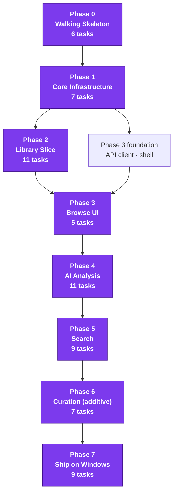
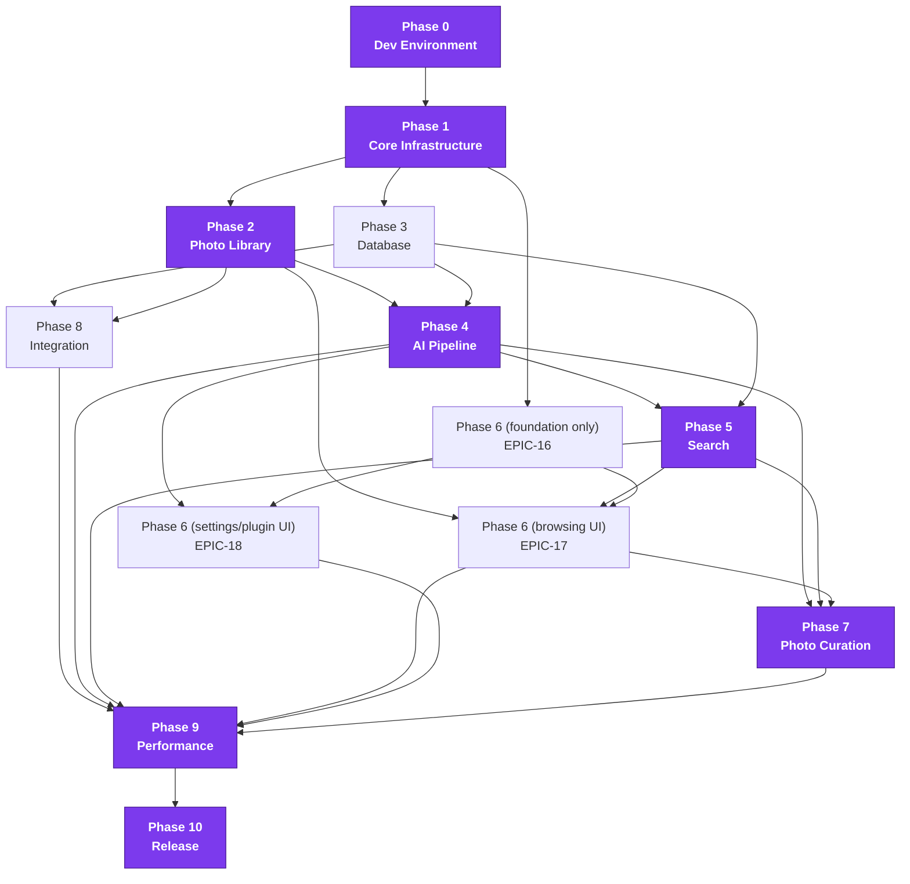
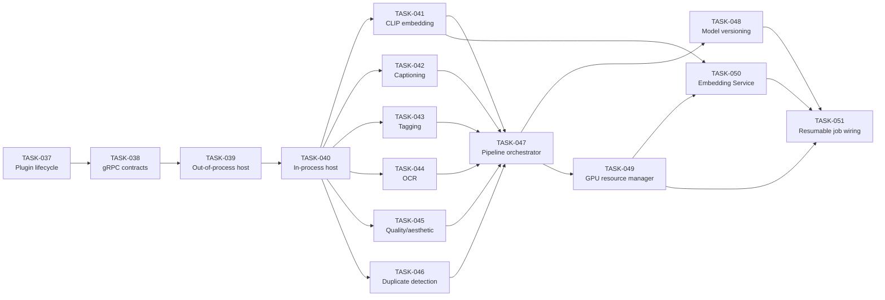

# Local AI Photo Intelligence Platform — Implementation Plan

Version: 1.1
Companion documents: `Local_AI_Photo_Intelligence_PRD_v2.md` (v2.1), `Local_AI_Photo_Intelligence_SDD_v1.md` (v1.1), `Architecture_Decision_Records_v1.md`, `AI_Development_Guide_v1.md`, `Architecture_Audit_v1.md`
Scope: this document does not change any architecture or technology decision made in the SDD. It decomposes the approved architecture into an executable roadmap of phases → epics → features → tasks.

> ## ⚠ v1.1 revision notice — the v1 plan is 61 tasks, not 101
>
> `Architecture_Audit_v1.md` rescoped v1 to the stated first milestone: **a fully functional desktop application running locally on a Windows PC.** Three things changed in this document:
>
> 1. **[§1](#1-overall-roadmap) and [§6](#6-milestones) are rewritten** — 8 phases instead of 11, 6 milestones instead of 8, and the UI moves from Phase 6 to Phase 3 so that every milestone is observable in the running application. v1.0's phase order violated this document's own "vertical slices over horizontal layers" principle.
> 2. **[§12](#12-mvp-scope-overlay-authoritative) is new and authoritative** — it maps all 101 original tasks to **Keep / Revised / Deferred**, with a target release for every deferral. Read it before starting any task.
> 3. **§2–§4's epic, feature, and task detail is retained unchanged** as the specification for both v1 and later releases. A task's detail block is still correct; whether it is *in v1* is answered only by §12.
>
> Five SDD decisions were reversed (Tauri, LanceDB, gRPC plugins, process pools, DI framework) and destructive file operations were deferred in full. If a task below references Rust, Tauri, gRPC, protobuf, LanceDB, `dependency-injector`, `ProcessPoolExecutor`, a GPU scheduler, or moving/renaming/deleting files, check §12 — it is deferred or revised. The governing ADRs are 0002–0009.
>
> **Do not start work from §1's old phase table or §4's task list alone. §12 is the scope of record.**

Traceability convention: every epic/feature/task references the SDD section(s) it implements, e.g. `[SDD §6.2]`, so an agent picking up a single task can go straight to the relevant interface definition without reading the whole SDD.

ID scheme: `EPIC-NN`, `FEAT-NNN`, `TASK-NNN` — all sequential and global (not reused across phases). Task size: **S** = ≤0.5 day, **M** = 1 day, **L** = 2–3 days (no task should exceed L; if it would, it must be split further before work starts).

---

## Table of Contents

1. [Overall Roadmap](#1-overall-roadmap)
2. [Epic Breakdown](#2-epic-breakdown)
3. [Feature Breakdown](#3-feature-breakdown)
4. [Task Breakdown](#4-task-breakdown)
5. [Dependency Graph](#5-dependency-graph)
6. [Milestones](#6-milestones)
7. [Definition of Done](#7-definition-of-done)
8. [Testing Plan](#8-testing-plan)
9. [Suggested Repository Structure](#9-suggested-repository-structure)
10. [Development Order](#10-development-order)
11. [AI Coding Agent Guidance](#11-ai-coding-agent-guidance) *(superseded by `AI_Development_Guide_v1.md`)*
12. [**MVP Scope Overlay (authoritative)**](#12-mvp-scope-overlay-authoritative) *(new in v1.1 — read this first)*

---

## 1. Overall Roadmap

*Rewritten in v1.1. This is the v1 plan: 8 phases, 61 tasks, ending in an installable Windows application.*

| Phase | Name | Objective | Tasks |
|---|---|---|---|
| 0 | Walking Skeleton | One process: FastAPI serving a React build in a `pywebview` window, plus lint and CI for two languages. The application opens and reports its own health. No Rust, no handshake, no supervision. | 6 |
| 1 | Core Infrastructure | The substrate everything else is built on: settings, structured logging, SQLite engine + Alembic, single-connection write discipline, the durable job table, and the manual composition root. | 7 |
| 2 | Library Vertical Slice | Scan → hash → metadata → thumbnails, with progress and cancellation, plus the thumbnail HTTP endpoint. Windows path handling ([SDD §16.1](#)) lands here, not later. | 11 |
| 3 | Browse UI | Typed API client, progress stream, app shell, virtualised grid, detail view. **The library becomes visible in the application** — pulled forward from v1.0's Phase 6 so that every subsequent milestone is demonstrable. | 5 |
| 4 | AI Analysis | Provider `Protocol`s and the in-process registry, model acquisition, CLIP embeddings, tags derived from CLIP, captions, pHash duplicates, sharpness, append-only results, the resumable pipeline job, and the inference semaphore. | 11 |
| 5 | Search | FTS5 index, `sqlite-vec` index, metadata filters, query router, RRF fusion, semantic and similar-image search, incremental indexing, search UI. | 9 |
| 6 | Curation (additive) | Collections, smart collections, built-in filters, recommendations, duplicate review, XMP sidecar export, copy-to-folder export. **No destructive file operations** (ADR-0007). | 7 |
| 7 | Ship on Windows | Settings and first-run UI, Problems view, diagnostics bundle, capability status, PyInstaller freeze, Inno Setup installer, one real-library scale check, docs. | 9 |

**Total: 61 tasks.** v1.0's Phases 8–10 (Integration, synthetic-scale Performance, three-OS Release) become the v1.1/v2 backlog — see [§12](#12-mvp-scope-overlay-authoritative).

Every phase from 2 onward ends in something a stakeholder can see working. Phase 1 is the only phase with no visible output, and it is deliberately short.

**Parallelisation.** Phase 2's three verticals (scanner / metadata / thumbnails) are independent once the `photo` table exists. Phase 3's UI foundation can start as soon as Phase 1's API skeleton exists. Phase 4's providers (CLIP, captions, duplicates+sharpness) are independent of one another once the registry lands — the largest parallel cluster in the v1 plan, though smaller than v1.0's six-provider cluster because tags no longer need their own model (ADR-0006). See [§5](#5-dependency-graph) and [§10](#10-development-order).

---

## 2. Epic Breakdown

### Phase 0 — Development Environment

| Epic | Purpose | Deliverables | Dependencies | Complexity | Risk | Acceptance Criteria |
|---|---|---|---|---|---|---|
| **EPIC-01** Repository & Tooling Bootstrap | Establish the monorepo layout, CI, and code-quality tooling so every subsequent task starts from a working, linted, tested baseline. | Monorepo skeleton; CI pipelines (python/ts/rust); lint/format/type-check configs and pre-commit hooks. | None | Low | Low | A fresh clone passes `ci` on an empty/no-op change; pre-commit hooks block an intentionally malformed commit. |
| **EPIC-02** Skeleton Processes (Shell ↔ Core ↔ UI) | Prove the three-process topology from SDD §2.2 actually boots and talks to itself before any feature work begins. | Minimal FastAPI core with health-check; minimal Tauri shell that spawns/supervises it; minimal React UI showing live connection status. | EPIC-01 | Medium | Medium (first integration point across 3 languages/runtimes) | Launching the packaged dev build shows "Core: connected" in the UI within 5s on a clean machine; killing the core process triggers an automatic respawn visible in the UI. |

### Phase 1 — Core Infrastructure

| Epic | Purpose | Deliverables | Dependencies | Complexity | Risk | Acceptance Criteria |
|---|---|---|---|---|---|---|
| **EPIC-03** Configuration & Logging | Provide typed, validated app configuration and structured, contextual logging used by every other module. | `SettingsService` (SDD §4.12); `structlog` setup with JSON + console renderers. | EPIC-02 | Low | Low | Changing a TOML value or an env var is reflected in `SettingsService.get()`; a log line emitted from a nested async task carries the job/photo context bound at the top of the call chain. |
| **EPIC-04** Database Foundation | Stand up the SQLite/SQLAlchemy/Alembic engine, the single-writer actor (SDD §5.5), and the base repository pattern that all future repositories implement. | WAL-mode engine + session factory; Alembic baseline migration; `WriteRequest` queue + single-writer actor; generic `Repository[T]` base. | EPIC-03 | Medium | Medium (concurrency correctness) | A concurrency test with 50 simultaneous writers and 50 simultaneous readers produces no `SQLITE_BUSY` errors and no lost writes. |
| **EPIC-05** Job Queue & DI Skeleton | Provide the durable job-queue skeleton, the DI composition root, and the plugin-manifest discovery skeleton (no execution yet) that later phases hook real work into. | `jobs`/`job_items` tables + enqueue/dequeue/progress-stream skeleton; `dependency-injector` container; plugin manifest schema + directory scan. | EPIC-04 | Medium | Low | Enqueuing a no-op job runs it to `Completed` and streams progress events observable over the existing WebSocket connection from EPIC-02. |

### Phase 2 — Photo Library

| Epic | Purpose | Deliverables | Dependencies | Complexity | Risk | Acceptance Criteria |
|---|---|---|---|---|---|---|
| **EPIC-06** File System Abstraction & Scanner | Implement the Photo Scanner (SDD §4.1): recursive scan, change detection, live watching, cancellable/resumable job wiring. | `file`/`library_root` schema; recursive walker; xxHash change detection; OS-native directory watcher + polling fallback; scan wired into Task Scheduler. | EPIC-05 | High | Medium (cross-platform file-watch APIs) | Scanning a 10,000-file sample folder completes, lists all files in the `file` table, and a subsequent file rename is detected as a move (not a delete+add) without a full rescan. |
| **EPIC-07** Metadata Reader | Implement metadata extraction and normalization (SDD §4.2). | ExifTool subprocess pool wrapper; canonical `metadata` schema + normalization; existing-XMP sidecar reconciliation. | EPIC-06 | Medium | Medium (format-coverage edge cases) | EXIF/IPTC fields for a corpus of JPEG, RAW (at least 2 vendor formats), and HEIC samples are extracted and normalized without crashing on any malformed sample. |
| **EPIC-08** Thumbnail Generator | Implement thumbnail/preview generation and caching (SDD §4.3). | Raster thumbnailer (Pillow); RAW/HEIC decode path; on-disk content-hash-keyed cache with LRU eviction. | EPIC-06 | Medium | Medium (RAW decode correctness/performance) | Thumbnails generate for the same sample corpus as EPIC-07; cache never exceeds its configured size cap under a sustained-generation load test. |

### Phase 3 — Database

| Epic | Purpose | Deliverables | Dependencies | Complexity | Risk | Acceptance Criteria |
|---|---|---|---|---|---|---|
| **EPIC-09** Full Schema Migration | Complete the remaining tables from the SDD ERD (§5.2) not yet created in Phase 1/2. | `ai_result`/`embedding_ref` (with versioning semantics); `user_data`/`collection`/`collection_item`/`smart_collection_rule`; `duplicate_group(+member)`/`sync_state`/`xmp_export_record`/`file_operation_log`/`connector`/`plugin`. | EPIC-04 | Medium | Low | All tables in SDD §5.2 exist with the exact indexes from §5.3; a migration from an empty DB and from the Phase-2 baseline both succeed in CI. |
| **EPIC-10** Indexing & Backup | Implement the indexing, backup, and migration-safety machinery (SDD §5.3–5.4, §13.3). | All indexes incl. GPS R-tree; FTS5 shadow tables + sync triggers; SQLite backup-API snapshot scheduler; `PRAGMA integrity_check` on startup; pre-migration auto-backup/rollback wrapper; generic repositories for all Phase-3 tables; synthetic-library generator tool. | EPIC-09 | Medium | Medium (migration rollback correctness) | A migration deliberately made to fail partway is rolled back cleanly with the pre-migration snapshot restorable; `integrity_check` runs and passes on every CI DB fixture. |

### Phase 4 — AI Pipeline

| Epic | Purpose | Deliverables | Dependencies | Complexity | Risk | Acceptance Criteria |
|---|---|---|---|---|---|---|
| **EPIC-11** Plugin Runtime & RPC | Implement the full plugin lifecycle and gRPC transport (SDD §8.3–8.5). | Manifest validation + lifecycle state machine; protobuf contracts for all capability types; out-of-process host (spawn/health-check/idle-recycle/crash-restart); in-process host for trusted first-party plugins. | EPIC-05, EPIC-09 | High | High (process isolation/crash recovery correctness) | Killing a provider process mid-batch fails only that batch's in-flight items (marked retryable) without affecting the core service or other in-flight jobs. |
| **EPIC-12** First-Party Providers | Ship one reference implementation per AI capability (SDD §6.1). | CLIP embedding provider; captioning provider; tagging provider; OCR provider; quality/aesthetic provider; duplicate-detection provider. | EPIC-11 | High | High (model integration, CPU-only performance) | Each provider passes the shared plugin-contract test suite (see [Section 8](#8-testing-plan)) and produces a result on a fixed sample photo set on a CPU-only CI runner within an agreed latency budget. |
| **EPIC-13** Pipeline Orchestration & Scheduling | Implement the Analysis Pipeline orchestrator, model versioning, GPU resource management, and the Embedding Service (SDD §6.2–6.4, §4.5). | `AnalysisPipeline.run()`/`run_batch()`; content-addressed model cache + composite `model_version`; GPU Resource Manager with exclusive-slot scheduling + CPU fallback; `EmbeddingService`; pipeline wired as resumable Task Scheduler jobs. | EPIC-12 | High | Medium | Running the pipeline over a 500-photo sample with 2 of 6 capabilities enabled produces exactly the enabled capabilities' results, versioned correctly, and resumes correctly after a simulated mid-batch crash. |

### Phase 5 — Search

| Epic | Purpose | Deliverables | Dependencies | Complexity | Risk | Acceptance Criteria |
|---|---|---|---|---|---|---|
| **EPIC-14** Text & Vector Indexes | Stand up the two retrieval substrates search fuses over (SDD §7.1, §3.5–3.6). | FTS5 virtual tables + sync triggers; LanceDB `EmbeddingIndex` repository; SQL metadata-filter query builder (incl. GPS bbox). | EPIC-10, EPIC-13 | Medium | Medium | A caption/tag change is queryable via FTS within one debounce cycle; a stored embedding is retrievable via ANN query with correct top-k ordering on a known synthetic vector set. |
| **EPIC-15** Hybrid Search & NL Query | Implement the unified `SearchService`, rank fusion, and natural-language/similar-image modes (SDD §7.1–7.4). | `SearchQuery` DTO + mode router; Reciprocal Rank Fusion; NL search via CLIP text encoder; similar-image search; incremental indexing wiring; `SearchProvider` plugin point; full-reindex maintenance action. | EPIC-14 | High | Medium | A natural-language query against a labeled sample library returns the expected photo in the top 5 results; a metadata-filtered hybrid query (e.g. "beach" + date range) returns only in-range results. |

### Phase 6 — UI

| Epic | Purpose | Deliverables | Dependencies | Complexity | Risk | Acceptance Criteria |
|---|---|---|---|---|---|---|
| **EPIC-16** UI Foundation | Build the typed API client, live job-progress subscription, and app shell that every UI feature builds on. | Typed API client from OpenAPI schema; WebSocket progress client; app shell/routing/onboarding scaffold. | EPIC-02, EPIC-05 | Medium | Low | A UI-layer unit test can call any core endpoint through the typed client with compile-time type checking on request/response shapes. |
| **EPIC-17** Browsing & Search UI | Build the primary photo-browsing and search surfaces. | Virtualized photo grid; photo detail view; search bar/filters; search results view. | EPIC-16, EPIC-06, EPIC-15 | High | Medium (virtualization performance at scale) | Scrolling a 100,000-item grid maintains ≥50fps on the reference dev machine; a search query updates results within the UI without a full page reload. |
| **EPIC-18** Settings & Plugin UI | Build settings, plugin management, and the first-run wizard. | Settings UI (library roots, enabled modules, provider selection); plugin management UI (discover/enable/permission-approval); GPU/performance settings; first-run onboarding wizard. | EPIC-16, EPIC-11 | Medium | Low | A user can go from a fresh install to a first completed scan+AI pass using only the onboarding wizard, no manual config file editing. |

### Phase 7 — Photo Curation

| Epic | Purpose | Deliverables | Dependencies | Complexity | Risk | Acceptance Criteria |
|---|---|---|---|---|---|---|
| **EPIC-19** Collections | Implement virtual and smart collections (SDD §4.8, §10.1). | `CollectionManager` CRUD + UI; smart-collection live evaluation + UI. | EPIC-10, EPIC-15, EPIC-17 | Medium | Low | Adding 10,000 photos to a collection completes as a pure DB write with no file-system I/O, verified by a test asserting zero filesystem write syscalls during the operation. |
| **EPIC-20** Recommendations & Safety Flow | Implement the AI-recommendation → user-confirmed action pipeline and its safety/undo model (SDD §10.2–10.3) — the highest-stakes epic in the project given the "never auto move/rename/delete" constraint. | Recommendation engine; duplicate review UI; staged file-operation executor; final-confirmation dialog + atomic execution; undo; built-in smart filters; batch operation UI; trash/recycle-bin integration. | EPIC-19, EPIC-12 | High | **High** (irreversible-action safety) | An automated test suite asserts that **no code path** can reach `FileOperationExecutor.execute()` without a prior `status=confirmed` row in `file_operation_log`; every executed operation is undoable within the configured window in a dedicated test. |

### Phase 8 — Integration

| Epic | Purpose | Deliverables | Dependencies | Complexity | Risk | Acceptance Criteria |
|---|---|---|---|---|---|---|
| **EPIC-21** Export & XMP | Implement the Export Manager and XMP sidecar writing (SDD §4.10). | `export_xmp()` via ExifTool; export presets incl. Lightroom-compatible keyword hierarchy. | EPIC-10, EPIC-07 | Medium | Medium (round-trip fidelity vs. other tools) | Exported XMP sidecars are readable by digiKam/Lightroom without field loss for the supported field set, verified against a reference tool where available. |
| **EPIC-22** Connectors | Implement the connector interface and all four target connectors (SDD §9). | `Connector` Protocol + `SyncManager`; XMP filesystem, Immich, PhotoPrism, digiKam, Lightroom connectors. | EPIC-21 | High | Medium (external API drift) | Each connector passes its recorded-cassette integration test suite; the conflict-resolution rule (local AI fields always win, user fields conflict-flagged) is verified by a dedicated test per connector. |

### Phase 9 — Performance

| Epic | Purpose | Deliverables | Dependencies | Complexity | Risk | Acceptance Criteria |
|---|---|---|---|---|---|---|
| **EPIC-23** Scale Validation & Optimization | Prove and tune the system against PRD scale targets using synthetic libraries (SDD §12). | Benchmark suite (scan/AI/search throughput at 100K/1M/5M synthetic scale); cache tuning; write-batching tuning; GPU utilization profiling; query-latency optimization pass; memory/streaming audit. | EPIC-06, EPIC-13, EPIC-15 | High | Medium | Benchmarks at 1M synthetic photos meet the latency/throughput targets agreed in [Section 8](#8-testing-plan); no benchmark regresses more than an agreed threshold between CI runs. |

### Phase 10 — Release

| Epic | Purpose | Deliverables | Dependencies | Complexity | Risk | Acceptance Criteria |
|---|---|---|---|---|---|---|
| **EPIC-24** Packaging & Launch Readiness | Freeze, package, document, and sign off the release (SDD §3.14, §13). | Frozen core executable (PyInstaller/Nuitka) per OS; Tauri installer packaging (MSI/NSIS, dmg, deb/AppImage); first-run model download + offline-import path; security-review pass against SDD §13; documentation + release-candidate checklist. | All prior phases | Medium | Medium (per-OS packaging quirks) | A clean-machine install (no dev tools present) on Windows, macOS, and Linux completes a scan + AI pass + search query end-to-end using only the packaged installer. |

---

## 3. Feature Breakdown

Each row is one Feature. A Feature is the unit that maps 1:1 to a single Task in almost every case in this project (each Feature already *is* a small vertical slice); the few Features that split into two Tasks are noted. Full task detail is in [Section 4](#4-task-breakdown) under the matching `FEAT-NNN` heading.

### EPIC-01 — Repository & Tooling Bootstrap

| Feature | Purpose | Dependencies | Acceptance Criteria |
|---|---|---|---|
| **FEAT-001** Monorepo Scaffolding | Create the top-level directory layout (see [Section 9](#9-suggested-repository-structure)) and per-language project manifests (`pyproject.toml`, `package.json`, `Cargo.toml`) so every later task has a place to put its code. | None | `git clone` + one bootstrap command produces installable dependencies for all three sub-projects with zero errors. |
| **FEAT-002** CI Pipeline | Stand up CI (e.g. GitHub Actions) running lint/type-check/test on every PR, split by language. | FEAT-001 | A PR with a failing python test and a separate PR with a failing `tsc`/`cargo check` are both blocked from merge by CI. |
| **FEAT-003** Lint/Format/Type Tooling | Configure and enforce ruff/black/mypy (python), eslint/prettier/strict tsconfig (UI), rustfmt/clippy (shell) via pre-commit. | FEAT-001 | Committing intentionally malformed code in any of the three languages is rejected by the local pre-commit hook before it reaches CI. |

### EPIC-02 — Skeleton Processes (Shell ↔ Core ↔ UI)

| Feature | Purpose | Dependencies | Acceptance Criteria |
|---|---|---|---|
| **FEAT-004** Core Service Skeleton | Minimal FastAPI app: `/health` endpoint, loopback-only binding, random port + auth token generation (SDD §2.2). | FEAT-001–003 | `curl` against the bound port with the correct token returns `200 {"status":"ok"}`; without the token, `401`. |
| **FEAT-005** Shell + UI Skeleton & Handshake | Tauri shell spawns the core service, passes port/token via stdin, supervises the process (restart on crash, clean shutdown); minimal React UI polls `/health` and displays connection status. | FEAT-004 | Killing the core process externally results in the UI showing "reconnecting" then "connected" within the configured restart window, with no manual intervention. |

### EPIC-03 — Configuration & Logging

| Feature | Purpose | Dependencies | Acceptance Criteria |
|---|---|---|---|
| **FEAT-006** Settings Service | Typed, validated, layered config (defaults → TOML file → env var → CLI flag) per SDD §3.10/§4.12. | EPIC-02 | An invalid value in `config.toml` (wrong type) fails fast at startup with a clear error naming the offending key, rather than failing deep in unrelated code later. |
| **FEAT-007** Structured Logging | `structlog` setup with JSON file output + human-readable console renderer in dev mode, with context-var-based binding helpers (job id, photo id, plugin id). | EPIC-02 | A log call made inside a nested async task started from a job handler includes the job id in its JSON output without the call site having to pass it explicitly. |

### EPIC-04 — Database Foundation

| Feature | Purpose | Dependencies | Acceptance Criteria |
|---|---|---|---|
| **FEAT-008** SQLAlchemy Engine + Alembic Baseline | WAL-mode SQLite engine, session factory, Alembic initialized with an empty baseline migration. | FEAT-006 | `alembic upgrade head` on a fresh directory produces a valid, empty-schema `.sqlite` file; `alembic downgrade base` reverses it cleanly. |
| **FEAT-009** Single-Writer Actor | Implement the `WriteRequest` queue + single asyncio writer actor from SDD §5.5. | FEAT-008 | The concurrency test described in EPIC-04's acceptance criteria passes (50 concurrent writers, 0 lost writes, 0 `SQLITE_BUSY`). |
| **FEAT-010** Repository Base Pattern | Generic `Repository[T]` Protocol + base implementation (CRUD + query-building helpers) that all future concrete repositories extend. | FEAT-009 | A trivial concrete repository for a scratch table can be implemented in under 20 lines using only the base class. |

### EPIC-05 — Job Queue & DI Skeleton

| Feature | Purpose | Dependencies | Acceptance Criteria |
|---|---|---|---|
| **FEAT-011** Task Scheduler Skeleton | `jobs`/`job_items` tables + enqueue/dequeue/progress-stream API, no real work executed yet (SDD §4.13, §11.1). | FEAT-010 | A no-op job type enqueued via the API transitions `Queued → Running → Completed` and emits progress events. |
| **FEAT-012** DI Composition Root | `dependency-injector` container wiring Settings, Logging, DB session factory, and Scheduler together at app startup. | FEAT-011 | A unit test can override the DB repository binding with an in-memory fake without touching any application-layer code. |
| **FEAT-013** Plugin Manager Skeleton | Manifest schema (SDD §8.2) + directory discovery scan; no loading/execution yet. | FEAT-012 | Placing a valid `plugin.toml` in the plugins directory makes it appear in `PluginManager.discover()`'s output; an invalid manifest is rejected with a specific schema-validation error. |
| **FEAT-014** Core API Versioning Scaffold | Expose `core_api_version` via the FastAPI OpenAPI schema/health endpoint for plugin compatibility checks (SDD §8.2). | FEAT-004, FEAT-013 | A plugin manifest declaring an incompatible `core_api_version` range is rejected at discovery time with a clear message, not a silent skip. |

### EPIC-06 — File System Abstraction & Scanner

| Feature | Purpose | Dependencies | Acceptance Criteria |
|---|---|---|---|
| **FEAT-015** File Table & Library Root Model | `file`/`library_root` schema + repository (SDD §5.2). | EPIC-05 | A `LibraryRoot` can be registered and a `File` row created/queried through the repository with correct unique constraints on `(library_root_id, relative_path)`. |
| **FEAT-016** Recursive Scanner | Recursive directory walk with a supported-format allowlist and include/exclude glob rules (SDD §4.1). | FEAT-015 | Scanning a fixture directory tree with mixed supported/unsupported files and nested exclude patterns produces exactly the expected `file` row set. |
| **FEAT-017** Content Hash & Change Detection | xxHash-based content hashing; classify each scanned path as new/modified/moved/unchanged relative to prior scan state (SDD §4.1). | FEAT-016 | Renaming a file between two scans is classified as "moved," not "deleted + added" (same `content_hash`, new path). |
| **FEAT-018** Directory Watcher | OS-native live watch (`ReadDirectoryChangesW`/`inotify`/`FSEvents`) with a polling fallback (SDD §12). | FEAT-017 | Dropping a new file into a watched folder produces a `FileDiscovered` event within 2 seconds without a manual rescan trigger, on all three target OSes (verified in CI where the runner OS matches, manually elsewhere). |
| **FEAT-019** Scan Progress & Cancellation | Wire the scanner into the Task Scheduler as a cancellable, progress-reporting job. | FEAT-017, EPIC-05 | Cancelling a scan mid-walk stops further file discovery within one polling interval and leaves already-discovered files intact in the `file` table. |
| **FEAT-020** File Status Reconciliation | Mark files as `missing` when not seen in a scan pass, `deleted` after a grace period, and reconcile status if a missing file reappears. | FEAT-017 | A file temporarily on an unmounted external drive is marked `missing` (not `deleted`) and reverts to `active` automatically when the drive is reconnected and rescanned. |

### EPIC-07 — Metadata Reader

| Feature | Purpose | Dependencies | Acceptance Criteria |
|---|---|---|---|
| **FEAT-021** ExifTool Integration | Subprocess pool wrapper around ExifTool using `-stay_open` batching (SDD §3.8). | EPIC-06 | Extracting metadata for 1,000 fixture files completes without spawning more than one ExifTool process per pool worker (verified via process-count assertion in the test). |
| **FEAT-022** Metadata Normalization | Canonical `PhotoMetadata` schema + normalization from raw ExifTool output (SDD §4.2, §5.2 `metadata` table). | FEAT-021 | A fixture set covering at least 3 camera manufacturers normalizes into the canonical schema with no field silently dropped that ExifTool reported. |
| **FEAT-023** XMP Sidecar Reading | Read existing XMP sidecars and reconcile with embedded metadata per the precedence rule in SDD §4.2 (embedded wins for technical fields, sidecar wins for pre-existing user fields). | FEAT-022 | A fixture photo with a pre-existing XMP sidecar containing a rating produces a `metadata` row with camera-technical fields from EXIF and the rating from the sidecar. |

### EPIC-08 — Thumbnail Generator

| Feature | Purpose | Dependencies | Acceptance Criteria |
|---|---|---|---|
| **FEAT-024** Raster Thumbnailing | Pillow-based thumbnail + preview generation for JPEG/PNG/TIFF/WebP (SDD §4.3). | EPIC-06 | Thumbnails for a fixture set of standard-format images are generated at the configured size buckets with correct orientation (EXIF rotation applied). |
| **FEAT-025** RAW/HEIC Decode | rawpy/LibRaw + pillow-heif integration for RAW and HEIC/HEIF formats. | FEAT-024 | Thumbnails generate correctly for a fixture set covering at least 2 RAW vendor formats and HEIC, matching expected dimensions and orientation. |
| **FEAT-026** Thumbnail Cache Manager | On-disk cache keyed by `content_hash + size_bucket`, LRU eviction under a configurable size cap (SDD §12). | FEAT-024 | A sustained generation load test confirms the cache directory never exceeds its configured size cap and the least-recently-accessed entries are evicted first. |

### EPIC-09 — Full Schema Migration

| Feature | Purpose | Dependencies | Acceptance Criteria |
|---|---|---|---|
| **FEAT-027** AI Result & Embedding Ref Schema | `ai_result`/`embedding_ref` tables with the append-only, `is_current`-flipping versioning semantics (SDD §5.2, §5.4). | EPIC-04 | Inserting a second `ai_result` row for the same `(file_id, capability)` flips the prior row's `is_current` to `false` atomically within one transaction. |
| **FEAT-028** User Data & Collections Schema | `user_data`/`collection`/`collection_item`/`smart_collection_rule` tables. | EPIC-04 | All four tables support the CRUD operations needed by EPIC-19 with correct FK/unique constraints (e.g. one `collection_item` row per `(collection_id, file_id)`). |
| **FEAT-029** Duplicate/Sync/Export/FileOp Schema | `duplicate_group(+member)`, `sync_state`, `xmp_export_record`, `file_operation_log`, `connector`, `plugin` tables. | EPIC-04 | All six tables exist with the relationships shown in SDD §5.2's ERD and pass a schema-validation test asserting every FK constraint. |

### EPIC-10 — Indexing & Backup

| Feature | Purpose | Dependencies | Acceptance Criteria |
|---|---|---|---|
| **FEAT-030** Index Creation | Apply every index in SDD §5.3 including the GPS R-tree, plus FTS5 shadow tables with sync triggers. | EPIC-09 | `EXPLAIN QUERY PLAN` on each of the representative queries listed in SDD §5.3 shows index usage, not a full table scan. |
| **FEAT-031** Backup & Integrity Check | SQLite backup-API snapshot scheduler + `PRAGMA integrity_check` on startup (SDD §13.3). | FEAT-030 | A scheduled snapshot completes without blocking concurrent writers (verified via the EPIC-04 concurrency test running during a snapshot); a deliberately corrupted DB fixture fails `integrity_check` and triggers the documented recovery prompt. |
| **FEAT-032** Migration Safety Net | Pre-migration auto-backup + rollback-on-failure wrapper around Alembic upgrades (SDD §5.4). | FEAT-031 | A migration that raises partway through is rolled back and the pre-migration snapshot is restored automatically, verified by a test migration seeded to fail. |
| **FEAT-033** Repository Layer Completion | Concrete repositories for every Phase-3 table, built on the FEAT-010 base pattern. | FEAT-029, FEAT-010 | Every Phase-3 table has a repository with unit tests covering its CRUD + at least one domain-specific query method. |
| **FEAT-034** Synthetic Library Generator | A tool producing N synthetic photo file records with realistic-but-randomized metadata/content-hashes, used by later test/benchmark phases (SDD §14). | FEAT-033 | Generating a 100,000-row synthetic library completes in under an agreed time budget and the resulting DB passes `integrity_check`. |

### EPIC-11 — Plugin Runtime & RPC

| Feature | Purpose | Dependencies | Acceptance Criteria |
|---|---|---|---|
| **FEAT-035** Plugin Manifest Validation & Lifecycle | Full lifecycle state machine (Discovered → Disabled → PermissionCheck → Loaded → Running → Crashed/Unloaded) per SDD §8.3. | EPIC-05, EPIC-09 | A state-machine test drives every transition in the SDD §8.3 diagram, including the crash→auto-restart→retry-budget-exceeded path. |
| **FEAT-036** gRPC Provider Contract | Protobuf definitions + generated stubs for `CaptionProvider`, `TagProvider`, `EmbeddingProvider`, `OCRProvider`, `QualityProvider` (SDD §8.4). | FEAT-035 | A trivial echo-style test plugin implementing each contract round-trips a request/response correctly over the gRPC transport. |
| **FEAT-037** Out-of-process Plugin Host | Subprocess spawn/health-check/idle-recycle/crash-restart for `entry_point = "process"` plugins. | FEAT-036 | Killing a spawned provider process externally is detected within the health-check interval and triggers the documented restart-with-bounded-retries behavior. |
| **FEAT-038** In-process Plugin Host | Direct in-process call path for trusted `entry_point = "inproc"` first-party plugins. | FEAT-036 | A first-party provider marked `inproc` is invoked with no subprocess/RPC overhead, verified by a latency comparison test against an equivalent `process` plugin. |

### EPIC-12 — First-Party Providers

| Feature | Purpose | Dependencies | Acceptance Criteria |
|---|---|---|---|
| **FEAT-039** CLIP Embedding Provider | ONNX Runtime CLIP-family image + text embedding provider implementing `EmbeddingProvider` (SDD §6.1). | EPIC-11 | Embedding the same image twice produces identical vectors (determinism); a known-similar pair of images has higher cosine similarity than a known-dissimilar pair, verified on a fixed fixture set. |
| **FEAT-040** Captioning Provider | ONNX/llama.cpp vision-language captioning provider with versioned prompt templates (SDD §6.1, §6.5). | EPIC-11 | Captioning a fixed fixture set produces non-empty, plausible captions (spot-checked); the `model_version` recorded includes the prompt-template version per SDD §6.5. |
| **FEAT-041** Tagging Provider | Tag-generation provider implementing `TagProvider`. | EPIC-11 | Tagging a fixture set with known expected tags (e.g. "dog," "beach") returns those tags above a defined confidence threshold. |
| **FEAT-042** OCR Provider | Tesseract/PaddleOCR-based provider implementing `OCRProvider`. | EPIC-11 | OCR on a fixture set of screenshots/documents with known text extracts that text with an agreed minimum accuracy (e.g. character error rate threshold). |
| **FEAT-043** Quality/Aesthetic Provider | Sharpness (Laplacian variance) + exposure + aesthetic scoring provider implementing `QualityProvider`. | EPIC-11 | A fixture set with known-blurry and known-sharp images is correctly ranked by the sharpness score; a known over/under-exposed pair is flagged correctly. |
| **FEAT-044** Duplicate Detection Provider | Perceptual hash (pHash/dHash) provider + grouping logic writing to `duplicate_group`/`duplicate_group_member`. | EPIC-11, FEAT-029 | A fixture set containing exact duplicates, near-duplicates (resized/re-compressed), and unrelated images groups the first two categories correctly and leaves unrelated images ungrouped. |

### EPIC-13 — Pipeline Orchestration & Scheduling

| Feature | Purpose | Dependencies | Acceptance Criteria |
|---|---|---|---|
| **FEAT-045** Analysis Pipeline Orchestrator | `AnalysisPipeline.run()`/`run_batch()` wiring enabled providers to persistence (SDD §6.2). | EPIC-12 | Running the pipeline with a subset of capabilities enabled produces results for exactly that subset, correctly versioned per FEAT-027's semantics. |
| **FEAT-046** Model Versioning & Cache | Content-addressed local model cache + composite `model_version` hashing (provider + weights hash + runtime version) (SDD §6.4). | FEAT-045 | Two runs with the same provider/weights produce the same `model_version`; changing the weights file changes it. |
| **FEAT-047** GPU Resource Manager | Device enumeration + exclusive-slot scheduling with automatic CPU fallback (SDD §6.3). | FEAT-045 | A load test with more concurrent GPU-bound job items than available GPU slots shows correct serialization per device and no two jobs using the same device concurrently; disabling the GPU entirely still completes all jobs via CPU fallback. |
| **FEAT-048** Embedding Service API | `EmbeddingService.embed()`/`similar_to()`/`embed_text()` wrapping the LanceDB repository (SDD §4.5). | FEAT-039, EPIC-14 (soft — can stub LanceDB interface until EPIC-14 lands) | `similar_to()` on a fixture set returns the expected nearest neighbors in the correct order. |
| **FEAT-049** Pipeline Job Wiring (resumable) | Wire the Analysis Pipeline into the Task Scheduler as durable, resumable jobs per SDD §11.2. | FEAT-045, EPIC-05 | Simulating a core-service crash mid-batch and restarting resumes exactly the incomplete items, with no duplicate `ai_result` rows for already-completed items. |

### EPIC-14 — Text & Vector Indexes

| Feature | Purpose | Dependencies | Acceptance Criteria |
|---|---|---|---|
| **FEAT-050** FTS5 Integration | FTS5 virtual tables + SQL triggers keeping them in sync with captions/tags/filenames (SDD §3.6, §5.3). | EPIC-10 | Updating a caption's `ai_result` row is reflected in an FTS5 query within the same transaction, with no separate manual reindex step required. |
| **FEAT-051** LanceDB Repository | `EmbeddingIndex` implementation over LanceDB: upsert-by-key, ANN query by `vector_space` (SDD §3.5). | EPIC-10 | A known synthetic vector set returns correct top-k nearest neighbors by cosine distance, verified against a brute-force reference computation. |
| **FEAT-052** Metadata Filter Query Builder | SQL filter builder for date range, camera model, rating threshold, GPS bounding box (via R-tree) (SDD §7.2). | EPIC-10 | Each filter type in isolation and in combination produces the mathematically correct result set on a labeled fixture library. |

### EPIC-15 — Hybrid Search & NL Query

| Feature | Purpose | Dependencies | Acceptance Criteria |
|---|---|---|---|
| **FEAT-053** Search Query DTO & Mode Router | `SearchQuery` DTO + dispatch across `metadata`/`text`/`semantic`/`hybrid`/`similar_to` modes (SDD §7.1). | EPIC-14 | Each mode value routes to the correct retrieval branch, verified by a router-level unit test with fakes for each branch. |
| **FEAT-054** Rank Fusion | Reciprocal Rank Fusion combining BM25 rank and vector-similarity rank (SDD §7.2). | FEAT-053 | On a fixture query where text and vector retrieval disagree on ordering, the fused ranking matches a hand-computed RRF reference calculation. |
| **FEAT-055** Natural Language Search | Embed query text via the CLIP text encoder and retrieve via ANN (SDD §7.2). | FEAT-054, EPIC-13 | A natural-language query against a labeled sample library returns the expected photo in the top 5 results. |
| **FEAT-056** Similar-Image Search | `mode="similar_to"` using the reference photo's stored embedding (SDD §7.1). | FEAT-054 | Querying "similar to photo X" on a fixture set returns known visually-similar photos ranked above unrelated ones. |
| **FEAT-057** Incremental Indexing | Debounced `index_photo()` task triggered by writes to `ai_result`/`metadata`/`user_data` (SDD §7.3). | FEAT-050, FEAT-051 | Ten rapid successive edits to the same photo within the debounce window produce exactly one re-index call, not ten. |
| **FEAT-058** Search Provider Plugin Point | `SearchProvider` Protocol + registration mechanism for new search modes without modifying `SearchService` (SDD §7.4). | FEAT-053 | A test plugin registering a new fake search mode is invoked correctly by `SearchService` and its results participate in rank fusion. |
| **FEAT-059** Full Reindex Maintenance Action | Admin action rebuilding FTS5 + LanceDB from current `ai_result`/`metadata` rows (SDD §7.3). | FEAT-057 | Deleting the FTS5/LanceDB files entirely and running the reindex action restores identical search results to before deletion. |

### EPIC-16 — UI Foundation

| Feature | Purpose | Dependencies | Acceptance Criteria |
|---|---|---|---|
| **FEAT-060** API Client & Typed Hooks | Typed client generated from the core's OpenAPI schema + React Query hooks. | EPIC-02, FEAT-014 | Changing a response field's type in the core API and regenerating the client produces a compile-time TypeScript error at every UI call site using the old shape. |
| **FEAT-061** WebSocket Job Progress Client | Live subscription to job progress events with reconnect-on-drop handling. | FEAT-060, EPIC-05 | Progress events for a long-running job update a UI indicator in real time; disconnecting and reconnecting the core process resumes the stream without a manual page refresh. |
| **FEAT-062** App Shell & Navigation | Overall layout, routing, and library-root onboarding entry point. | FEAT-060 | Navigating between the (stubbed) grid/search/settings routes preserves app state and does not remount the WebSocket connection. |

### EPIC-17 — Browsing & Search UI

| Feature | Purpose | Dependencies | Acceptance Criteria |
|---|---|---|---|
| **FEAT-063** Virtualized Photo Grid | Windowed rendering of the photo grid over the `file`/thumbnail data, lazy-loading thumbnails on scroll. | FEAT-062, EPIC-06, EPIC-08 | Scrolling a 100,000-item synthetic grid (via FEAT-034) maintains the target frame rate on the reference dev machine. |
| **FEAT-064** Photo Detail View | Full preview + metadata + current AI results (caption/tags/scores) panel for a single photo. | FEAT-063, EPIC-13 | Opening a photo with all AI capabilities enabled displays its current caption, tags, and quality score without a page reload. |
| **FEAT-065** Search Bar & Filters UI | Unified search input + structured filter controls wired to `SearchQuery`. | FEAT-060, EPIC-15 | Typing a natural-language query and adding a date-range filter produces a single combined `SearchQuery` sent to the API, verified by an intercepted-request test. |
| **FEAT-066** Search Results View | Ranked results grid with relevance indicators, reusing the virtualized grid component. | FEAT-063, FEAT-065 | Results render in the rank order returned by the API with no client-side re-sorting. |

### EPIC-18 — Settings & Plugin UI

| Feature | Purpose | Dependencies | Acceptance Criteria |
|---|---|---|---|
| **FEAT-067** Settings UI | Library roots, enabled AI modules, per-capability provider selection. | FEAT-060, EPIC-05 | Disabling an AI module in Settings prevents it from running on the next scan, verified end-to-end. |
| **FEAT-068** Plugin Management UI | Discover/enable/disable/permission-approval UI matching the SDD §8.3 lifecycle. | FEAT-067, EPIC-11 | Enabling a plugin that declares `network:outbound` shows an explicit permission prompt naming that capability before it can be enabled. |
| **FEAT-069** GPU/Performance Settings UI | GPU preference and cache-size-limit controls. | FEAT-067, EPIC-13 | Changing the GPU preference to "CPU only" is reflected in the next job's execution (verified via job metadata, not just UI state). |
| **FEAT-070** Onboarding First-Run Wizard | End-to-end first-run flow: pick library root(s), enable default providers, trigger first scan. | FEAT-067, FEAT-068 | A fresh install reaches a completed first scan + AI pass using only the wizard, with no manual config file editing. |

### EPIC-19 — Collections

| Feature | Purpose | Dependencies | Acceptance Criteria |
|---|---|---|---|
| **FEAT-071** Collection CRUD | `CollectionManager.create()`/`add_members()` + minimal UI. | EPIC-10, EPIC-17 | Adding 10,000 photos to a collection is a pure DB write (see EPIC-19 acceptance criteria) and completes within an agreed latency budget. |
| **FEAT-072** Smart Collections | `evaluate_smart()` live query evaluation + UI presenting results as a virtual collection. | FEAT-071, EPIC-15 | A smart collection defined by a saved `SearchQuery` returns updated membership immediately after a new matching photo is indexed, with no manual refresh action needed. |

### EPIC-20 — Recommendations & Safety Flow

| Feature | Purpose | Dependencies | Acceptance Criteria |
|---|---|---|---|
| **FEAT-073** Recommendation Engine | Group AI results into actionable suggestions (screenshots, daily snapshots, low-quality, burst groups) (SDD §10.2). | EPIC-13, EPIC-15 | On a labeled fixture library, each recommendation category identifies its known members with an agreed minimum precision/recall. |
| **FEAT-074** Duplicate Review UI | Grouped duplicate review surfacing `is_recommended_keeper` as a suggestion, not an automatic choice. | FEAT-073, EPIC-12 (FEAT-044) | The UI never pre-selects a "delete" action; the user must actively choose which photos in a group to act on. |
| **FEAT-075** File Operation Executor (Stage 1: staging) | Stage move/copy/rename/archive/delete requests, writing `file_operation_log` rows with `status=pending_confirmation` — **no actual file I/O occurs in this task**. | FEAT-029 | A staged request is fully described (exact source/dest paths, byte count) in the log row before any confirmation UI is shown; attempting to call the underlying file-system function directly (bypassing staging) is structurally impossible per the module's public interface. |
| **FEAT-076** Final Confirmation & Atomic Execution | Explicit confirmation dialog showing exact paths/count/size; atomic execution (write-to-temp+rename same-volume, copy-verify-delete-source cross-volume) only after confirmation. | FEAT-075 | The automated test described in EPIC-20's acceptance criteria (no path to `execute()` without a `confirmed` log row) passes; an interrupted operation (simulated crash mid-copy) never leaves the destination in a partially-written state readable as complete. |
| **FEAT-077** Undo | Reverse a completed operation from `file_operation_log` within a configurable time window. | FEAT-076 | Every operation type (move/copy/rename/archive/delete-to-trash) has a passing round-trip test: execute, then undo, then verify the file system matches the pre-operation state. |
| **FEAT-078** Built-in Smart Filters | Ship built-in smart-filter presets (screenshots, receipts, daily snapshots, memes, low quality, blurry, similar, burst) as saved `SearchQuery` definitions. | FEAT-073, EPIC-19 | Each built-in filter is selectable from the UI and returns results consistent with FEAT-073's recommendation engine output for the same criteria. |
| **FEAT-079** Batch Operation UI | Multi-select + batch action toolbar wired to the curation flow (FEAT-075/076). | FEAT-076, EPIC-17 | Selecting 500 photos and choosing "archive" stages exactly 500 `file_operation_log` rows and shows one aggregate confirmation dialog, not 500 individual prompts. |
| **FEAT-080** Trash/Recycle-bin Integration | Default soft-delete via the OS trash/recycle bin; hard delete is a separate, more strongly confirmed, opt-in setting (SDD §13.2). | FEAT-076 | With default settings, a "delete" action is recoverable from the OS trash after the operation completes; hard delete requires an explicit, separately-worded confirmation step. |

### EPIC-21 — Export & XMP

| Feature | Purpose | Dependencies | Acceptance Criteria |
|---|---|---|---|
| **FEAT-081** XMP Export Manager | `export_xmp()` writing caption/tags/rating/keywords to sidecars via ExifTool, never touching originals (SDD §4.10). | EPIC-10, EPIC-07 | Exporting a batch of 100 photos produces 100 sidecar files with no modification (verified by content-hash comparison) to any original file. |
| **FEAT-082** Export Presets | Preset system incl. a Lightroom-compatible keyword-hierarchy preset; batch export for an entire collection. | FEAT-081, EPIC-19 | Exporting a collection with the Lightroom preset produces keyword hierarchies importable by Lightroom without manual reformatting (verified against Lightroom where available, else against the XMP spec). |

### EPIC-22 — Connectors

| Feature | Purpose | Dependencies | Acceptance Criteria |
|---|---|---|---|
| **FEAT-083** Connector Interface & Sync Manager | `Connector` Protocol + `SyncManager` orchestration + `sync_state` cursoring and conflict resolution (SDD §9.2–9.3). | EPIC-10, EPIC-21 | The conflict-resolution rule (AI fields always local-wins; user fields conflict-flagged if changed both sides since last sync) is enforced and covered by a dedicated test per rule branch. |
| **FEAT-084** XMP Filesystem Connector | Baseline connector requiring no external service, built directly on FEAT-081. | FEAT-083 | Running a sync with only the XMP connector enabled produces sidecars for all changed photos since the last sync cursor, and only those. |
| **FEAT-085** Immich Connector | REST API export (+ pull for ratings/albums where the API supports it). | FEAT-083 | Recorded-cassette integration tests cover export success, export failure/retry, and (if supported) pull-and-merge scenarios. |
| **FEAT-086** PhotoPrism Connector | REST API export/pull, same shape as FEAT-085. | FEAT-083 | Same acceptance bar as FEAT-085, against PhotoPrism's API. |
| **FEAT-087** digiKam Connector | Primarily XMP-based, optionally direct API/DBus where available. | FEAT-084 | Sidecars produced are read correctly by digiKam in a manual verification pass (documented in the PR). |
| **FEAT-088** Lightroom Connector | XMP-tuned export connector; explicitly documented as one-directional (no writable local Lightroom API exists). | FEAT-084 | Sidecars produced are read correctly by Lightroom in a manual verification pass (documented in the PR); the connector's `capabilities()` correctly reports `supports_pull=False`. |

### EPIC-23 — Scale Validation & Optimization

| Feature | Purpose | Dependencies | Acceptance Criteria |
|---|---|---|---|
| **FEAT-089** Large-Library Benchmark Suite | `pytest-benchmark`/custom harness measuring scan/AI/search throughput at 100K/1M/5M synthetic scale (SDD §12, §14). | EPIC-06, EPIC-13, EPIC-15, FEAT-034 | Benchmarks run in CI on a fixed synthetic scale and publish a trend-tracked result; a regression beyond an agreed threshold fails the build. |
| **FEAT-090** Cache Tuning & Eviction | Tune LRU eviction and validate configurable size caps under sustained load (builds on FEAT-026). | FEAT-089 | Cache size stays within cap under a 24-hour-equivalent simulated load, with hit-rate metrics reported. |
| **FEAT-091** Batch Write Tuning | Tune the single-writer actor's flush-interval/batch-size parameters (builds on FEAT-009). | FEAT-089 | Write throughput under the benchmark's AI-pipeline-write workload meets the agreed target after tuning, with before/after numbers recorded. |
| **FEAT-092** GPU Utilization Profiling | Profile GPU scheduling under concurrent job load; tune slot count/fallback thresholds (builds on FEAT-047). | FEAT-089 | GPU utilization during a saturated AI-pipeline benchmark run stays above an agreed floor without exceeding device memory limits. |
| **FEAT-093** Query Latency Optimization | Profile p50/p95 search latency at scale; make the FTS5-vs-Tantivy upgrade decision based on real numbers (SDD §3.6). | FEAT-089, EPIC-15 | p95 hybrid-search latency at 1M synthetic photos meets the agreed target; the FTS5-vs-Tantivy decision is documented with the profiling data that drove it. |
| **FEAT-094** Memory Profiling & Streaming Audit | Audit all list-materializing code paths; convert to streaming/paginated equivalents where needed (SDD §12). | FEAT-089 | No code path in the audited set requests an unbounded result set from the DB or a plugin call at 1M-photo scale, verified by a static-analysis or runtime-assertion check. |

### EPIC-24 — Packaging & Launch Readiness

| Feature | Purpose | Dependencies | Acceptance Criteria |
|---|---|---|---|
| **FEAT-095** Core Service Freezing | PyInstaller/Nuitka build producing a frozen core executable per OS (SDD §3.14). | All Phase 1–9 epics functionally complete | A frozen build runs the full core service with no Python interpreter present on the target machine. |
| **FEAT-096** Tauri Installer Packaging | Tauri bundler configuration for MSI/NSIS (Windows), `.dmg` (macOS), `.deb`/AppImage (Linux). | FEAT-095 | Each installer completes a silent/interactive install on a clean VM per OS and launches the app successfully. |
| **FEAT-097** Model Asset Distribution | First-run model download flow + offline-import path for air-gapped installs (SDD §6.4). | FEAT-096 | A machine with no internet access can complete first-run setup by importing model files from a local path, with identical resulting behavior to the online download path. |
| **FEAT-098** Security Review Pass | Audit plugin sandboxing, secrets-in-keychain handling, and file permissions against SDD §13. | FEAT-096 | Every SDD §13 requirement has a corresponding passing check or test, tracked in a single review checklist artifact attached to the release PR. |
| **FEAT-099** Documentation & Release-Candidate Checklist | Finalize user/plugin-author/contributor docs; run the full Definition of Done sweep across all tasks before sign-off. | FEAT-097, FEAT-098 | The release-candidate checklist (mirroring [Section 7](#7-definition-of-done)) is 100% checked off, with a link to evidence for each item. |

---

## 4. Task Breakdown

101 tasks total (`TASK-001`–`TASK-101`). Each task is scoped to one pull request. Unless noted, "Dependencies" lists task IDs that must be merged first — a task with no listed dependency beyond its phase can start as soon as its feature's stated dependency is met.

### Phase 0 tasks

#### TASK-001 — Monorepo scaffolding
*Feature: FEAT-001 | Size: S*
- **Description:** Create the directory layout from [Section 9](#9-suggested-repository-structure); add `pyproject.toml` (core), `package.json` (ui), `Cargo.toml` (shell) with placeholder entry points.
- **Inputs:** None (greenfield).
- **Outputs:** Committed skeleton directory tree; each sub-project installs its dependencies successfully (`pip install -e .`, `npm install`, `cargo check`).
- **Dependencies:** None.
- **Suggested Tests:** A CI smoke step that runs each sub-project's install command and fails the build if any errors.
- **Completion Criteria:** Fresh clone + documented bootstrap command succeeds with zero manual steps.

#### TASK-002 — CI: Python lint/type-check/test pipeline
*Feature: FEAT-002 | Size: S*
- **Description:** GitHub Actions workflow running `ruff`, `mypy`, and `pytest` against `src/core` on every PR touching python files.
- **Inputs:** TASK-001's `pyproject.toml`.
- **Outputs:** `.github/workflows/ci-core.yml` (or equivalent).
- **Dependencies:** TASK-001.
- **Suggested Tests:** A PR with a deliberately failing lint rule and a deliberately failing test both fail the workflow; a clean PR passes.
- **Completion Criteria:** Workflow is required-status-check on the main branch.

#### TASK-003 — CI: UI/shell lint/build pipeline
*Feature: FEAT-002 | Size: S*
- **Description:** GitHub Actions workflow running `eslint`/`tsc --noEmit` for the UI and `cargo check`/`clippy` for the shell.
- **Inputs:** TASK-001's `package.json`/`Cargo.toml`.
- **Outputs:** `.github/workflows/ci-ui-shell.yml`.
- **Dependencies:** TASK-001.
- **Suggested Tests:** Same pattern as TASK-002, one failing case per language.
- **Completion Criteria:** Workflow is a required status check.

#### TASK-004 — Python lint/format/type-check config + pre-commit
*Feature: FEAT-003 | Size: S*
- **Description:** Configure `ruff` (lint+format), `mypy` (strict mode on `src/core`), and wire both into a `pre-commit` hook.
- **Inputs:** TASK-001.
- **Outputs:** `pyproject.toml` tool config sections; `.pre-commit-config.yaml`.
- **Dependencies:** TASK-002.
- **Suggested Tests:** `pre-commit run --all-files` on a fixture file with a known violation fails locally before commit.
- **Completion Criteria:** A commit with a lint violation is rejected by the local hook, not just CI.

#### TASK-005 — UI/shell lint/format/type-check config + pre-commit
*Feature: FEAT-003 | Size: S*
- **Description:** Configure `eslint`+`prettier`+strict `tsconfig.json` for the UI; `rustfmt`+`clippy` for the shell; wire into the same pre-commit config as TASK-004.
- **Inputs:** TASK-001.
- **Outputs:** `.eslintrc`, `.prettierrc`, `tsconfig.json`, `rustfmt.toml`, `clippy.toml`; updated `.pre-commit-config.yaml`.
- **Dependencies:** TASK-003.
- **Suggested Tests:** Same pattern as TASK-004 for both languages.
- **Completion Criteria:** Local hook blocks violations in both UI and shell code.

#### TASK-006 — Core service skeleton (FastAPI health-check)
*Feature: FEAT-004 | Size: M*
- **Description:** Minimal FastAPI app bound to `127.0.0.1` on a randomly assigned free port; generates a per-launch auth token; exposes `GET /health` requiring a `Bearer <token>` header.
- **Inputs:** None beyond TASK-002's project scaffold.
- **Outputs:** `src/core/app.py` (or equivalent entry point) runnable via `python -m core`.
- **Dependencies:** TASK-002.
- **Suggested Tests:** Integration test launching the app as a subprocess, asserting `200` with correct token and `401` without.
- **Completion Criteria:** Running the entry point prints the bound port and prints (not writes to disk) the token for local dev use.

#### TASK-007 — Tauri shell + UI skeleton with handshake and supervision
*Feature: FEAT-005 | Size: L*
- **Description:** Tauri Rust shell spawns TASK-006's core executable as a child process, reads its stdout for the port/token handshake line, passes them to the embedded React UI via a Tauri command; shell restarts the core process if it exits unexpectedly (bounded retry) and terminates it cleanly on app quit.
- **Inputs:** TASK-006's core entry point; TASK-003's UI scaffold.
- **Outputs:** Running Tauri app showing a "Core: connected/disconnected/reconnecting" status driven by real health-check polling.
- **Dependencies:** TASK-006, TASK-003.
- **Suggested Tests:** Manual/E2E test (Playwright driving the built app) killing the core process externally and asserting the UI shows "reconnecting" then "connected" within the configured window.
- **Completion Criteria:** EPIC-02's acceptance criteria (see [Section 2](#2-epic-breakdown)) pass.

### Phase 1 tasks

#### TASK-008 — Settings Service
*Feature: FEAT-006 | Size: M*
- **Description:** Implement `SettingsService` per SDD §4.12 using `pydantic-settings`: typed `AppSettings` model, layered resolution (defaults < `config.toml` < env vars < CLI flags), `get()`/`update()` methods.
- **Inputs:** SDD §3.10, §4.12.
- **Outputs:** `core/settings/service.py`, `AppSettings` model, default `config.toml` template.
- **Dependencies:** TASK-006.
- **Suggested Tests:** Unit tests for each layer's precedence; a test asserting an invalid type in the TOML file raises a clear validation error at load time.
- **Completion Criteria:** EPIC-03/FEAT-006 acceptance criteria pass.

#### TASK-009 — Structured logging
*Feature: FEAT-007 | Size: S*
- **Description:** `structlog` configuration: JSON renderer for file output, colored console renderer for dev mode; a context-binding helper (`bind_context(job_id=..., photo_id=...)`) usable across `asyncio` task boundaries via context vars.
- **Inputs:** SDD §3.11.
- **Outputs:** `core/logging/setup.py`.
- **Dependencies:** TASK-008.
- **Suggested Tests:** A test spawning a nested async task from a context-bound parent asserts the child's log output includes the parent's bound fields.
- **Completion Criteria:** EPIC-03/FEAT-007 acceptance criteria pass.

#### TASK-010 — SQLite engine + Alembic baseline
*Feature: FEAT-008 | Size: M*
- **Description:** SQLAlchemy 2.0 engine configured for SQLite WAL mode, session factory, Alembic initialized with an empty baseline migration (no tables yet beyond an `alembic_version` marker).
- **Inputs:** SDD §3.4, §5.4.
- **Outputs:** `core/db/engine.py`, `alembic/` directory with baseline revision.
- **Dependencies:** TASK-008.
- **Suggested Tests:** `alembic upgrade head` / `alembic downgrade base` round-trip test on a temp file.
- **Completion Criteria:** EPIC-04/FEAT-008 acceptance criteria pass.

#### TASK-011 — Single-writer actor
*Feature: FEAT-009 | Size: L*
- **Description:** Implement the `WriteRequest` queue + single asyncio writer actor from SDD §5.5: all writes funnel through one in-process task; readers use separate pooled read-only connections.
- **Inputs:** TASK-010's engine.
- **Outputs:** `core/db/writer.py` (`WriteQueue`, `WriteActor`, `WriteRequest` dataclass).
- **Dependencies:** TASK-010.
- **Suggested Tests:** The 50-writer/50-reader concurrency test specified in EPIC-04's acceptance criteria.
- **Completion Criteria:** EPIC-04/FEAT-009 acceptance criteria pass.

#### TASK-012 — Repository base pattern
*Feature: FEAT-010 | Size: S*
- **Description:** Generic `Repository[T]` `Protocol` + base implementation providing `get`, `list` (paginated/streaming, never unbounded), `create`, `update`, `delete`, all routed through the TASK-011 write actor for writes and direct read connections for reads.
- **Inputs:** TASK-011.
- **Outputs:** `core/db/repository.py`.
- **Dependencies:** TASK-011.
- **Suggested Tests:** A scratch-table repository built purely from the base class passes a shared CRUD contract test.
- **Completion Criteria:** EPIC-04/FEAT-010 acceptance criteria pass.

#### TASK-013 — Task Scheduler skeleton
*Feature: FEAT-011 | Size: M*
- **Description:** `jobs`/`job_items` tables (subset of SDD §5.2 needed now); `enqueue()`/`cancel()`/`progress_stream()` API per SDD §4.13; a no-op `JobType` for testing the skeleton before any real job type exists.
- **Inputs:** TASK-012.
- **Outputs:** `core/scheduler/` package; migration adding `jobs`/`job_items`.
- **Dependencies:** TASK-012.
- **Suggested Tests:** Enqueue a no-op job, assert it reaches `Completed` and emits at least one progress event.
- **Completion Criteria:** EPIC-05/FEAT-011 acceptance criteria pass.

#### TASK-014 — DI composition root
*Feature: FEAT-012 | Size: S*
- **Description:** `dependency-injector` `Container` wiring `SettingsService`, logging, DB session/repository factories, and `TaskScheduler` at app startup; used by TASK-006's app instead of ad hoc globals.
- **Inputs:** TASK-008, TASK-011, TASK-013.
- **Outputs:** `core/container.py`.
- **Dependencies:** TASK-013.
- **Suggested Tests:** A test overriding a repository binding with an in-memory fake and asserting the application layer uses the fake without modification.
- **Completion Criteria:** EPIC-05/FEAT-012 acceptance criteria pass.

#### TASK-015 — Plugin manifest schema + discovery
*Feature: FEAT-013 | Size: M*
- **Description:** JSON-schema (or Pydantic model) validation for the `plugin.toml` manifest shape from SDD §8.2; directory-scan discovery producing `PluginManifest` objects; no loading/execution yet.
- **Inputs:** SDD §8.2.
- **Outputs:** `core/plugins/manifest.py`, `core/plugins/discovery.py`.
- **Dependencies:** TASK-014.
- **Suggested Tests:** Valid manifest fixture discovered correctly; invalid manifest (missing required field, bad `capability` enum value) rejected with a specific error.
- **Completion Criteria:** EPIC-05/FEAT-013 acceptance criteria pass.

#### TASK-016 — Core API versioning scaffold
*Feature: FEAT-014 | Size: S*
- **Description:** Expose `core_api_version` (semver) via the FastAPI app's OpenAPI metadata and a dedicated `/version` endpoint; add manifest-vs-core compatibility check (`core_api_version` range) to TASK-015's discovery step.
- **Inputs:** TASK-006, TASK-015.
- **Outputs:** `/version` endpoint; compatibility-check function in `core/plugins/discovery.py`.
- **Dependencies:** TASK-015.
- **Suggested Tests:** A manifest declaring an incompatible range is rejected at discovery with a message naming the mismatch.
- **Completion Criteria:** EPIC-05/FEAT-014 acceptance criteria pass.

### Phase 2 tasks

#### TASK-017 — File & library-root schema and repository
*Feature: FEAT-015 | Size: M*
- **Description:** `library_root`/`file` tables per SDD §5.2 with the `(library_root_id, relative_path)` unique index and `content_hash`/`status` indexes; repository built on TASK-012's base.
- **Inputs:** SDD §5.2, §5.3.
- **Outputs:** Migration + `core/library/repository.py`.
- **Dependencies:** TASK-016 (Phase 1 complete).
- **Suggested Tests:** Unique-constraint violation test; status-filter query test.
- **Completion Criteria:** FEAT-015 acceptance criteria pass.

#### TASK-018 — Recursive scanner
*Feature: FEAT-016 | Size: M*
- **Description:** Recursive directory walker respecting a supported-format allowlist and configurable include/exclude globs (SDD §4.1); emits discovered paths without yet computing hashes.
- **Inputs:** TASK-017.
- **Outputs:** `core/library/scanner.py::walk()`.
- **Dependencies:** TASK-017.
- **Suggested Tests:** Fixture tree with nested excludes and mixed formats produces the exact expected path set.
- **Completion Criteria:** FEAT-016 acceptance criteria pass.

#### TASK-019 — Content hash & change detection
*Feature: FEAT-017 | Size: M*
- **Description:** xxHash content hashing; compare walker output against existing `file` rows to classify each path as new/modified/moved/unchanged (SDD §4.1).
- **Inputs:** TASK-018.
- **Outputs:** `core/library/change_detection.py`.
- **Dependencies:** TASK-018.
- **Suggested Tests:** Rename-between-scans fixture classified as "moved"; content edit classified as "modified."
- **Completion Criteria:** FEAT-017 acceptance criteria pass.

#### TASK-020 — Directory watcher
*Feature: FEAT-018 | Size: L*
- **Description:** Live filesystem watch using the OS-native API per platform (`ReadDirectoryChangesW` on Windows, `inotify` on Linux, `FSEvents` on macOS) behind one `Watcher` interface, with a polling fallback for unsupported filesystems (e.g. network shares).
- **Inputs:** TASK-019.
- **Outputs:** `core/library/watcher.py` with per-OS backends.
- **Dependencies:** TASK-019.
- **Suggested Tests:** Platform-specific integration test (runs only on matching CI runner OS) asserting a dropped file is detected within 2 seconds; a forced-polling-mode test for the fallback path.
- **Completion Criteria:** FEAT-018 acceptance criteria pass.

#### TASK-021 — Scan progress & cancellation
*Feature: FEAT-019 | Size: S*
- **Description:** Wire the scanner (TASK-018/019) into the Task Scheduler (TASK-013) as a job type reporting percentage progress and honoring cooperative cancellation.
- **Inputs:** TASK-020, TASK-013.
- **Outputs:** `ScanJob` job-type implementation.
- **Dependencies:** TASK-020.
- **Suggested Tests:** Cancel mid-walk on a large fixture tree; assert no further discovery after cancellation and prior results intact.
- **Completion Criteria:** FEAT-019 acceptance criteria pass.

#### TASK-022 — File status reconciliation
*Feature: FEAT-020 | Size: S*
- **Description:** Mark files `missing` when absent from a scan pass, `deleted` after a configurable grace period, and revert to `active` if a missing file reappears (SDD §4.1).
- **Inputs:** TASK-021.
- **Outputs:** Status-reconciliation step in the scan job.
- **Dependencies:** TASK-021.
- **Suggested Tests:** Simulate an unmounted-then-remounted external drive fixture; assert `missing → active` transition without data loss.
- **Completion Criteria:** FEAT-020 acceptance criteria pass.

#### TASK-023 — ExifTool subprocess pool
*Feature: FEAT-021 | Size: M*
- **Description:** Wrapper managing a pool of ExifTool processes in `-stay_open` mode, batching metadata-read requests across many files per process to amortize startup cost (SDD §3.8).
- **Inputs:** Bundled ExifTool binary (per-OS).
- **Outputs:** `core/metadata/exiftool_pool.py`.
- **Dependencies:** TASK-017.
- **Suggested Tests:** 1,000-file fixture batch asserts process count stays within the configured pool size.
- **Completion Criteria:** FEAT-021 acceptance criteria pass.

#### TASK-024 — Metadata normalization
*Feature: FEAT-022 | Size: M*
- **Description:** Canonical `PhotoMetadata` schema + normalization logic mapping raw ExifTool JSON output to it; `metadata` table repository (SDD §5.2).
- **Inputs:** TASK-023.
- **Outputs:** `core/metadata/normalize.py`, `metadata` table migration + repository.
- **Dependencies:** TASK-023.
- **Suggested Tests:** Multi-manufacturer fixture set (≥3 vendors) normalizes with no field ExifTool reported silently dropped.
- **Completion Criteria:** FEAT-022 acceptance criteria pass.

#### TASK-025 — XMP sidecar reading & reconciliation
*Feature: FEAT-023 | Size: M*
- **Description:** Read existing XMP sidecars alongside embedded metadata; apply the precedence rule (embedded wins for camera-technical fields, sidecar wins for pre-existing user fields) per SDD §4.2.
- **Inputs:** TASK-024.
- **Outputs:** `core/metadata/xmp_reader.py`.
- **Dependencies:** TASK-024.
- **Suggested Tests:** Fixture photo + sidecar with a pre-set rating; assert correct field-level precedence in the resulting `metadata`/`user_data` rows.
- **Completion Criteria:** FEAT-023 acceptance criteria pass.

#### TASK-026 — Raster thumbnailing
*Feature: FEAT-024 | Size: M*
- **Description:** Pillow-based thumbnail + preview generation for JPEG/PNG/TIFF/WebP with EXIF-orientation correction, at the size buckets defined in Settings (SDD §4.3).
- **Inputs:** TASK-017.
- **Outputs:** `core/thumbnails/raster.py`.
- **Dependencies:** TASK-017.
- **Suggested Tests:** Fixture set with varied EXIF orientation tags renders upright thumbnails at correct dimensions.
- **Completion Criteria:** FEAT-024 acceptance criteria pass.

#### TASK-027 — RAW/HEIC decode
*Feature: FEAT-025 | Size: L*
- **Description:** Extend the thumbnailer with rawpy/LibRaw for RAW formats and pillow-heif for HEIC/HEIF.
- **Inputs:** TASK-026.
- **Outputs:** `core/thumbnails/raw.py`, `core/thumbnails/heic.py`.
- **Dependencies:** TASK-026.
- **Suggested Tests:** Fixture set covering ≥2 RAW vendor formats + HEIC; assert correct dimensions/orientation.
- **Completion Criteria:** FEAT-025 acceptance criteria pass.

#### TASK-028 — Thumbnail cache manager
*Feature: FEAT-026 | Size: M*
- **Description:** On-disk cache keyed by `content_hash + size_bucket`; LRU eviction against a configurable size cap (SDD §12).
- **Inputs:** TASK-026.
- **Outputs:** `core/thumbnails/cache.py`.
- **Dependencies:** TASK-026.
- **Suggested Tests:** Sustained-generation load test asserting the cache directory never exceeds its cap and LRU ordering is respected on eviction.
- **Completion Criteria:** FEAT-026 acceptance criteria pass.

### Phase 3 tasks

#### TASK-029 — AI result & embedding-ref schema with versioning
*Feature: FEAT-027 | Size: M*
- **Description:** `ai_result`/`embedding_ref` tables (SDD §5.2) with a repository method that atomically inserts a new row and flips the prior current row's `is_current` to `false` within one transaction (SDD §5.4).
- **Inputs:** TASK-012, TASK-016.
- **Outputs:** Migration + `core/ai/results_repository.py`.
- **Dependencies:** TASK-016.
- **Suggested Tests:** Insert-twice-for-same-capability test asserts exactly one `is_current=true` row remains.
- **Completion Criteria:** FEAT-027 acceptance criteria pass.

#### TASK-030 — User data & collections schema
*Feature: FEAT-028 | Size: M*
- **Description:** `user_data`, `collection`, `collection_item`, `smart_collection_rule` tables (SDD §5.2) with repositories.
- **Inputs:** TASK-016.
- **Outputs:** Migration + repositories.
- **Dependencies:** TASK-016.
- **Suggested Tests:** FK/unique-constraint tests per table.
- **Completion Criteria:** FEAT-028 acceptance criteria pass.

#### TASK-031 — Duplicate/sync/export/file-op schema
*Feature: FEAT-029 | Size: M*
- **Description:** `duplicate_group`, `duplicate_group_member`, `sync_state`, `xmp_export_record`, `file_operation_log`, `connector`, `plugin` tables (SDD §5.2).
- **Inputs:** TASK-016.
- **Outputs:** Migration + repository stubs (full repositories completed in TASK-035).
- **Dependencies:** TASK-016.
- **Suggested Tests:** Schema-validation test asserting every FK relationship in SDD §5.2's ERD exists.
- **Completion Criteria:** FEAT-029 acceptance criteria pass.

#### TASK-032 — Index creation & FTS5 shadow tables
*Feature: FEAT-030 | Size: M*
- **Description:** Apply every index listed in SDD §5.3 (including the GPS R-tree module) across all tables from TASK-017/029/030/031; create FTS5 virtual tables shadowing caption/tag/filename text with sync triggers.
- **Inputs:** TASK-029, TASK-030, TASK-031.
- **Outputs:** Migration adding all indexes + FTS5 tables/triggers.
- **Dependencies:** TASK-031.
- **Suggested Tests:** `EXPLAIN QUERY PLAN` assertions for each representative query in SDD §5.3.
- **Completion Criteria:** FEAT-030 acceptance criteria pass.

#### TASK-033 — Backup & integrity check
*Feature: FEAT-031 | Size: M*
- **Description:** Scheduled SQLite backup-API snapshot (non-blocking to concurrent writers) + `PRAGMA integrity_check` run on core-service startup (SDD §13.3).
- **Inputs:** TASK-011 (single-writer actor), TASK-032.
- **Outputs:** `core/db/backup.py`.
- **Dependencies:** TASK-032.
- **Suggested Tests:** Snapshot-during-concurrent-write test (reuses EPIC-04's harness); corrupted-DB fixture fails `integrity_check` and surfaces the recovery prompt.
- **Completion Criteria:** FEAT-031 acceptance criteria pass.

#### TASK-034 — Migration safety net
*Feature: FEAT-032 | Size: S*
- **Description:** Wrap `alembic upgrade` with a pre-migration auto-snapshot (via TASK-033) and automatic restore-on-failure.
- **Inputs:** TASK-033.
- **Outputs:** `scripts/migrate.py` wrapper (or Alembic hook).
- **Dependencies:** TASK-033.
- **Suggested Tests:** A migration seeded to raise partway through is rolled back with the snapshot restored automatically.
- **Completion Criteria:** FEAT-032 acceptance criteria pass.

#### TASK-035 — Repository layer completion
*Feature: FEAT-033 | Size: M*
- **Description:** Complete concrete repositories for every Phase-3 table (duplicate groups, sync state, export records, file operation log, connector, plugin) built on the TASK-012 base pattern.
- **Inputs:** TASK-031, TASK-012.
- **Outputs:** `core/*/repository.py` for each remaining table.
- **Dependencies:** TASK-032.
- **Suggested Tests:** CRUD + one domain-specific query method per repository.
- **Completion Criteria:** FEAT-033 acceptance criteria pass.

#### TASK-036 — Synthetic library generator
*Feature: FEAT-034 | Size: M*
- **Description:** Tool producing N synthetic `file`/`metadata` rows with randomized-but-realistic EXIF and content hashes (minimal valid JPEG bytes, not real photo content) for use by later test/benchmark phases (SDD §14).
- **Inputs:** TASK-017, TASK-024, TASK-035.
- **Outputs:** `tools/synth_library.py` (CLI: `synth-library --count 100000 --out <db>`).
- **Dependencies:** TASK-035.
- **Suggested Tests:** Generating 100,000 rows completes within an agreed time budget; resulting DB passes `integrity_check`.
- **Completion Criteria:** FEAT-034 acceptance criteria pass.

### Phase 4 tasks

#### TASK-037 — Plugin lifecycle state machine
*Feature: FEAT-035 | Size: L*
- **Description:** Implement the full lifecycle from SDD §8.3: `Discovered → Disabled → PermissionCheck → Loaded → Running → Crashed/Unloaded`, including bounded auto-restart on crash and permission-grant persistence in the `plugin` table.
- **Inputs:** TASK-015 (discovery), TASK-031 (`plugin` table).
- **Outputs:** `core/plugins/lifecycle.py`.
- **Dependencies:** TASK-035 (Phase 3 complete).
- **Suggested Tests:** State-machine test driving every transition in the SDD §8.3 diagram, including exceeding the retry budget.
- **Completion Criteria:** FEAT-035 acceptance criteria pass.

#### TASK-038 — gRPC provider contracts
*Feature: FEAT-036 | Size: M*
- **Description:** Protobuf service definitions + generated Python stubs for `CaptionProvider`, `TagProvider`, `EmbeddingProvider`, `OCRProvider`, `QualityProvider` per SDD §8.4, including client-streaming batch RPCs.
- **Inputs:** SDD §8.4.
- **Outputs:** `plugins/protocol/*.proto` + generated stubs.
- **Dependencies:** TASK-037.
- **Suggested Tests:** A trivial echo test-plugin per contract round-trips correctly.
- **Completion Criteria:** FEAT-036 acceptance criteria pass.

#### TASK-039 — Out-of-process plugin host
*Feature: FEAT-037 | Size: L*
- **Description:** Subprocess spawn, health-check polling, idle-timeout recycling, and crash-detection/restart for `entry_point="process"` plugins (SDD §8.3/§8.5).
- **Inputs:** TASK-038.
- **Outputs:** `core/plugins/process_host.py`.
- **Dependencies:** TASK-038.
- **Suggested Tests:** Externally kill a spawned provider process mid-call; assert detection within the health-check interval and correct bounded-retry restart.
- **Completion Criteria:** FEAT-037 acceptance criteria pass.

#### TASK-040 — In-process plugin host
*Feature: FEAT-038 | Size: S*
- **Description:** Direct-call path for trusted `entry_point="inproc"` first-party plugins, bypassing subprocess/RPC overhead while implementing the same capability interfaces.
- **Inputs:** TASK-038.
- **Outputs:** `core/plugins/inproc_host.py`.
- **Dependencies:** TASK-039.
- **Suggested Tests:** Latency comparison test between an `inproc` and an equivalent `process` plugin on the same fake workload.
- **Completion Criteria:** FEAT-038 acceptance criteria pass.

#### TASK-041 — CLIP embedding provider
*Feature: FEAT-039 | Size: L*
- **Description:** First-party `EmbeddingProvider` implementing `embed_image`/`embed_text` via ONNX Runtime running a CLIP-family model (SDD §6.1), packaged as an `inproc` plugin per SDD §3.11/§6.4 model-cache conventions.
- **Inputs:** TASK-040.
- **Outputs:** `plugins/builtin/clip_embedding/`.
- **Dependencies:** TASK-040.
- **Suggested Tests:** Determinism test (same image twice → identical vector); known-similar-vs-dissimilar pair ranking test on a fixed fixture set.
- **Completion Criteria:** FEAT-039 acceptance criteria pass.

#### TASK-042 — Captioning provider
*Feature: FEAT-040 | Size: L*
- **Description:** First-party `CaptionProvider` using an ONNX/llama.cpp vision-language model, with versioned Jinja2 prompt templates folded into `model_version` (SDD §6.1, §6.5).
- **Inputs:** TASK-040.
- **Outputs:** `plugins/builtin/captioning/`.
- **Dependencies:** TASK-040.
- **Suggested Tests:** Fixed fixture set produces non-empty plausible captions (spot-checked assertions); `model_version` includes the prompt-template version.
- **Completion Criteria:** FEAT-040 acceptance criteria pass.

#### TASK-043 — Tagging provider
*Feature: FEAT-041 | Size: M*
- **Description:** First-party `TagProvider` producing tag lists with confidence scores.
- **Inputs:** TASK-040.
- **Outputs:** `plugins/builtin/tagging/`.
- **Dependencies:** TASK-040.
- **Suggested Tests:** Fixture set with known expected tags returns them above a defined confidence threshold.
- **Completion Criteria:** FEAT-041 acceptance criteria pass.

#### TASK-044 — OCR provider
*Feature: FEAT-042 | Size: M*
- **Description:** First-party `OCRProvider` using Tesseract or PaddleOCR (ONNX).
- **Inputs:** TASK-040.
- **Outputs:** `plugins/builtin/ocr/`.
- **Dependencies:** TASK-040.
- **Suggested Tests:** Fixture set of screenshots/documents with known text meets an agreed character-error-rate threshold.
- **Completion Criteria:** FEAT-042 acceptance criteria pass.

#### TASK-045 — Quality/aesthetic provider
*Feature: FEAT-043 | Size: M*
- **Description:** First-party `QualityProvider` combining OpenCV-based sharpness (Laplacian variance) and exposure analysis with a small ONNX aesthetic-scoring model.
- **Inputs:** TASK-040.
- **Outputs:** `plugins/builtin/quality/`.
- **Dependencies:** TASK-040.
- **Suggested Tests:** Known-blurry-vs-sharp and known-over/under-exposed fixture pairs are ranked/flagged correctly.
- **Completion Criteria:** FEAT-043 acceptance criteria pass.

#### TASK-046 — Duplicate detection provider
*Feature: FEAT-044 | Size: M*
- **Description:** Perceptual hash (pHash/dHash) provider grouping near-duplicate photos into `duplicate_group`/`duplicate_group_member` rows (SDD §6.1).
- **Inputs:** TASK-040, TASK-035 (schema).
- **Outputs:** `plugins/builtin/duplicate_detection/`.
- **Dependencies:** TASK-040.
- **Suggested Tests:** Fixture set with exact duplicates, near-duplicates (resized/recompressed), and unrelated images groups correctly.
- **Completion Criteria:** FEAT-044 acceptance criteria pass.

#### TASK-047 — Analysis Pipeline orchestrator
*Feature: FEAT-045 | Size: L*
- **Description:** `AnalysisPipeline.run()`/`run_batch()` per SDD §6.2: for a photo and an enabled-module set, invoke each provider via the Plugin Manager and persist results through TASK-029's versioned-write repository method.
- **Inputs:** TASK-041–046 (at least one provider per capability), TASK-029.
- **Outputs:** `core/ai/pipeline.py`.
- **Dependencies:** TASK-046.
- **Suggested Tests:** Running with a subset of capabilities enabled produces results for exactly that subset, correctly versioned.
- **Completion Criteria:** FEAT-045 acceptance criteria pass.

#### TASK-048 — Model versioning & cache
*Feature: FEAT-046 | Size: M*
- **Description:** Content-addressed local model-weights cache (`~/.cache/photointel/models/...`) + composite `model_version` = `(provider_id, weights_hash, runtime_version[, prompt_version])` per SDD §6.4.
- **Inputs:** TASK-047.
- **Outputs:** `core/ai/model_cache.py`.
- **Dependencies:** TASK-047.
- **Suggested Tests:** Same weights → same `model_version` across two runs; changed weights file → changed `model_version`.
- **Completion Criteria:** FEAT-046 acceptance criteria pass.

#### TASK-049 — GPU resource manager
*Feature: FEAT-047 | Size: L*
- **Description:** Device enumeration (ONNX Runtime execution providers / `nvidia-smi` / DirectML query) + exclusive-per-device slot scheduling with automatic CPU fallback per SDD §6.3.
- **Inputs:** TASK-047.
- **Outputs:** `core/scheduler/gpu.py`.
- **Dependencies:** TASK-047.
- **Suggested Tests:** Concurrent-load test with more GPU-bound items than slots shows correct per-device serialization; GPU-disabled test completes all jobs via CPU fallback.
- **Completion Criteria:** FEAT-047 acceptance criteria pass.

#### TASK-050 — Embedding Service API
*Feature: FEAT-048 | Size: M*
- **Description:** `EmbeddingService.embed()`/`similar_to()`/`embed_text()` wrapping the (interface-stubbed until EPIC-14 lands) `EmbeddingIndex` repository, per SDD §4.5.
- **Inputs:** TASK-041, TASK-047.
- **Outputs:** `core/ai/embedding_service.py`.
- **Dependencies:** TASK-047.
- **Suggested Tests:** `similar_to()` on a small fixture set returns expected nearest neighbors in correct order (against an in-memory fake `EmbeddingIndex` until TASK-053 lands).
- **Completion Criteria:** FEAT-048 acceptance criteria pass.

#### TASK-051 — Pipeline job wiring (resumable)
*Feature: FEAT-049 | Size: M*
- **Description:** Wire `AnalysisPipeline.run_batch()` into the Task Scheduler as durable `job`/`job_item` rows per SDD §11.2, so a crash mid-batch resumes only incomplete items on restart.
- **Inputs:** TASK-047, TASK-013.
- **Outputs:** `AnalysisJob` job-type implementation.
- **Dependencies:** TASK-050.
- **Suggested Tests:** Simulated core-service crash mid-batch; restart resumes exactly the incomplete items with no duplicate `ai_result` rows.
- **Completion Criteria:** FEAT-049 acceptance criteria pass; Phase 4 acceptance criteria (EPIC-13) pass.

### Phase 5 tasks

#### TASK-052 — FTS5 integration
*Feature: FEAT-050 | Size: M*
- **Description:** FTS5 virtual tables shadowing caption/tag text (from `ai_result`) and camera/filename text (from `metadata`), kept current via SQL triggers on insert/update of `is_current` rows (SDD §3.6, §7.3). Note: the table/trigger DDL itself was created in TASK-032 — this task implements the query-facing `TextSearchIndex` repository interface over it.
- **Inputs:** TASK-032.
- **Outputs:** `core/search/fts_index.py` implementing `TextSearchIndex`.
- **Dependencies:** TASK-051 (Phase 4 complete enough to have real `ai_result` data to index against in integration tests).
- **Suggested Tests:** Updating a caption is queryable via FTS5 within the same transaction, no manual reindex step.
- **Completion Criteria:** FEAT-050 acceptance criteria pass.

#### TASK-053 — LanceDB repository
*Feature: FEAT-051 | Size: M*
- **Description:** `EmbeddingIndex` implementation over LanceDB: upsert-by-`lancedb_key`, ANN query filtered by `vector_space` (SDD §3.5).
- **Inputs:** TASK-050 (`EmbeddingService`'s stubbed interface).
- **Outputs:** `core/search/lance_index.py` implementing `EmbeddingIndex`; wire into TASK-050 replacing the fake.
- **Dependencies:** TASK-052.
- **Suggested Tests:** Known synthetic vector set returns correct top-k neighbors by cosine distance vs. a brute-force reference.
- **Completion Criteria:** FEAT-051 acceptance criteria pass.

#### TASK-054 — Metadata filter query builder
*Feature: FEAT-052 | Size: M*
- **Description:** SQL filter builder for date range, camera model, rating threshold, and GPS bounding box (via the R-tree index from TASK-032) per SDD §7.2.
- **Inputs:** TASK-032.
- **Outputs:** `core/search/filters.py`.
- **Dependencies:** TASK-053.
- **Suggested Tests:** Each filter type isolated and combined produces the mathematically correct result set on a labeled fixture library.
- **Completion Criteria:** FEAT-052 acceptance criteria pass.

#### TASK-055 — SearchQuery DTO & mode router
*Feature: FEAT-053 | Size: M*
- **Description:** `SearchQuery` dataclass + `SearchService.search()` dispatch across `metadata`/`text`/`semantic`/`hybrid`/`similar_to` modes per SDD §7.1.
- **Inputs:** TASK-052, TASK-053, TASK-054.
- **Outputs:** `core/search/service.py`.
- **Dependencies:** TASK-054.
- **Suggested Tests:** Router-level unit test with fakes for each retrieval branch, asserting correct dispatch per mode.
- **Completion Criteria:** FEAT-053 acceptance criteria pass.

#### TASK-056 — Rank fusion (RRF)
*Feature: FEAT-054 | Size: S*
- **Description:** Reciprocal Rank Fusion combining BM25 rank (text) and cosine-similarity rank (vector) per SDD §7.2.
- **Inputs:** TASK-055.
- **Outputs:** `core/search/rank_fusion.py`.
- **Dependencies:** TASK-055.
- **Suggested Tests:** Fixture query where text and vector retrieval disagree on order; fused ranking matches a hand-computed RRF reference.
- **Completion Criteria:** FEAT-054 acceptance criteria pass.

#### TASK-057 — Natural language search
*Feature: FEAT-055 | Size: M*
- **Description:** Embed query text via the CLIP text encoder (TASK-041/050) and retrieve via `EmbeddingIndex` ANN query (SDD §7.2).
- **Inputs:** TASK-056, TASK-050.
- **Outputs:** `semantic` mode implementation in `core/search/service.py`.
- **Dependencies:** TASK-056.
- **Suggested Tests:** Labeled sample library; a natural-language query returns the expected photo in the top 5 results.
- **Completion Criteria:** FEAT-055 acceptance criteria pass.

#### TASK-058 — Similar-image search
*Feature: FEAT-056 | Size: S*
- **Description:** `mode="similar_to"` using the reference photo's stored embedding (SDD §7.1).
- **Inputs:** TASK-057.
- **Outputs:** `similar_to` mode implementation.
- **Dependencies:** TASK-057.
- **Suggested Tests:** Fixture set; "similar to photo X" returns known visually-similar photos ranked above unrelated ones.
- **Completion Criteria:** FEAT-056 acceptance criteria pass.

#### TASK-059 — Incremental indexing
*Feature: FEAT-057 | Size: M*
- **Description:** Debounced `index_photo(file_id)` task triggered by writes to `ai_result`/`metadata`/`user_data`, coalescing rapid successive edits (SDD §7.3).
- **Inputs:** TASK-011 (write actor hook point), TASK-055.
- **Outputs:** `core/search/incremental.py`.
- **Dependencies:** TASK-058.
- **Suggested Tests:** Ten rapid edits to the same photo within the debounce window produce exactly one re-index call.
- **Completion Criteria:** FEAT-057 acceptance criteria pass.

#### TASK-060 — Search Provider plugin point
*Feature: FEAT-058 | Size: M*
- **Description:** `SearchProvider` `Protocol` + registration mechanism allowing new search modes to participate in rank fusion without modifying `SearchService` (SDD §7.4).
- **Inputs:** TASK-055.
- **Outputs:** `core/search/provider_registry.py`.
- **Dependencies:** TASK-059.
- **Suggested Tests:** A fake test plugin registering a new mode is invoked correctly and its results participate in RRF.
- **Completion Criteria:** FEAT-058 acceptance criteria pass.

#### TASK-061 — Full reindex maintenance action
*Feature: FEAT-059 | Size: S*
- **Description:** Admin-triggered action rebuilding FTS5 + LanceDB entirely from current `ai_result`/`metadata` rows (SDD §7.3).
- **Inputs:** TASK-059.
- **Outputs:** `core/search/reindex.py` + admin API endpoint.
- **Dependencies:** TASK-060.
- **Suggested Tests:** Delete FTS5/LanceDB files entirely; run reindex; assert identical search results to before deletion.
- **Completion Criteria:** FEAT-059 acceptance criteria pass; Phase 5 acceptance criteria (EPIC-15) pass.

### Phase 6 tasks

#### TASK-062 — API client & typed hooks
*Feature: FEAT-060 | Size: M*
- **Description:** Generate a TypeScript client from the core's OpenAPI schema (TASK-016's `/version` + all endpoints defined so far); wrap in React Query hooks.
- **Inputs:** Core OpenAPI schema (grows as later tasks add endpoints — this task establishes the generation pipeline, re-run per PR that adds endpoints).
- **Outputs:** `ui/src/api/client.ts` (generated) + `ui/src/api/hooks.ts`.
- **Dependencies:** TASK-007 (shell/UI skeleton), TASK-016.
- **Suggested Tests:** Changing a response field's type server-side and regenerating produces a compile-time TS error at stale call sites (verified by a deliberately-stale fixture call site in the test).
- **Completion Criteria:** FEAT-060 acceptance criteria pass.

#### TASK-063 — WebSocket job-progress client
*Feature: FEAT-061 | Size: M*
- **Description:** Live subscription to `TaskScheduler.progress_stream()` (TASK-013) over WebSocket, with reconnect-on-drop handling.
- **Inputs:** TASK-062, TASK-013.
- **Outputs:** `ui/src/api/progressSocket.ts`.
- **Dependencies:** TASK-062.
- **Suggested Tests:** Simulate a core-process restart mid-stream; assert the client resumes without a manual page refresh.
- **Completion Criteria:** FEAT-061 acceptance criteria pass.

#### TASK-064 — App shell & navigation
*Feature: FEAT-062 | Size: M*
- **Description:** Overall layout, client-side routing between grid/search/settings routes, and the entry point for the onboarding flow (TASK-072).
- **Inputs:** TASK-063.
- **Outputs:** `ui/src/App.tsx`, route definitions.
- **Dependencies:** TASK-063.
- **Suggested Tests:** Navigation between routes preserves the WebSocket connection instance (no remount), verified via a connection-identity assertion in an integration test.
- **Completion Criteria:** FEAT-062 acceptance criteria pass.

#### TASK-065 — Virtualized photo grid
*Feature: FEAT-063 | Size: L*
- **Description:** Windowed rendering of the photo grid over `file`/thumbnail data (TASK-017/028), lazy-loading thumbnails on scroll.
- **Inputs:** TASK-064, TASK-028.
- **Outputs:** `ui/src/components/PhotoGrid.tsx`.
- **Dependencies:** TASK-064, TASK-036 (synthetic library for scale testing).
- **Suggested Tests:** Scrolling a 100,000-item synthetic grid (via TASK-036) maintains the target frame rate on the reference dev machine (Playwright + performance trace).
- **Completion Criteria:** FEAT-063 acceptance criteria pass.

#### TASK-066 — Photo detail view
*Feature: FEAT-064 | Size: M*
- **Description:** Full preview + metadata + current AI-results panel (caption/tags/scores) for a single photo.
- **Inputs:** TASK-065, TASK-051 (AI results available).
- **Outputs:** `ui/src/components/PhotoDetail.tsx`.
- **Dependencies:** TASK-065.
- **Suggested Tests:** Opening a photo with all capabilities enabled displays its current caption/tags/quality score without a page reload.
- **Completion Criteria:** FEAT-064 acceptance criteria pass.

#### TASK-067 — Search bar & filters UI
*Feature: FEAT-065 | Size: M*
- **Description:** Unified search input + structured filter controls (date range, camera, rating, GPS) producing a single `SearchQuery` sent to the API.
- **Inputs:** TASK-062, TASK-061 (Phase 5 `SearchService` API exposed).
- **Outputs:** `ui/src/components/SearchBar.tsx`.
- **Dependencies:** TASK-066, TASK-061.
- **Suggested Tests:** Intercepted-request test asserting a combined text+filter interaction produces one correctly-shaped `SearchQuery` payload.
- **Completion Criteria:** FEAT-065 acceptance criteria pass.

#### TASK-068 — Search results view
*Feature: FEAT-066 | Size: S*
- **Description:** Ranked results grid reusing the TASK-065 virtualized grid component, rendering in server-provided rank order.
- **Inputs:** TASK-067, TASK-065.
- **Outputs:** `ui/src/components/SearchResults.tsx`.
- **Dependencies:** TASK-067.
- **Suggested Tests:** Results render in API rank order with no client-side re-sort (assert via a deliberately-scrambled-then-check-no-reorder test).
- **Completion Criteria:** FEAT-066 acceptance criteria pass.

#### TASK-069 — Settings UI
*Feature: FEAT-067 | Size: M*
- **Description:** UI for library roots, enabled AI modules, and per-capability provider selection, backed by `SettingsService` (TASK-008).
- **Inputs:** TASK-062, TASK-008.
- **Outputs:** `ui/src/pages/Settings.tsx`.
- **Dependencies:** TASK-064.
- **Suggested Tests:** Disabling a module in Settings and running a scan confirms (end-to-end) it does not execute.
- **Completion Criteria:** FEAT-067 acceptance criteria pass.

#### TASK-070 — Plugin management UI
*Feature: FEAT-068 | Size: M*
- **Description:** Discover/enable/disable UI with an explicit permission-approval step matching the SDD §8.3 lifecycle, surfacing `network:outbound` prominently.
- **Inputs:** TASK-069, TASK-037 (Plugin lifecycle).
- **Outputs:** `ui/src/pages/Plugins.tsx`.
- **Dependencies:** TASK-069.
- **Suggested Tests:** Enabling a plugin manifest declaring `network:outbound` shows an explicit prompt naming that permission before the enable action can complete.
- **Completion Criteria:** FEAT-068 acceptance criteria pass.

#### TASK-071 — GPU/performance settings UI
*Feature: FEAT-069 | Size: S*
- **Description:** GPU preference (auto/CPU-only) and cache-size-limit controls, wired to TASK-049's GPU Resource Manager and TASK-028's cache cap.
- **Inputs:** TASK-069, TASK-049.
- **Outputs:** Extension to `ui/src/pages/Settings.tsx`.
- **Dependencies:** TASK-069.
- **Suggested Tests:** Setting "CPU only" and running a job confirms (via job metadata) it executed on CPU even with a GPU present.
- **Completion Criteria:** FEAT-069 acceptance criteria pass.

#### TASK-072 — Onboarding first-run wizard
*Feature: FEAT-070 | Size: M*
- **Description:** End-to-end first-run flow: pick library root(s) → enable default providers → trigger first scan, using only TASK-069/070's underlying settings/plugin APIs.
- **Inputs:** TASK-069, TASK-070.
- **Outputs:** `ui/src/pages/Onboarding.tsx`.
- **Dependencies:** TASK-070.
- **Suggested Tests:** Playwright E2E test: fresh install → wizard completion → first scan+AI pass observed complete, no manual config file editing.
- **Completion Criteria:** FEAT-070 acceptance criteria pass; Phase 6 acceptance criteria (EPIC-16/17/18) pass.

### Phase 7 tasks

#### TASK-073 — Collection CRUD
*Feature: FEAT-071 | Size: M*
- **Description:** `CollectionManager.create()`/`add_members()` (SDD §4.8) + minimal list/create/add-to UI, backed by the TASK-030 schema.
- **Inputs:** TASK-030, TASK-068 (UI grid to select photos from).
- **Outputs:** `core/curation/collections.py`; `ui/src/pages/Collections.tsx`.
- **Dependencies:** TASK-030, TASK-068.
- **Suggested Tests:** Adding 10,000 photos to a collection is asserted (via a syscall/IO-monitoring test double) to perform zero filesystem writes.
- **Completion Criteria:** FEAT-071 acceptance criteria pass.

#### TASK-074 — Smart collections
*Feature: FEAT-072 | Size: M*
- **Description:** `evaluate_smart()` live query evaluation (SDD §4.8) using a saved `SearchQuery`; UI presenting results as a virtual collection.
- **Inputs:** TASK-073, TASK-061 (Search Service).
- **Outputs:** `core/curation/smart_collections.py`; UI extension.
- **Dependencies:** TASK-073, TASK-061.
- **Suggested Tests:** A newly-indexed photo matching a smart collection's saved query appears in it without a manual refresh action.
- **Completion Criteria:** FEAT-072 acceptance criteria pass.

#### TASK-075 — Recommendation engine
*Feature: FEAT-073 | Size: L*
- **Description:** Group AI results (duplicate groups, quality scores, scene/caption text patterns) into actionable suggestion sets — "these N photos look like screenshots," "these N are daily snapshots," "these N are near-identical" (SDD §10.2).
- **Inputs:** TASK-051, TASK-046, TASK-061.
- **Outputs:** `core/curation/recommendations.py`.
- **Dependencies:** TASK-074.
- **Suggested Tests:** Labeled fixture library; each recommendation category identifies known members at an agreed minimum precision/recall.
- **Completion Criteria:** FEAT-073 acceptance criteria pass.

#### TASK-076 — Duplicate review UI
*Feature: FEAT-074 | Size: M*
- **Description:** UI presenting `duplicate_group` members with `is_recommended_keeper` shown as a suggestion the user must actively confirm, never pre-selected as an action.
- **Inputs:** TASK-075, TASK-046.
- **Outputs:** `ui/src/pages/DuplicateReview.tsx`.
- **Dependencies:** TASK-075.
- **Suggested Tests:** UI test asserting no destructive action is reachable without an explicit user selection step (no default-checked "delete" checkboxes).
- **Completion Criteria:** FEAT-074 acceptance criteria pass.

#### TASK-077 — File Operation Executor (staging only)
*Feature: FEAT-075 | Size: M*
- **Description:** Stage move/copy/rename/archive/delete requests as `file_operation_log` rows with `status=pending_confirmation`, recording exact source/dest paths and byte counts. **This task must not perform any actual file I/O** — that is TASK-078's sole responsibility, enforced by keeping staging and execution as separate modules with no shared code path that could skip confirmation.
- **Inputs:** TASK-031 (`file_operation_log` schema).
- **Outputs:** `core/curation/file_ops/staging.py`.
- **Dependencies:** TASK-076.
- **Suggested Tests:** A test asserting the staging module has no import of, or reference to, any filesystem-mutating function.
- **Completion Criteria:** FEAT-075 acceptance criteria pass.

#### TASK-078 — Final confirmation & atomic execution
*Feature: FEAT-076 | Size: L*
- **Description:** Explicit confirmation dialog (exact paths/count/total size) gating a separate `execute()` call that performs the actual atomic file operation (write-to-temp+rename same-volume; copy-verify-delete-source cross-volume) per SDD §10.2/§13.2.
- **Inputs:** TASK-077.
- **Outputs:** `core/curation/file_ops/executor.py`; `ui/src/components/ConfirmFileOperation.tsx`.
- **Dependencies:** TASK-077.
- **Suggested Tests:** The project-wide safety test asserting no code path reaches `execute()` without a prior `status=confirmed` log row (this is the canonical test for EPIC-20's top acceptance criterion); simulated crash mid-copy leaves no partially-written file readable as complete at the destination.
- **Completion Criteria:** FEAT-076 acceptance criteria pass.

#### TASK-079 — Undo
*Feature: FEAT-077 | Size: M*
- **Description:** Reverse a completed operation from `file_operation_log` within a configurable time window (SDD §10.3).
- **Inputs:** TASK-078.
- **Outputs:** `core/curation/file_ops/undo.py`.
- **Dependencies:** TASK-078.
- **Suggested Tests:** Execute-then-undo round-trip test per operation type (move/copy/rename/archive/delete-to-trash), asserting the filesystem matches its pre-operation state.
- **Completion Criteria:** FEAT-077 acceptance criteria pass.

#### TASK-080 — Built-in smart filters
*Feature: FEAT-078 | Size: M*
- **Description:** Ship built-in smart-filter presets (screenshots, receipts, daily snapshots, memes, low quality, blurry, similar, burst) as saved `SearchQuery` definitions consumed by TASK-074's smart-collection mechanism.
- **Inputs:** TASK-074, TASK-075.
- **Outputs:** `core/curation/builtin_filters.py`.
- **Dependencies:** TASK-075.
- **Suggested Tests:** Each preset's results are consistent with TASK-075's recommendation-engine output for the same underlying criteria.
- **Completion Criteria:** FEAT-078 acceptance criteria pass.

#### TASK-081 — Batch operation UI
*Feature: FEAT-079 | Size: M*
- **Description:** Multi-select + batch action toolbar in the photo grid, wired to TASK-077/078's staging/confirmation flow, aggregating many photos into one confirmation dialog.
- **Inputs:** TASK-078, TASK-065 (grid).
- **Outputs:** `ui/src/components/BatchActionToolbar.tsx`.
- **Dependencies:** TASK-078.
- **Suggested Tests:** Selecting 500 photos and choosing "archive" stages exactly 500 log rows behind exactly one confirmation dialog.
- **Completion Criteria:** FEAT-079 acceptance criteria pass.

#### TASK-082 — Trash/recycle-bin integration
*Feature: FEAT-080 | Size: S*
- **Description:** Default soft-delete via the OS trash/recycle bin; a separate, more strongly worded confirmation step for the opt-in hard-delete setting (SDD §13.2).
- **Inputs:** TASK-078.
- **Outputs:** Extension to `core/curation/file_ops/executor.py`.
- **Dependencies:** TASK-081.
- **Suggested Tests:** Default-settings delete is recoverable from OS trash post-operation; hard delete requires a distinct, separately-worded confirmation.
- **Completion Criteria:** FEAT-080 acceptance criteria pass; Phase 7 acceptance criteria (EPIC-19/20) pass.

### Phase 8 tasks

#### TASK-083 — XMP Export Manager
*Feature: FEAT-081 | Size: M*
- **Description:** `export_xmp()` writing caption/tags/rating/keywords to sidecar files via ExifTool (TASK-023's pool), never touching originals (SDD §4.10).
- **Inputs:** TASK-023, TASK-035 (`xmp_export_record` repository).
- **Outputs:** `core/export/xmp_manager.py`.
- **Dependencies:** TASK-051 (real AI data to export), TASK-035.
- **Suggested Tests:** Exporting 100 fixture photos produces 100 sidecars with zero modification (content-hash comparison) to any original file.
- **Completion Criteria:** FEAT-081 acceptance criteria pass.

#### TASK-084 — Export presets
*Feature: FEAT-082 | Size: M*
- **Description:** Preset system incl. Lightroom-compatible keyword-hierarchy preset; batch export for an entire collection (TASK-073).
- **Inputs:** TASK-083, TASK-073.
- **Outputs:** `core/export/presets.py`.
- **Dependencies:** TASK-083.
- **Suggested Tests:** Exporting a collection with the Lightroom preset produces keyword hierarchies importable without manual reformatting (verified against Lightroom where available, else against the XMP keyword-hierarchy spec).
- **Completion Criteria:** FEAT-082 acceptance criteria pass.

#### TASK-085 — Connector interface & Sync Manager
*Feature: FEAT-083 | Size: L*
- **Description:** `Connector` `Protocol` + `SyncManager` orchestration with `sync_state` cursoring and the conflict-resolution rule (AI fields always local-wins; user fields conflict-flagged if changed on both sides since the last sync) per SDD §9.2–9.3.
- **Inputs:** TASK-084, TASK-035 (`sync_state`/`connector` repositories).
- **Outputs:** `core/integration/sync_manager.py`, `core/integration/connector_protocol.py`.
- **Dependencies:** TASK-084.
- **Suggested Tests:** Dedicated test per conflict-resolution branch (AI field never overwritten inbound; user field conflict correctly flagged, not silently resolved).
- **Completion Criteria:** FEAT-083 acceptance criteria pass.

#### TASK-086 — XMP filesystem connector
*Feature: FEAT-084 | Size: S*
- **Description:** Baseline `Connector` implementation requiring no external service, built directly on TASK-083's export manager.
- **Inputs:** TASK-085, TASK-083.
- **Outputs:** `core/integration/connectors/xmp_filesystem.py`.
- **Dependencies:** TASK-085.
- **Suggested Tests:** A sync run with only this connector enabled produces sidecars for all photos changed since the last cursor, and only those.
- **Completion Criteria:** FEAT-084 acceptance criteria pass.

#### TASK-087 — Immich connector
*Feature: FEAT-085 | Size: L*
- **Description:** REST API export (+ pull for ratings/albums where supported) implementing `Connector` against the Immich API.
- **Inputs:** TASK-086.
- **Outputs:** `core/integration/connectors/immich.py`.
- **Dependencies:** TASK-086.
- **Suggested Tests:** Recorded-cassette (VCR-style) tests covering export success, export failure/retry, and pull-and-merge (if supported).
- **Completion Criteria:** FEAT-085 acceptance criteria pass.

#### TASK-088 — PhotoPrism connector
*Feature: FEAT-086 | Size: L*
- **Description:** Same shape as TASK-087, against the PhotoPrism API.
- **Inputs:** TASK-086.
- **Outputs:** `core/integration/connectors/photoprism.py`.
- **Dependencies:** TASK-086.
- **Suggested Tests:** Same bar as TASK-087.
- **Completion Criteria:** FEAT-086 acceptance criteria pass.

#### TASK-089 — digiKam connector
*Feature: FEAT-087 | Size: M*
- **Description:** Primarily XMP-based connector (extends TASK-086), optionally using a direct API/DBus channel where available.
- **Inputs:** TASK-086.
- **Outputs:** `core/integration/connectors/digikam.py`.
- **Dependencies:** TASK-086.
- **Suggested Tests:** Manual verification pass confirming digiKam reads produced sidecars correctly, documented in the PR description.
- **Completion Criteria:** FEAT-087 acceptance criteria pass.

#### TASK-090 — Lightroom connector
*Feature: FEAT-088 | Size: M*
- **Description:** XMP-tuned export connector (extends TASK-086); `capabilities()` reports `supports_pull=False` since no writable local Lightroom API exists.
- **Inputs:** TASK-086.
- **Outputs:** `core/integration/connectors/lightroom.py`.
- **Dependencies:** TASK-086.
- **Suggested Tests:** Manual verification pass confirming Lightroom reads produced sidecars correctly; unit test asserting `supports_pull=False`.
- **Completion Criteria:** FEAT-088 acceptance criteria pass; Phase 8 acceptance criteria (EPIC-21/22) pass.

### Phase 9 tasks

#### TASK-091 — Large-library benchmark suite
*Feature: FEAT-089 | Size: L*
- **Description:** `pytest-benchmark`/custom harness measuring scan throughput (files/sec), AI pipeline throughput (photos/sec, CPU vs. GPU), and search latency (p50/p95) at 100K/1M/5M synthetic scale using TASK-036's generator.
- **Inputs:** TASK-036, TASK-021, TASK-051, TASK-061.
- **Outputs:** `benchmarks/` suite + CI trend-tracking job.
- **Dependencies:** TASK-090 (all functional phases complete).
- **Suggested Tests:** The benchmark suite itself, run in CI on a fixed synthetic scale; a regression beyond an agreed threshold fails the build.
- **Completion Criteria:** FEAT-089 acceptance criteria pass.

#### TASK-092 — Cache tuning & eviction
*Feature: FEAT-090 | Size: M*
- **Description:** Tune TASK-028's LRU eviction parameters and validate the size cap under a sustained, 24-hour-equivalent simulated load.
- **Inputs:** TASK-091, TASK-028.
- **Outputs:** Tuned defaults + a documented tuning rationale in the PR.
- **Dependencies:** TASK-091.
- **Suggested Tests:** Simulated sustained-load test asserting the cap holds and reporting hit-rate metrics.
- **Completion Criteria:** FEAT-090 acceptance criteria pass.

#### TASK-093 — Batch write tuning
*Feature: FEAT-091 | Size: S*
- **Description:** Tune TASK-011's single-writer flush-interval/batch-size parameters against the benchmark's AI-pipeline-write workload.
- **Inputs:** TASK-091, TASK-011.
- **Outputs:** Tuned defaults + before/after numbers recorded in the PR.
- **Dependencies:** TASK-091.
- **Suggested Tests:** Write-throughput benchmark before/after the tuning change.
- **Completion Criteria:** FEAT-091 acceptance criteria pass.

#### TASK-094 — GPU utilization profiling
*Feature: FEAT-092 | Size: M*
- **Description:** Profile TASK-049's GPU scheduling under concurrent job load; tune slot count and CPU-fallback thresholds.
- **Inputs:** TASK-091, TASK-049.
- **Outputs:** Tuned defaults + profiling report in the PR.
- **Dependencies:** TASK-091.
- **Suggested Tests:** Saturated AI-pipeline benchmark run stays above an agreed GPU-utilization floor without exceeding device memory limits.
- **Completion Criteria:** FEAT-092 acceptance criteria pass.

#### TASK-095 — Query latency optimization
*Feature: FEAT-093 | Size: L*
- **Description:** Profile p50/p95 search latency at scale; make the documented FTS5-vs-Tantivy decision (SDD §3.6) based on the resulting numbers rather than speculation.
- **Inputs:** TASK-091, TASK-061.
- **Outputs:** Profiling report + (if warranted) a Tantivy `TextSearchIndex` implementation behind the same interface as TASK-052.
- **Dependencies:** TASK-091.
- **Suggested Tests:** p95 hybrid-search latency at 1M synthetic photos meets the agreed target.
- **Completion Criteria:** FEAT-093 acceptance criteria pass.

#### TASK-096 — Memory profiling & streaming audit
*Feature: FEAT-094 | Size: M*
- **Description:** Audit all list-materializing code paths (scanner, repositories, search results, UI data fetches) for unbounded-result-set risk at 1M-photo scale; convert to streaming/paginated equivalents where needed (SDD §12).
- **Inputs:** TASK-091.
- **Outputs:** Audit report + fixes applied across affected modules.
- **Dependencies:** TASK-091.
- **Suggested Tests:** Runtime assertion/static-analysis check confirming no audited path requests an unbounded result set at 1M-photo scale.
- **Completion Criteria:** FEAT-094 acceptance criteria pass; Phase 9 acceptance criteria (EPIC-23) pass.

### Phase 10 tasks

#### TASK-097 — Core service freezing
*Feature: FEAT-095 | Size: L*
- **Description:** PyInstaller/Nuitka build producing a frozen core executable per target OS (SDD §3.14), with lazy-loaded heavy ML dependencies per SDD §3.14's size mitigation.
- **Inputs:** All functional phases (0–9) complete.
- **Outputs:** Per-OS build scripts + CI artifact publishing.
- **Dependencies:** TASK-096.
- **Suggested Tests:** Frozen build runs the full core service with no Python interpreter present on a clean VM.
- **Completion Criteria:** FEAT-095 acceptance criteria pass.

#### TASK-098 — Tauri installer packaging
*Feature: FEAT-096 | Size: M*
- **Description:** Tauri bundler configuration producing MSI/NSIS (Windows), `.dmg`/`.app` (macOS), `.deb`/AppImage (Linux) installers bundling TASK-097's frozen core.
- **Inputs:** TASK-097.
- **Outputs:** Bundler config + CI release-artifact job per OS.
- **Dependencies:** TASK-097.
- **Suggested Tests:** Silent/interactive install on a clean VM per OS launches the app successfully.
- **Completion Criteria:** FEAT-096 acceptance criteria pass.

#### TASK-099 — Model asset distribution
*Feature: FEAT-097 | Size: M*
- **Description:** First-run model download flow (using TASK-048's cache) + an offline-import path for air-gapped installs.
- **Inputs:** TASK-098, TASK-048.
- **Outputs:** First-run download UI step; `photointel import-models <path>` CLI/UI action.
- **Dependencies:** TASK-098.
- **Suggested Tests:** A machine with no internet access completes first-run setup via local-path import with behavior identical to the online path.
- **Completion Criteria:** FEAT-097 acceptance criteria pass.

#### TASK-100 — Security review pass
*Feature: FEAT-098 | Size: M*
- **Description:** Audit plugin sandboxing (TASK-037/039), secrets-in-keychain handling (Settings/connector credentials), and file permissions/atomicity (TASK-078) against every requirement in SDD §13.
- **Inputs:** TASK-099.
- **Outputs:** A review checklist artifact mapping each SDD §13 requirement to a passing check or test.
- **Dependencies:** TASK-099.
- **Suggested Tests:** Each checklist item has a linked passing automated test or documented manual verification.
- **Completion Criteria:** FEAT-098 acceptance criteria pass.

#### TASK-101 — Documentation & release-candidate checklist
*Feature: FEAT-099 | Size: M*
- **Description:** Finalize user, plugin-author, and contributor documentation; run the full [Section 7](#7-definition-of-done) sweep across every task in this plan before sign-off.
- **Inputs:** TASK-100.
- **Outputs:** `docs/` content; a completed release-candidate checklist attached to the release PR.
- **Dependencies:** TASK-100.
- **Suggested Tests:** N/A (documentation/process task) — completion is the checklist itself being 100% checked off with evidence links.
- **Completion Criteria:** FEAT-099 acceptance criteria pass; Phase 10 acceptance criteria (EPIC-24) pass; **Milestone 8 (Production Ready)** achieved.

---

## 5. Dependency Graph

### 5.0 v1 phase graph (revised in v1.1)

The v1 critical path is a straight line, because each phase's visible output is the next phase's input. Bold = critical path.



Why UI sits at Phase 3 rather than Phase 6: putting a real photo grid in front of a real library before any AI work begins is the cheapest way to discover that actual libraries contain long paths, odd RAW variants, missing timestamps, and folders with 40,000 files in them. Those discoveries are cheap in Phase 3 and expensive in Phase 7.

**Parallel clusters in v1** (largest first): Phase 2's scanner / metadata / thumbnails verticals once the `photo` table exists; Phase 4's CLIP / captioning / duplicates+sharpness providers once the registry lands; Phase 7's packaging / Problems view / diagnostics / settings-UI streams.

**Phase 4's provider cluster is smaller than v1.0's** — three independent providers instead of six, because tags now derive from CLIP (ADR-0006) and OCR plus the aesthetic model are deferred. Fewer parallel slots, but also two fewer model integrations on the critical path.

### 5.1 Phase-level dependency graph (v1.0 — superseded)

*Retained for continuity with the deferred v1.1/v2 backlog. The v1 graph is §5.0.*

A full 101-node task graph is not useful to read; the shape that matters is at the phase/epic level, plus a few illustrative task-level fan-outs (§5.3). Bold nodes are on the **critical path**.



### 5.2 Critical path

| Order | Phase | Why it's on the critical path | Highest-risk epic in this phase |
|---|---|---|---|
| 1 | Phase 0 | Nothing can start before the three-process skeleton boots. | EPIC-02 (first cross-language integration) |
| 2 | Phase 1 | Every module depends on config/DB/scheduler/DI. | EPIC-04 (write-concurrency correctness) |
| 3 | Phase 2 | Phase 4 needs real files/thumbnails to analyze; this is the longer of the two Phase-1 successors (12 tasks vs. Phase 3's 8), so it — not Phase 3 — paces Phase 4's start. | EPIC-06 (cross-platform file-watch APIs) |
| 4 | Phase 4 | The AI pipeline is the largest phase (15 tasks) and gates both Search and Curation. | EPIC-11/EPIC-12 (process isolation, model integration) |
| 5 | Phase 5 | Curation's recommendation engine (TASK-075) consumes Search Service output. | EPIC-15 (hybrid ranking correctness) |
| 6 | Phase 7 | The highest-risk epic in the whole project (irreversible-action safety); also the last phase gating Phase 9's full-system benchmarks. | **EPIC-20 (file-operation safety) — highest risk in the project** |
| 7 | Phase 9 | Needs every functional phase in place to benchmark meaningfully. | EPIC-23 (scale validation) |
| 8 | Phase 10 | Packaging/release depends on everything else being feature-complete. | EPIC-24 (per-OS packaging quirks) |

Phase 3 (Database) and Phase 8 (Integration) are **not** on the critical path — they can absorb schedule slack without delaying release, provided Phase 3 still finishes before Phase 4 needs its schema (a soft internal deadline, not the project's critical path). Phase 6's UI foundation (EPIC-16) should start as early as possible (right after Phase 1) precisely because it is *not* on the critical path but is a prerequisite for later critical-path UI work (EPIC-17 in Phase 7's curation UI).

### 5.3 Illustrative task-level graph — Phase 4 (highest-risk phase)



TASK-041 through TASK-046 (six providers) are **fully independent of one another** — this is the single best parallelization opportunity in the entire project: six agents/developers can each own one provider simultaneously once TASK-040 merges, all converging on TASK-047.

### 5.4 Tasks suitable for parallel development

| Cluster | Tasks | Condition to start | Notes |
|---|---|---|---|
| Phase 0 tooling | TASK-002, TASK-003 (then TASK-004, TASK-005) | After TASK-001 | Python-track and UI/shell-track can be split across two agents. |
| Phase 2 sub-modules | Scanner (TASK-018–022), Metadata (TASK-023–025), Thumbnails (TASK-026–028) | After TASK-017 | Three independent verticals sharing only the `file` table read path. |
| Phase 3 schema groups | TASK-029, TASK-030, TASK-031 | After TASK-016 | Three independent table groups with no cross-dependencies. |
| Phase 4 providers | TASK-041, TASK-042, TASK-043, TASK-044, TASK-045, TASK-046 | After TASK-040 | See §5.3 — the largest single parallelization opportunity in the project. |
| Phase 6 UI surfaces | TASK-065–068 (browsing/search), TASK-069–071 (settings/plugin) | After TASK-064 | Two independent UI verticals once the app shell exists. |
| Phase 8 connectors | TASK-087, TASK-088, TASK-089, TASK-090 | After TASK-086 | Four independent connectors sharing only the `Connector` interface from TASK-085. |
| Phase 9 tuning passes | TASK-092, TASK-093, TASK-094, TASK-095 | After TASK-091 | Four independent tuning passes over different subsystems, all consuming the same benchmark suite. |

### 5.5 Independent (low-coupling) tasks worth noting

These tasks have unusually few downstream consumers and can be safely deferred or reassigned without blocking other work: TASK-020 (directory watcher — the polling fallback covers functionality in the interim), TASK-034 (migration safety net — valuable but not blocking until the first real schema-changing migration ships), TASK-093 (batch write tuning — a pure optimization pass), and TASK-089/TASK-090 (digiKam/Lightroom connectors — additive, no other task depends on them).

---

## 6. Milestones

*Rewritten in v1.1. Six milestones, each a **usable application** — v1.0's M2–M5 were only observable by querying the database, which contradicted this document's own stated requirement.*

| # | Milestone | Ends at | What a stakeholder can actually do |
|---|---|---|---|
| **M1** | Application opens | Phase 0 | Launch the app; see an empty library and a healthy status. One process, no supervision drama. |
| **M2** | Library visible | Phase 3 | Point at a real folder; watch thumbnails and metadata fill a scrollable grid; open a photo and read its EXIF. Rename a file on disk and see it tracked as a move, not a delete plus add. |
| **M3** | AI understands photos | Phase 4 | See captions, tags, duplicate groups and sharpness scores on real photos in the grid; interrupt the analysis run and watch it resume exactly where it stopped. |
| **M4** | Semantic search works | Phase 5 | Type "dog on a beach" and find it; use "find similar" from any photo; combine a text query with a date filter. |
| **M5** | Curation works | Phase 6 | Build collections, review duplicates and recommendations, export XMP sidecars, copy a selection to a folder — with every original file still exactly where it was. |
| **M6** | Installable Windows app | Phase 7 | Install from a single installer on a clean Windows 11 machine with no developer tools present, and complete scan → analyse → search → curate end to end. |

**M6 is the stated first milestone:** a fully functional desktop application running locally on a Windows PC.

Deferred milestones, for continuity with v1.0: **Immich integration** (v1.1, was M7) and **cross-platform production readiness** (v1.1/v2, was M8). File operations with undo — v1.0's M6 — are v2 (ADR-0007).

---

## 7. Definition of Done

A task is not "done" until every applicable item below is true. This is the single checklist referenced by every task's Completion Criteria and by TASK-101's release sweep.

- [ ] **Build succeeds** — the affected sub-project (core/UI/shell) builds cleanly from a fresh checkout.
- [ ] **Tests pass** — the task's own Suggested Tests are implemented and green, plus the full existing suite (no regressions).
- [ ] **No compiler/type-checker warnings** — `mypy`/`tsc`/`cargo check` report zero warnings introduced by the change (pre-existing warnings elsewhere are out of scope but must not increase).
- [ ] **No TODOs, no placeholder logic** — a function either fully implements the behavior described in its task, or the task is not marked done. "Stub now, finish later" is not an acceptable PR state per the Production Quality principle.
- [ ] **No dead/fake architecture** — no interfaces implemented against a mock that will never be swapped for the real thing without a tracked follow-up task explicitly referenced in the PR description.
- [ ] **Code reviewed** — at least one human or designated review-agent approval, checking the diff against this task's Description/Inputs/Outputs, not just "does it run."
- [ ] **Documentation updated** — any new public interface, config key, or plugin extension point is documented at the point of change (docstring/README fragment), not deferred to TASK-101.
- [ ] **Traceability preserved** — the PR description references its `TASK-NNN` ID and the SDD section(s) it implements.
- [ ] **Performance acceptable** — for tasks touching a hot path identified in SDD §12 or this plan's Phase 9, a basic before/after sanity check is included (full benchmarking is Phase 9's job, but a task must not introduce an obvious regression, e.g. an unbounded query, ahead of that).
- [ ] **Safety-critical tasks only (Phase 7/EPIC-20, connectors, migrations):** an explicit test proves the safety invariant named in the task's Completion Criteria (e.g. "no path to `execute()` without `confirmed` status") — this is not optional and is not satisfied by manual testing alone.
- [ ] **Secrets hygiene** — no credentials, tokens, or API keys committed; connector credentials go through the OS keychain (SDD §13.4), never the config file.

---

## 8. Testing Plan

| Layer | Scope | Approach | Primary owning phase |
|---|---|---|---|
| **Unit** | Individual functions/classes against `Protocol` interfaces. | `pytest` (core), fake/in-memory implementations for all dependencies (fake `EmbeddingProvider`, in-memory repository) — no real model inference, no real DB file. | All phases; enforced per-task via Suggested Tests. |
| **Integration** | Real SQLite (temp WAL file), real FTS5, a small real LanceDB instance, at least one real (tiny) ONNX model per capability. | `pytest` with fixtures spinning up real (but small/fast) infra; no GPU or large downloads required in CI. | Phase 3, Phase 4, Phase 5. |
| **Database** | Schema correctness, migrations, concurrency, backup/recovery. | Migration round-trip tests (up/down); the 50-writer/50-reader concurrency harness (EPIC-04); seeded-failure migration rollback test (TASK-034); `PRAGMA integrity_check` on every CI DB fixture. | Phase 1, Phase 3. |
| **Plugin contract** | Every provider implementation (first-party or third-party) against its declared `Protocol`/gRPC contract. | A shared contract test suite run against both `inproc` and `process` transports, so serialization-only bugs are caught independently of business-logic bugs. | Phase 4. |
| **Performance** | Scan/AI/search throughput and latency at defined synthetic scales. | `pytest-benchmark`/custom harness (TASK-091) against TASK-036's synthetic library generator; trend-tracked in CI with regression thresholds. | Phase 9. |
| **GPU** | Correct device selection, exclusive scheduling, and CPU fallback. | A CI-runnable subset using a mocked/simulated device enumeration (for PR gating, since CI runners rarely have GPUs) plus a manual/opt-in real-GPU verification pass before each release. | Phase 4 (TASK-049), Phase 9 (TASK-094). |
| **UI** | Critical user flows: onboarding, search, curation confirm/undo. | Playwright driving the built Tauri app (or the React app standalone in dev mode). | Phase 6, Phase 7. |
| **Connector** | External API integrations. | Recorded-cassette (VCR-style) tests for CI; a manual/opt-in real-integration suite run against live test instances before releases. | Phase 8. |
| **Regression** | Nothing that previously passed silently breaks. | Full existing suite re-run on every PR via CI (Phase 0's pipelines); Phase 9's benchmark trend tracking catches performance regressions specifically. | All phases, continuously. |
| **Safety-critical** | The file-operation confirm/execute/undo invariant (EPIC-20). | A dedicated, always-run test asserting no code path reaches `execute()` without a prior `confirmed` `file_operation_log` row, plus crash-mid-operation and round-trip-undo tests per operation type. | Phase 7. |

---

## 9. Suggested Repository Structure

*Revised in v1.1: `src/shell/` is removed (no Rust — ADR-0002), `plugins/protocol/` is removed (no protobuf — ADR-0004), and `src/core/integration/` moves to v1.1. The v1 tree is otherwise as below; create directories when a task first needs one rather than scaffolding all thirteen up front.*

```
photo-intelligence/
├── src/
│   ├── core/               # Python core service (FastAPI) — SDD Section 2's "Process 2"
│   │   ├── settings/       # EPIC-03
│   │   ├── db/             # EPIC-04 (engine, single-writer actor, repository base)
│   │   ├── scheduler/      # EPIC-05, EPIC-13 (Task Scheduler, GPU Resource Manager)
│   │   ├── library/        # EPIC-06 (Scanner)
│   │   ├── metadata/       # EPIC-07 (Metadata Reader)
│   │   ├── thumbnails/     # EPIC-08 (Thumbnail Generator)
│   │   ├── ai/              # EPIC-13 (Analysis Pipeline, Embedding Service, model cache)
│   │   ├── search/         # EPIC-14, EPIC-15 (Search Service, indexes, rank fusion)
│   │   ├── plugins/        # EPIC-11 (Plugin Manager, lifecycle, RPC hosts)
│   │   ├── curation/       # EPIC-19, EPIC-20 (Collections, recommendations, file ops)
│   │   ├── export/         # EPIC-21 (XMP Export Manager)
│   │   └── integration/    # EPIC-22 (Connector interface + Sync Manager)
│   ├── ui/                 # React + TypeScript — SDD Section 2's UI Layer
│   │   ├── src/api/        # EPIC-16 (typed client, WebSocket progress client)
│   │   ├── src/components/ # EPIC-17 (grid, detail view, search)
│   │   └── src/pages/      # EPIC-18 (settings, plugins, onboarding), curation pages
│   └── shell/               # Tauri/Rust — process supervision, native dialogs, packaging glue
├── plugins/
│   ├── protocol/            # gRPC/protobuf contracts (TASK-038) — the stable interface third parties build against
│   └── builtin/             # First-party providers (EPIC-12): clip_embedding/, captioning/, tagging/, ocr/, quality/, duplicate_detection/
├── tests/
│   ├── unit/                # Mirrors src/ structure
│   ├── integration/         # Real-infra tests (DB, FTS5, LanceDB, tiny real models)
│   ├── plugin_contract/     # Shared contract suite (Section 8)
│   ├── ui_e2e/               # Playwright specs
│   └── fixtures/             # Sample photos (JPEG/RAW/HEIC), fixture EXIF/XMP, VCR cassettes
├── benchmarks/               # Phase 9 (EPIC-23) — pytest-benchmark suites, trend baselines
├── docs/
│   ├── user/                 # End-user documentation
│   ├── plugin-authoring/     # How to write a third-party provider/connector against plugins/protocol
│   └── contributing/         # Dev setup, architecture pointers into the SDD
├── scripts/                  # Dev bootstrap, release scripts, migration wrapper (TASK-034)
├── tools/                    # synth_library.py (TASK-036) and other one-off developer tooling
├── samples/                  # Small, license-clean sample photo sets used by fixtures/manual testing
├── assets/                   # Installer icons, branding assets consumed by the Tauri bundler
└── .github/workflows/        # CI pipelines (EPIC-01)
```

**Rationale for the split**: `src/core`, `src/ui`, `src/shell` mirror the three-process topology from SDD §2.2 exactly, so "which sub-project does this task touch" is never ambiguous. `plugins/` is top-level (not nested under `src/core`) specifically because third-party plugin authors should be able to depend on `plugins/protocol/` without needing the rest of the core service's source — it is the one folder whose stability contract extends outside this repository. `benchmarks/` and `tools/` are separated from `tests/` because they are not correctness checks; conflating them with the test suite would make "did I break something" and "did performance regress" the same CI signal when they need different failure-handling (a benchmark regression should not block merge the same way a correctness test failure does, per Phase 9's own tuning-pass workflow).

---

## 10. Development Order

*Revised in v1.1. The four lenses below are unchanged in kind, but two conclusions changed.*

**What changed from v1.0's ordering, and why:**

| Change | Reason |
|---|---|
| **UI moved from Phase 6 to Phase 3** | v1.0's own principles required vertical slices and usable milestones; putting all UI in Phase 6 delivered neither. A visible grid over a real library at Phase 3 also front-loads the discovery of real-world file, path, and timestamp edge cases — the project's largest non-architectural risk. |
| **The highest-risk epic (destructive file operations) left v1 entirely** | v1.0 placed it at Phase 7, in the release with the least accumulated testing. Deferring it to v2 removes the only v1 code path capable of losing a user's photograph (ADR-0007). The *new* highest-risk v1 area is Phase 4's model integration, which fails visibly and recoverably rather than destructively. |
| **Performance work replaced by one real-library check** | v1.0 sequenced synthetic 1M/5M benchmarks before any real library had been indexed, which cannot distinguish a real bottleneck from a generator artefact. |
| **Foundation shortened from 16 tasks to 13** | Removing the Rust shell, the write-queue actor, and the DI framework cut foundation work without weakening any interface that later phases depend on. |

The four lenses, applied to the revised plan:

- **Highest risk first.** Phase 4 (model integration, ONNX execution providers, CPU-only throughput) is the highest-risk v1 work and sits mid-plan, not last — unknowns surface with phases still available to absorb them. Phase 2's Windows path handling is the second risk and is deliberately in the earliest feature phase.
- **Highest value first.** Phases 2–3 produce a working photo browser before any AI exists. If everything after Phase 3 slipped, what shipped would still be useful.
- **Longest lead time.** Phase 4 remains the largest single body of work (11 tasks, two model integrations). Phase 3's UI foundation starts as early as Phase 1 allows, because UI polish has a long tail.
- **Foundational first, then independent.** Phases 0–1 are pure foundation and deliberately short. The parallel clusters in §5.0 are where additional contributors add throughput without coordination cost.

The original four-lens discussion follows and remains valid for the deferred v1.1/v2 backlog.

### 10.1 Highest risk first

EPIC-20 (Photo Curation's safety flow) is the single highest-risk epic in the project — it is the one place where a bug has irreversible, user-trust-destroying consequences (an unconfirmed file deletion). It cannot be built first (it depends on AI recommendations and a working UI), but its **design** (the staged-confirmation pattern in SDD §10.2) is locked in from the SDD and should not be reinterpreted or "simplified" under schedule pressure when Phase 7 arrives — this plan treats TASK-077/078's safety invariant as non-negotiable scope, not a nice-to-have. Similarly, EPIC-11 (Plugin Runtime & RPC) is high-risk because every later AI/connector feature builds on its process-isolation guarantees; getting crash-isolation wrong here means every provider added afterward inherits the bug.

### 10.2 Highest value first

Phase 2 (Photo Library) is sequenced immediately after core infrastructure specifically because it is the first phase that produces something a non-technical stakeholder can look at and evaluate ("it found my photos and made thumbnails"), well before any AI capability exists. This front-loads stakeholder confidence and surfaces file-system/format edge cases (weird RAW files, huge libraries, unusual filenames) as early as possible, when they're cheapest to fix — rather than discovering a LibRaw compatibility gap in Phase 9 while chasing a performance target.

### 10.3 Longest lead time

Phase 4 (AI Pipeline, 15 tasks, three high-complexity epics) and Phase 6 (UI, 11 tasks across three epics) are the two largest bodies of work. Phase 4 is placed on the critical path deliberately — model integration work (prompt tuning, ONNX Runtime execution-provider quirks, GPU scheduling) tends to surface unknowns late, so it should not be the *last* major phase before release. Phase 6's UI foundation (EPIC-16) is pulled forward to start right after Phase 1 (see §5.1) precisely because UI work has a long tail of polish/iteration that benefits from starting early even though full UI completion waits on Phases 2–5's APIs.

### 10.4 Foundational modules

Phase 0 and Phase 1 are pure foundation with zero user-visible output — this is intentional and time-boxed deliberately short (16 tasks total) so the project reaches Milestone 2 (real folder scanning) quickly. Foundational work is front-loaded, not spread out, because retrofitting the single-writer actor (TASK-011) or the DI composition root (TASK-014) after other modules have organically grown direct DB/global-state dependencies is far more expensive than establishing the pattern once, first.

### 10.5 Independent modules (best parallelization candidates)

Per [Section 5.4](#54-tasks-suitable-for-parallel-development), the six AI providers (Phase 4), the three Phase-2 sub-verticals (scanner/metadata/thumbnails), and the four Phase-8 connectors are the project's best opportunities to add contributors/agents without increasing coordination overhead — each cluster shares only a narrow, already-frozen interface (the provider `Protocol`, the `file` table, the `Connector` `Protocol`, respectively).

---

## 11. AI Coding Agent Guidance

This plan is written so an agent can execute **one task at a time** without reading the entire codebase or the entire SDD. Follow this procedure for every task:

1. **Read only three things before starting**: (a) this task's block in [Section 4](#4-task-breakdown) — Description/Inputs/Outputs/Dependencies/Tests/Completion Criteria; (b) the specific SDD section(s) referenced in that block (not the whole SDD); (c) the public interface(s) of any Dependency task's Output that this task consumes (e.g., TASK-047 needs `CaptionProvider`'s `Protocol` signature from TASK-036/§6.1, not TASK-036's internal implementation).
2. **Do not re-derive architecture.** If a task's description references an interface, class name, or table from the SDD, use it verbatim — do not rename, restructure, or "improve" it as part of an unrelated task. Architectural changes are out of scope for this document (see the constraints at the top of this plan) and out of scope for any single implementation task.
3. **Treat "Dependencies" as a hard gate.** If a listed dependency task is not yet merged, do not stub around it with a fake/placeholder "to be replaced later" — either wait, or (if truly independent work exists within the task) split it further rather than building on an assumption about an unmerged interface.
4. **Produce exactly the Outputs listed, nothing more.** A task that also happens to refactor an unrelated module, add an unrequested convenience feature, or "clean up while I'm in here" has exceeded its scope — per the Development Philosophy's Small Pull Requests and Low Coupling principles, file that as a separate follow-up rather than folding it in.
5. **Write the Suggested Tests as real, passing tests** — not `pytest.mark.skip`, not an empty assertion. A task is not complete without them (see [Section 7](#7-definition-of-done)).
6. **No placeholder implementations.** If a task's full scope genuinely cannot be completed in its estimated size (S/M/L), that is a signal the task was mis-scoped — flag it for splitting rather than shipping a partial implementation behind a `# TODO` or a `NotImplementedError` in a code path the Completion Criteria claims is done.
7. **When a requirement is ambiguous**, resolve it in favor of whichever choice is already explicit in the SDD or PRD (e.g., "never auto-delete without confirmation" always wins over a more convenient implementation shortcut). If the SDD is genuinely silent and the choice is consequential, prefer the narrower/safer interpretation and note the assumption explicitly in the PR description rather than guessing silently.
8. **Cross-reference, don't duplicate.** When implementing a task whose Output is an interface other tasks depend on (e.g., TASK-085's `Connector` `Protocol`), match the exact method signatures given in the SDD/this plan so downstream tasks (TASK-086–090) can be picked up by a different agent with zero renegotiation.
9. **Safety-critical tasks (Phase 7/EPIC-20 especially) require the invariant test named in their Completion Criteria before the task can be marked done** — this is the one place in the project where "the happy path works" is explicitly not sufficient evidence of completion.
10. **Update the typed API client generation (TASK-062's pipeline) whenever a core endpoint changes shape** — UI tasks depending on stale generated types are a common hidden-dependency failure mode this plan is structured to avoid; regenerating is part of the originating task's Outputs, not a separate follow-up.

Each task block is intentionally self-contained enough to hand directly to an agent as its entire brief, e.g.: *"Implement TASK-046 (Duplicate detection provider) per `Local_AI_Photo_Intelligence_Implementation_Plan_v1.md` — read SDD §6.1 for the `Protocol` shape and SDD §5.2 for the `duplicate_group`/`duplicate_group_member` schema you write to; TASK-040 (in-process plugin host) is already merged."* No further scoping conversation should be necessary.

> **v1.1 note:** this section is superseded by `AI_Development_Guide_v1.md`, which is the normative working agreement (glossary, conventions, layering rules, PR checklist, Windows pitfalls, task-brief template). The guidance above remains correct but is a subset. Read the guide instead.

---

## 12. MVP Scope Overlay (authoritative)

*New in v1.1. This section is the scope of record. Where it disagrees with §1–§4, this section wins.*

Legend — **KEEP**: in v1 as specified. **REVISED**: in v1, but the approach changed (governing ADR named). **DEFER**: not in v1; target release named. Sizes are re-estimated where the approach changed.

### Phase 0 → v1 Phase 0 · Walking Skeleton (6 tasks)

| Task | Disposition | Note |
|---|---|---|
| TASK-001 Monorepo scaffolding | **REVISED** | Two sub-projects (`core`, `ui`), not three. No `Cargo.toml`, no `src/shell/`. |
| TASK-002 CI: Python pipeline | KEEP | |
| TASK-003 CI: UI/shell pipeline | **REVISED** | UI only — drop `cargo check`/`clippy`. |
| TASK-004 Python lint/format/type config | KEEP | Add the import-linter rule enforcing layering (Guide §4.1). |
| TASK-005 UI/shell lint config | **REVISED** | Drop `rustfmt`/`clippy`. |
| TASK-006 Core service skeleton | **REVISED** | Fixed loopback port + in-memory bearer token; no random port, no stdin handshake (ADR-0002). Serves the React static build. |
| TASK-007 Tauri shell + handshake | **DEFER → v1.1** | Replaced by a ~30-line `pywebview` window inside TASK-006. The task returns when Tauri packaging is adopted (TD-06). |
| *new* TASK-0A `pywebview` window host | **NEW · S** | Open a window on the served UI, `debug=True` in dev for devtools. |

### Phase 1 → v1 Phase 1 · Core Infrastructure (7 tasks)

| Task | Disposition | Note |
|---|---|---|
| TASK-008 Settings Service | **REVISED** | Add `platformdirs`-based path resolution and `--portable` (ADR-0010). |
| TASK-009 Structured logging | KEEP | Enforce the no-paths-above-debug rule (Guide §5.2). |
| TASK-010 SQLite engine + Alembic | **REVISED** | Also load the `sqlite-vec` extension here (ADR-0003), so one module owns connection setup. |
| TASK-011 Single-writer actor | **REVISED · L→S** | Becomes "write discipline": one write connection on the event loop + `busy_timeout`. No queue, no actor, no futures (SDD §5.5). |
| TASK-012 Repository base pattern | **REVISED** | `list_*` methods must *require* pagination arguments (Guide §4.5). |
| TASK-013 Task Scheduler skeleton | KEEP | |
| TASK-014 DI composition root | **REVISED** | Manual composition in `composition.py`; drop `dependency-injector` (ADR-0008). |
| TASK-015 Plugin manifest + discovery | KEEP | v1 manifests declare in-process providers only. |
| TASK-016 Core API versioning scaffold | KEEP | |

### Phase 2 → v1 Phase 2 · Library Vertical Slice (11 tasks)

| Task | Disposition | Note |
|---|---|---|
| TASK-017 File/library-root schema | **REVISED** | Table is `photo`, not `file` (Guide §2). Add the case-folded comparison key and the three `captured_at_*` columns (ADR-0010, ADR-0011). |
| TASK-018 Recursive scanner | **REVISED** | Long-path (`\\?\`) handling and no-symlink-following are acceptance criteria, not follow-ups. |
| TASK-019 Content hash & change detection | **REVISED** | Non-local roots default to size+mtime (SDD §16.1). |
| TASK-020 Directory watcher | **DEFER → v1.1** | v1 uses on-demand and on-startup rescan. The most platform-specific code in the project, for the least v1 value (TD-03). |
| TASK-021 Scan progress & cancellation | KEEP | Cancellation granularity is one item (SDD §16.6). |
| TASK-022 File status reconciliation | KEEP | |
| TASK-023 ExifTool subprocess pool | **REVISED** | One persistent `-stay_open` process, not a pool. |
| TASK-024 Metadata normalization | **REVISED** | Implements the ADR-0011 timestamp policy; `captured_at_local` authoritative. |
| TASK-025 XMP sidecar reading | KEEP | |
| TASK-026 Raster thumbnailing | KEEP | |
| TASK-027 RAW/HEIC decode | **REVISED** | HEIC is an optional component with visible degraded state, not a hard dependency (ADR-0012). |
| TASK-028 Thumbnail cache manager | KEEP | |
| *new* TASK-0B Thumbnail HTTP endpoint | **NEW · M** | `GET /api/v1/thumbnails/{photo_id}`, ETag + immutable caching, on-demand generation, request coalescing (SDD §16.7). |

### Phase 3 (Database) → merged into v1 Phases 1–2

Schema work no longer forms its own phase; each table lands with the feature that first writes to it, which is what "vertical slice" means in practice.

| Task | Disposition | Note |
|---|---|---|
| TASK-029 AI result & embedding-ref schema | **REVISED → Phase 4** | `vector_key` not `lancedb_key`; `photo_id` not `file_id`. Lands with the pipeline that writes it. |
| TASK-030 User data & collections schema | **KEEP → Phase 6** | Lands with Collections. |
| TASK-031 Duplicate/sync/export/file-op schema | **SPLIT** | `duplicate_group(+member)` → Phase 4 (KEEP). `xmp_export_record` → Phase 6 (KEEP). `sync_state`, `connector` → **DEFER → v1.1**. `file_operation_log` → **DEFER → v2** (ADR-0007). |
| TASK-032 Index creation & FTS5 tables | **KEEP → Phase 5** | Add the `captured_at_local` index. |
| TASK-033 Backup & integrity check | **REVISED** | `PRAGMA integrity_check` at startup: **KEEP**. Scheduled snapshot rotation: **DEFER → v1.1**. A pre-migration file copy is part of TASK-034. |
| TASK-034 Migration safety net | **REVISED · S** | Pre-migration file copy plus restore-on-failure. Drop the rotation scheduler. |
| TASK-035 Repository layer completion | **REVISED** | Only the v1 tables. |
| TASK-036 Synthetic library generator | **REVISED · M→S** | Kept, but only at ~100k scale to exercise the grid and the scale check — not as a 1M/5M benchmark harness. |

### Phase 6 (UI) → v1 Phase 3 · Browse UI, moved forward (5 tasks)

| Task | Disposition | Note |
|---|---|---|
| TASK-062 API client & typed hooks | KEEP | Regeneration is part of any API-changing PR (Guide §5.5). |
| TASK-063 WebSocket job progress | KEEP | |
| TASK-064 App shell & navigation | KEEP | |
| TASK-065 Virtualized photo grid | KEEP | Consumes TASK-0B's endpoint. Scale-tested at 100k via TASK-036. |
| TASK-066 Photo detail view | KEEP | Metadata in Phase 3; the AI-results panel fills in during Phase 4. |

### Phase 4 → v1 Phase 4 · AI Analysis (11 tasks)

| Task | Disposition | Note |
|---|---|---|
| TASK-037 Plugin lifecycle state machine | **REVISED · L→S** | v1 lifecycle is discover → instantiate → catch-per-call. No crash/restart/idle states (ADR-0004). |
| TASK-038 gRPC provider contracts | **DEFER → v2** | No serialization boundary in v1. |
| TASK-039 Out-of-process plugin host | **DEFER → v2** | Ships with third-party plugin support, never before (TD-02). |
| TASK-040 In-process plugin host | **REVISED** | Becomes the *only* provider host: a small registry resolving capability → provider. |
| TASK-041 CLIP embedding provider | KEEP | The single most important provider in v1 — feeds semantic search, similar-image, and tags. |
| TASK-042 Captioning provider | KEEP | Opt-in; CPU throughput is a known limitation (TD-12). |
| TASK-043 Tagging provider | **REVISED** | Derived zero-shot from CLIP against a versioned label vocabulary; no second model (ADR-0006). |
| TASK-044 OCR provider | **DEFER → v1.1** | |
| TASK-045 Quality/aesthetic provider | **REVISED** | v1 ships Laplacian sharpness + exposure statistics only. The aesthetic **model** defers to v2. |
| TASK-046 Duplicate detection provider | KEEP | No model needed; enables duplicate review and the "similar" filter. |
| TASK-047 Analysis Pipeline orchestrator | KEEP | Catch-and-continue per item, recording `error_code` (SDD §16.3). |
| TASK-048 Model versioning & cache | **REVISED** | Provider-declared version string; content-addressed weights cache; no composite hashing (TD-07). |
| TASK-049 GPU resource manager | **REVISED · L→S** | Startup device selection (CUDA→DirectML→CPU) + one global `Semaphore(1)` (ADR-0009). |
| TASK-050 Embedding Service API | **REVISED** | Soft dependency removed — sequenced after TASK-053 (`sqlite-vec` index), fixing the hard-gate contradiction. |
| TASK-051 Pipeline job wiring (resumable) | KEEP | Crash-resume test is mandatory. |
| *new* TASK-0C Model acquisition + degraded mode | **NEW · M** | Download and local-import paths, capability-availability computation, and the "works with zero models" guarantee (SDD §16.4). |

### Phase 5 → v1 Phase 5 · Search (9 tasks)

| Task | Disposition | Note |
|---|---|---|
| TASK-052 FTS5 integration | KEEP | |
| TASK-053 LanceDB repository | **REVISED** | Becomes `SqliteVecEmbeddingIndex` against the unchanged `EmbeddingIndex` interface (ADR-0003). |
| TASK-054 Metadata filter query builder | **REVISED** | Date filters use `captured_at_local`; this module is the single enforcement point for that rule. |
| TASK-055 SearchQuery DTO & mode router | KEEP | |
| TASK-056 Rank fusion (RRF) | KEEP | |
| TASK-057 Natural language search | KEEP | CLIP text encoder only. NL→structured-filter parsing defers to v2. |
| TASK-058 Similar-image search | KEEP | |
| TASK-059 Incremental indexing | KEEP | |
| TASK-060 Search Provider plugin point | **DEFER → v2** | No v1 consumer; `SearchService` handles v1's five modes directly. |
| TASK-061 Full reindex maintenance action | **REVISED · S** | A maintenance command rather than a full admin surface. |
| TASK-067 Search bar & filters UI | **KEEP → Phase 5** | Moved here so search ships visible. |
| TASK-068 Search results view | **KEEP → Phase 5** | |

### Phase 7 → v1 Phase 6 · Curation, additive only (7 tasks)

| Task | Disposition | Note |
|---|---|---|
| TASK-073 Collection CRUD | KEEP | Zero-filesystem-write assertion retained. |
| TASK-074 Smart collections | KEEP | |
| TASK-075 Recommendation engine | KEEP | |
| TASK-076 Duplicate review UI | **REVISED** | Review, select keeper, act by collection or export. No delete action in v1. |
| TASK-077 File Operation Executor (staging) | **DEFER → v2** | ADR-0007. |
| TASK-078 Final confirmation & atomic execution | **DEFER → v2** | ADR-0007. **When built, implement SDD §10.2 exactly** — the five numbered constraints are non-negotiable. |
| TASK-079 Undo | **DEFER → v2** | ADR-0007. |
| TASK-080 Built-in smart filters | **REVISED** | v1 ships the four filters v1 data supports: screenshots, blurry, duplicates, similar. Receipts/memes need OCR or scene classification (v1.1). |
| TASK-081 Batch operation UI | **REVISED** | Multi-select driving v1's additive actions: add to collection, export XMP, copy to folder. |
| TASK-082 Trash/recycle-bin integration | **DEFER → v2** | Nothing to delete in v1. |
| *new* TASK-0D Copy/export to folder | **NEW · M** | The one v1 bulk file-writing operation. Additive only: never modifies or removes a source, verifies each copy, reports per-file results. |

### Phase 8 → v1 Phase 6 (XMP only) / v1.1 (connectors)

| Task | Disposition | Note |
|---|---|---|
| TASK-083 XMP Export Manager | **KEEP → Phase 6** | Content-hash assertion that no original changed is mandatory. |
| TASK-084 Export presets | **REVISED** | v1 ships a default preset plus the Lightroom-compatible keyword hierarchy. |
| TASK-085 Connector interface & Sync Manager | **DEFER → v1.1** | Define the interface when the second connector exists, not before. |
| TASK-086 XMP filesystem connector | **DEFER → v1.1** | v1's XMP export is an ordinary module; wrapping it as a connector adds nothing until a second connector exists. |
| TASK-087 Immich connector | **DEFER → v1.1** | First connector; was M7. |
| TASK-088 PhotoPrism connector | **DEFER → v2** | |
| TASK-089 digiKam connector | **DEFER → v2** | |
| TASK-090 Lightroom connector | **DEFER → v2** | v1's Lightroom keyword preset already covers the practical need. |

### Phase 9 (Performance) → v1.1/v2, replaced by one scale check

| Task | Disposition | Note |
|---|---|---|
| TASK-091 Large-library benchmark suite | **DEFER → v1.1** | TD-08. Replaced in v1 by TASK-0E below. |
| TASK-092 Cache tuning | **DEFER → v1.1** | |
| TASK-093 Batch write tuning | **DEFER → v2** | TD-05. |
| TASK-094 GPU utilization profiling | **DEFER → v2** | TD-04. |
| TASK-095 Query latency optimization | **DEFER → v1.1** | Also the decision point for TD-01 (LanceDB) and TD-09 (Tantivy) — both driven by data, not speculation. |
| TASK-096 Memory/streaming audit | **REVISED → Phase 7** | Kept as a v1 review pass over list-materializing paths; drop the 1M-scale runtime assertion harness. |
| *new* TASK-0E Real-library scale check | **NEW · M** | One manual pass over a real ~100k-photo library: record scan throughput, analysis throughput, p50/p95 search latency, peak memory, and cache size. Findings feed the v1.1 benchmark suite. |

### Phase 10 → v1 Phase 7 · Ship on Windows (9 tasks)

| Task | Disposition | Note |
|---|---|---|
| TASK-069 Settings UI | **KEEP → Phase 7** | |
| TASK-070 Plugin management UI | **REVISED** | v1 shows discovered providers and enable/disable. No permission prompts — nothing untrusted to permit (ADR-0004). |
| TASK-071 GPU/performance settings UI | **REVISED** | Execution-provider override and cache cap. |
| TASK-072 Onboarding first-run wizard | **REVISED** | Pick roots → start scanning immediately → acquire models in the background (SDD §16.4). |
| TASK-097 Core service freezing | **REVISED** | PyInstaller over the single process, ML imports lazy. |
| TASK-098 Tauri installer packaging | **REVISED** | Inno Setup, Windows only. Cross-platform bundling defers to v1.1 (TD-10). |
| TASK-099 Model asset distribution | **MERGED** | Absorbed into TASK-0C. |
| TASK-100 Security review pass | **REVISED** | Audit against SDD §13's **v1** surface: loopback + token, read-only originals (with the CI check), keychain secrets. Plugin sandboxing is out of scope until v2. |
| TASK-101 Documentation & RC checklist | KEEP | |
| *new* TASK-0F Problems view + retry | **NEW · M** | Surfaces `job_item` failures grouped by `error_code` with retry and ignore actions (SDD §16.3). |
| *new* TASK-0G Diagnostics bundle | **NEW · S** | Zip logs, redacted config, versions, capability status, host details; paths only with consent (SDD §16.5). |

### Overlay summary

| | Count |
|---|---|
| KEEP as specified | 34 |
| REVISED (in v1, changed approach) | 27 |
| **v1 total** (incl. 7 new tasks) | **61** |
| DEFER → v1.1 | 12 |
| DEFER → v2 | 15 |

Deferred tasks keep their original IDs and detail blocks in §4, so picking one up for v1.1 or v2 needs no re-specification — only a check of the governing ADR to see whether the approach changed while it waited.

