# Local AI Photo Intelligence Platform — Software Design Document

Version: 1.1
Status: Approved for implementation
Companion documents: `Local_AI_Photo_Intelligence_PRD_v2.md` (v2.1), `Architecture_Decision_Records_v1.md`, `AI_Development_Guide_v1.md`, `Architecture_Audit_v1.md`
Audience: AI coding agents and human engineers implementing the system module-by-module

> **v1.1 revision notice — read before implementing anything.**
>
> `Architecture_Audit_v1.md` reversed five decisions in v1.0 of this document and deferred a substantial amount of its design to v2. The affected sections have been rewritten in place and each names the ADR that governs it. Sections retained for a later release are marked **(deferred — v2 design)**; do not implement them.
>
> | Changed | Was (v1.0) | Now (v1.1) | ADR |
> |---|---|---|---|
> | §2.2, §3.2 | Tauri/Rust shell, 3 processes | Single process; React served by FastAPI in a `pywebview` window | 0002 |
> | §3.5 | LanceDB | `sqlite-vec` in the same SQLite file | 0003 |
> | §3.6 | FTS5 + Tantivy path | FTS5 only | — |
> | §3.8 | ExifTool pool + pyexiv2 fast-path | One persistent ExifTool process | — |
> | §3.9, §3.1 | `ProcessPoolExecutor` | `asyncio.to_thread` | 0005 |
> | §3.12 | `dependency-injector` | Manual composition | 0008 |
> | §5.5 | Write-queue actor | Single write connection + `busy_timeout` | — |
> | §6.3 | GPU resource manager with per-device slots | Single global inference semaphore | 0009 |
> | §6.4 | Composite `model_version` hash | Provider-declared version string | — |
> | §8 | gRPC/protobuf plugin runtime | In-process providers; gRPC deferred to v2 | 0004 |
> | §10 | Move/rename/delete with staged confirmation | **v1 writes no destructive operations**; design retained for v2 | 0007 |
> | **§16 (new)** | — | Windows paths, timezone policy, failure taxonomy, degraded mode, diagnostics, cancellation, thumbnail delivery | 0010, 0011 |
>
> The domain architecture — photos on disk, a rebuildable derived index, append-only versioned AI results, `Protocol`-based providers, XMP as export-only, read-only originals, offline-first — is unchanged and was explicitly reaffirmed by the audit.

---

## How to read this document

Each major decision is presented as: **Decision → Alternatives considered → Rejection rationale → Trade-offs accepted**. Where a decision is deferred or reversible, this is called out explicitly (see [Section 15](#15-future-architecture)). Nothing here should be read as "the only possible answer" — it is the recommended answer given the PRD's constraints (offline-first, AI-first, plugin architecture, Windows-primary/cross-platform-capable, scale to millions of photos).

---

## Table of Contents

1. [Executive Summary](#1-executive-summary)
2. [High-Level Architecture](#2-high-level-architecture)
3. [Technology Evaluation](#3-technology-evaluation)
4. [Module Design](#4-module-design)
5. [Database Design](#5-database-design)
6. [AI Architecture](#6-ai-architecture)
7. [Search Architecture](#7-search-architecture)
8. [Plugin System](#8-plugin-system)
9. [Integration Layer](#9-integration-layer)
10. [Photo Curation](#10-photo-curation)
11. [Background Processing](#11-background-processing)
12. [Performance Optimisation](#12-performance-optimisation)
13. [Security](#13-security)
14. [Testing Strategy](#14-testing-strategy)
15. [Future Architecture](#15-future-architecture)
16. [Platform, Failure, and Runtime Concerns](#16-platform-failure-and-runtime-concerns) *(new in v1.1)*

---

## 1. Executive Summary

### 1.1 What this system is

The Local AI Photo Intelligence Platform is **an AI index over a photo library the user already owns**, not a photo manager and not a photo store. Photos never leave their location on disk unless the user explicitly initiates a file operation. The application builds and maintains a local database of metadata, AI-derived understanding (captions, tags, embeddings, scene/quality/aesthetic scores), and user curation state (collections, ratings), and exposes that intelligence through search, browsing, and recommendation surfaces.

This framing drives almost every architectural decision below: the database is a **derived, rebuildable index**, not a system of record for pixels. Backups, corruption recovery, and versioning strategies all follow from "the index can be deleted and rebuilt from source files + sidecars," which is a much weaker durability requirement than a real photo store would need.

### 1.2 Architectural shape

*Revised in v1.1 — see ADR-0002 and ADR-0004.*

The system is composed of three logical layers separated by interfaces rather than by processes, so that no layer's technology choice constrains another's:

1. **UI** — a React/TypeScript application rendering photo grids, search, curation workflows, and settings. Built to static assets and served by the core service; displayed in a `pywebview` window.
2. **Core application service** — a local, no-network-required Python application (FastAPI) that owns the database, orchestrates scanning, metadata extraction, job scheduling, search, and provider dispatch. This is where "AI-first" business logic lives.
3. **AI providers** — modules implementing narrow capability interfaces (embeddings, captioning, tagging, duplicate detection, quality scoring). Providers are swappable and versioned independently of the code that calls them.

The UI reaches the core over **loopback HTTP/WebSocket**; providers are called through **in-process `Protocol` interfaces** in v1. No layer requires internet access; the design only *permits* it, and only where the user opts in (e.g., an optional cloud-inference provider, see [Section 15](#15-future-architecture)).

v1 runs all three layers in one OS process (§2.2). The separation is enforced by dependency direction and interface contracts, which is what makes later redistribution across processes or machines a deployment change rather than a rewrite.

### 1.3 Key technology recommendations (summary — full rationale in [Section 3](#3-technology-evaluation))

*Revised in v1.1. Rows marked → show the v1.0 recommendation that was superseded.*

| Concern | v1 Recommendation | Superseded |
|---|---|---|
| Core language | Python 3.12+ | — |
| Window host | `pywebview` (WebView2 on Windows) | ← Tauri 2.x / Rust shell (ADR-0002) |
| UI framework | React + TypeScript, served by the core | — |
| Core framework | FastAPI (async), single process | — |
| Relational database | SQLite (WAL), SQLAlchemy 2.0, Alembic | — |
| Vector search | `sqlite-vec`, same database file | ← LanceDB (ADR-0003) |
| Full-text search | SQLite FTS5 only | ← FTS5 + Tantivy path |
| Inference runtime | ONNX Runtime (CUDA → DirectML → CPU) | — |
| Image processing | Pillow, pillow-heif, rawpy/LibRaw, OpenCV | — |
| Metadata | ExifTool, one persistent `-stay_open` process | ← pool + pyexiv2 fast-path |
| Concurrency | `asyncio` + `asyncio.to_thread` | ← `ProcessPoolExecutor` (ADR-0005) |
| Background jobs | `asyncio` runner + SQLite `job`/`job_item` tables | — |
| Device scheduling | One global inference semaphore | ← GPU resource manager (ADR-0009) |
| Config | pydantic-settings + TOML; `platformdirs` for locations | — |
| Logging | structlog, JSON structured logs | — |
| Dependency wiring | Manual composition in one module | ← `dependency-injector` (ADR-0008) |
| Plugin transport | In-process `Protocol` calls | ← gRPC + protobuf (ADR-0004) |
| Testing | pytest, Hypothesis, Playwright | — |
| Packaging | PyInstaller-frozen app | ← Tauri bundler |
| Installer | Inno Setup (Windows) | ← MSI/NSIS/.dmg/.deb/AppImage |

Cross-platform packaging is deferred to v1.1; nothing in the v1 stack is Windows-specific, so it remains a packaging exercise rather than a port.

### 1.4 Design principles applied

- **Offline-first**: every required code path functions with the network adapter disabled. Network access is additive (optional cloud plugin, optional connector sync), never load-bearing.
- **AI-first**: the pipeline (scan → metadata → thumbnail → AI modules → store → index) is the spine of the system; photo browsing is a view over its output.
- **Plugin architecture**: every AI capability, connector, importer/exporter, and search provider is defined as an interface with a first-party default implementation. New capabilities are additive, not modifications to existing modules (Open/Closed in practice).
- **Loose coupling / high cohesion**: UI, application core, AI, database, search, and connectors are separate deployable/testable units communicating through narrow, versioned contracts.
- **Dependency inversion**: modules depend on `Protocol`/ABC interfaces (`CaptionProvider`, `SearchProvider`, `Connector`, ...) resolved via a composition root, never on concrete plugin classes.
- **Performance at scale**: the design targets 100K–5M+ photos, multi-TB libraries, GPU-accelerated where available, fully functional CPU-only.

---

## 2. High-Level Architecture

### 2.1 Component overview

*Revised in v1.1: one process, one database file, in-process providers. Components marked v2 are shown for continuity but are not v1 scope.*

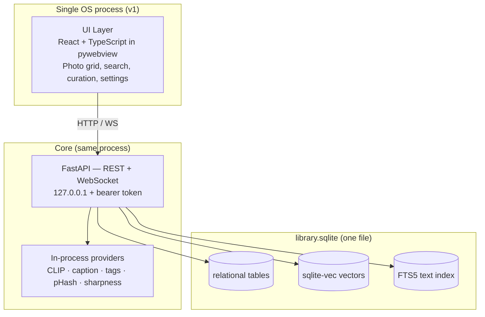

The detailed component map below retains the full logical decomposition. Read it as *modules and interfaces*, not as processes: in v1 every box inside "Core Application Service" and "AI Provider Processes" runs in the one process above, and the Connector Layer is v1.1/v2 scope.

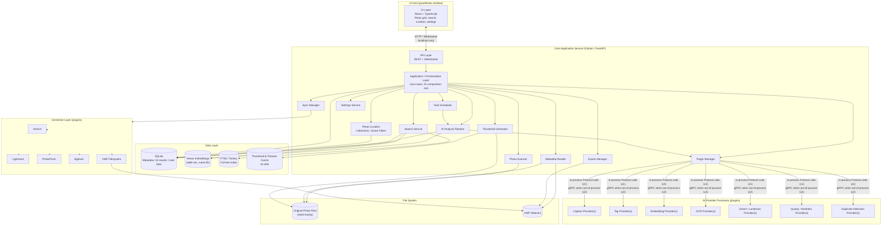

### 2.2 Process topology

*Revised in v1.1 — see ADR-0002.*

**v1 runs as a single OS process.** A `pywebview` window (backed by WebView2 on Windows, WebKitGTK on Linux, WKWebView on macOS) displays the React UI, which is served as a static build by the same FastAPI application that owns the domain logic. Uvicorn runs on a background thread within that process, bound to `127.0.0.1` on a fixed port, and every request carries a per-launch bearer token held in memory — the token prevents other local processes or visited web pages from reaching the API, and because UI and API share a process it never needs to be written to disk or passed through stdin.

This is deliberately one process rather than three. The UI is nonetheless a plain web client talking HTTP to a plain HTTP server, so the split into separate processes — and ultimately into a remote client and a server on another machine — remains a deployment change rather than a rewrite.

**Deferred process topology (v1.1+):** replacing `pywebview` with Tauri or Electron for a smaller signed installer changes only the window host, because the UI is already web technology over HTTP.

**Deferred process topology (v2):** third-party plugins run as isolated child processes (§8). No v1 plugin is third-party, so v1 spawns no child processes.

The UI technology, the core business-logic language, and the AI runtime remain **three independent axes** — the boundaries are interfaces and HTTP, not process boundaries, which is what preserves loose coupling without paying for process supervision in v1.

### 2.3 Layering & dependency direction

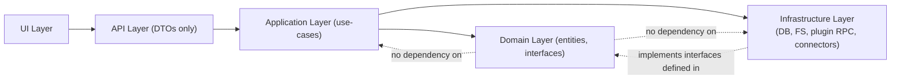

This is a standard **Clean/Hexagonal Architecture** applied inside the Core Service: the `domain` package defines interfaces (`Protocol` classes) such as `CaptionProvider`, `EmbeddingProvider`, `SearchIndex`, `Connector`, `FileOperationExecutor`; the `infrastructure` package provides concrete implementations; the `application` package orchestrates use-cases against the interfaces only, never against concrete infrastructure classes. This is what makes "swap SQLite for Postgres later" or "swap ONNX Runtime for a new inference engine" a localized change (see [Section 15](#15-future-architecture)).

---

## 3. Technology Evaluation

For each concern: recommendation, advantages, disadvantages, alternatives considered, and why the alternatives were rejected.

### 3.1 Programming language (core service)

**Recommendation: Python 3.12+**

| | |
|---|---|
| Advantages | Unmatched AI/ML ecosystem (PyTorch, ONNX Runtime, transformers, OpenCV, Pillow bindings, rawpy); fastest path from "new model released" to "integrated provider"; huge library coverage for EXIF/RAW/image formats; excellent for AI coding agents to read/modify (extremely common training distribution); async support (asyncio) sufficient for an I/O-bound orchestration core; cross-platform. |
| Disadvantages | GIL limits true CPU parallelism within one process — mitigated by the fact that Pillow, rawpy/LibRaw, OpenCV and NumPy all **release the GIL** while executing native code, which is where essentially all of the time in scanning, hashing, decoding and thumbnailing is spent, so `asyncio.to_thread` captures nearly all available parallelism (revised in v1.1 — v1.0 reached for `ProcessPoolExecutor` here; see §3.9 and ADR-0005); slower raw execution than compiled languages for tight loops (mitigated by delegating hot paths to native libraries: OpenCV, NumPy, Pillow-SIMD, LibRaw — all C/C++ under the hood); packaging a Python app as a single-binary desktop install requires freezing (PyInstaller/Nuitka), an extra build step. |
| Alternatives considered | **Rust** (excellent performance/memory-safety, but the AI/ML ecosystem is far thinner — most new model releases ship PyTorch/ONNX weights with Python reference code, so a Rust core would spend significant effort re-implementing or FFI-wrapping inference; would slow "new provider added with minimal code change" — directly against the PRD's extensibility principle). **C#/.NET** (strong Windows story via WPF/MAUI, ML.NET exists but is a distant second-class citizen to the Python ML ecosystem; would also bias the architecture toward Windows, contradicting the portability goal). **Go** (excellent concurrency and single-binary deploys, but minimal ML ecosystem — would require FFI/subprocess to Python anyway, so no benefit over "Python core with native-library hot paths"). |
| Rejection rationale | All three alternatives would still need to shell out to Python (or bind C/C++ inference libraries) for state-of-the-art AI models, so choosing them as the *orchestration* language buys memory-safety/perf at the cost of a second language boundary for the app's actual core value proposition (AI analysis). Python already gets adequate performance for orchestration by delegating CPU-bound work to native-backed libraries and process pools. |
| Trade-off accepted | Slightly heavier packaging pipeline (frozen executable) and a GIL-aware concurrency model, in exchange for maximal AI-model integration velocity — which is the PRD's top stated priority ("AI First"). |

### 3.2 Desktop UI framework

*Rewritten in v1.1. **Supersedes** the v1.0 Tauri recommendation — see ADR-0002.*

**Recommendation: React + TypeScript, served by the core service and displayed in a `pywebview` window.**

| | |
|---|---|
| Advantages | Removes Rust and its toolchain from the project entirely — v1 has two languages instead of three, and no process-supervision or handshake code. The window host is roughly thirty lines. Debugging is a single Python debugger plus WebView2 devtools, both natively supported in VS Code on Windows. React remains the UI stack with the deepest ecosystem for data-dense views and the highest AI-agent fluency, which matters directly given that implementation is primarily AI-agent-driven. One UI codebase serves the desktop window today and the future web/mobile clients unchanged. |
| Disadvantages | Thumbnails are delivered over local HTTP rather than read directly from disk, so a caching endpoint is required (§16.7) — the same approach Immich and PhotoPrism take, and a single small module. `pywebview` has a smaller maintainer base than Tauri or Electron; mitigated by the shell being trivially small and swappable. The v1 installer is larger than a Tauri build. |
| Alternatives considered | **Tauri** — the v1.0 recommendation, reversed for v1: its benefits are installer size, a native shell, and a code-signing story, all of which arrive at distribution time, while its costs (a third language, process supervision, a stdin port/token handshake) are paid on day one. It remains the recommended **v1.1** packaging upgrade, and because the UI is already web technology over HTTP, adopting it later replaces the window host only. **Electron** — same reasoning with a larger runtime footprint. **PySide6/Qt** — genuinely the strongest single-language alternative and the better choice for a team that will never want a web or mobile client: one process, one language, no HTTP layer at all, and `QListView` in icon mode is purpose-built for a very large thumbnail grid backed by a model. Rejected because the PRD anticipates a web interface and mobile companion that Qt would require a second UI to serve, and because AI-agent output quality for React is materially higher. **.NET MAUI/WPF** — rejected on portability grounds as before. |
| Rejection rationale | The v1.0 reasoning for Tauri was sound on its own terms but weighed the wrong milestone: it optimised for distribution polish while the stated first milestone is a working application. The reversal removes a language from the critical path without foreclosing anything — Tauri, Electron, and even Qt all remain reachable, and the first two require no UI changes at all. |
| Trade-off accepted | Thumbnails travel over loopback HTTP instead of direct file reads, and the v1 installer is larger — in exchange for deleting an entire language and toolchain from the path to a working application, with a clean upgrade route when installer polish matters. |

### 3.3 Backend/core framework

**Recommendation: FastAPI**

| | |
|---|---|
| Advantages | Async-native (fits an I/O-heavy orchestration core coordinating DB, file I/O, and RPC to plugin processes); Pydantic-based request/response models give free validation and directly reuse the same models as `pydantic-settings` config and internal DTOs; auto-generated OpenAPI schema is useful both for the TypeScript UI (typed client generation) and for third-party tooling; WebSocket support out of the box for streaming job progress to the UI. |
| Disadvantages | Overkill-looking for a "local-only" API at first glance (mitigated: the same API surface is what enables the "optional web interface / remote worker" future path in [Section 15](#15-future-architecture) with zero rework). |
| Alternatives considered | **Flask** (simpler, but sync-first — WebSocket/streaming progress needs extensions, less natural fit). **gRPC as the primary UI-facing API** (great typed contracts and streaming, but browsers/webviews need grpc-web plus a proxy, adding complexity for no benefit over REST+WebSocket at this trust boundary — the UI and core are on the same machine, so raw performance of gRPC vs HTTP/JSON is not the bottleneck). **Litestar** (comparable to FastAPI, smaller ecosystem/community, less battle-tested tooling for typed client generation). |
| Rejection rationale | gRPC's main strengths (strict schemas, binary efficiency, native streaming) matter more at the **core ↔ plugin** boundary, where high-throughput structured data (embeddings, batches of tags) crosses a process boundary many times per second — that is where this document *does* recommend gRPC (see [Section 3.11](#311-inference-engine) and [Section 8](#8-plugin-system)). At the **UI ↔ core** boundary, simplicity and browser/webview compatibility win. |
| Trade-off accepted | None significant; FastAPI is close to a dominant choice for this role. |

### 3.4 Relational database

**Recommendation: SQLite (WAL mode) via SQLAlchemy 2.0 + Alembic**

| | |
|---|---|
| Advantages | Zero-install, single-file, embedded — matches "offline-first desktop app" perfectly (no server process to manage, back up as a file copy); WAL (write-ahead log) mode allows concurrent readers while a writer is active, which matters because the UI queries the DB while background AI jobs write results; extremely well understood, decades of production hardening; trivially portable across Windows/macOS/Linux; SQLAlchemy + Alembic give a familiar ORM/migration workflow that is easy for an AI coding agent to extend module-by-module. |
| Disadvantages | Single-writer at a time (WAL mitigates most contention, but sustained high-frequency writes from many parallel AI workers need to funnel through a single writer connection/queue — addressed directly in [Section 5.5](#55-write-concurrency-strategy)); no native network access for multi-machine deployment (acceptable now, addressed as a pluggable swap in [Section 15](#15-future-architecture)). |
| Alternatives considered | **PostgreSQL** (superior write concurrency, richer indexing (GIN, native vector via pgvector) — but requires a running server process, which is a poor fit for "install and go" desktop software and directly increases the support burden of "what if the DB service won't start"). **DuckDB** (excellent OLAP/analytics performance, columnar — but is optimized for bulk analytical scans, not the transactional row-level upsert pattern of "scan found 200 new files, write 200 rows, an AI job updates one row's caption" that dominates this app's write pattern). |
| Rejection rationale | PostgreSQL's advantages only matter at multi-machine or extremely high concurrent-write scale, neither of which is this application's primary deployment target (a single-user desktop app, even with a 5M-photo library, is not write-contended in the way a multi-tenant server is). DuckDB was rejected because its sweet spot (large scans/aggregations) is not the dominant workload; SQLite with proper indexing handles point lookups and incremental upserts better for this access pattern. Both remain valid **pluggable alternatives** behind the repository interface for future NAS/server deployment. |
| Trade-off accepted | A disciplined single-writer pattern must be engineered explicitly (queued writes) rather than relying on the database to handle contention — this is designed in [Section 5.5](#55-write-concurrency-strategy) and [Section 11](#11-background-processing). |

### 3.5 Vector search

*Rewritten in v1.1. **Supersedes** the v1.0 LanceDB recommendation — see ADR-0003.*

**Recommendation: `sqlite-vec`, in the same database file as all other data.**

| | |
|---|---|
| Advantages | Vectors live in the application's single SQLite file, so there is one storage engine, one backup (a file copy), one integrity check, and one rebuild path. Vector similarity can be combined with metadata filters in a single SQL statement instead of intersecting result sets across two engines. One fewer dependency to package and freeze into the installer. Comfortable to roughly a million vectors — the entire v1 target range. |
| Disadvantages | Search degrades beyond a few million vectors. Accepted for v1 and tracked as TD-01 with an explicit payment trigger: a real library above ~750k photos, or p95 semantic search above 500 ms. |
| Alternatives considered | **LanceDB** — the v1.0 recommendation, and genuinely the correct choice above roughly a million vectors. Retained as the planned **v2** migration behind the unchanged `EmbeddingIndex` interface. Rejected for v1 because a second storage engine costs a second consistency and backup story before any user has a library large enough to benefit. **Offering both, selectable in Settings** — what v1.0 actually proposed, and the worst option: it doubles the test matrix and makes behaviour configuration-dependent, for a choice no user is equipped to make. **Qdrant/Milvus/Weaviate** — server processes, incompatible with a zero-service desktop install. **Chroma** — embedded but weaker at scale than LanceDB, so it wins on neither axis. **FAISS** — an index without persistence or metadata storage. |
| Rejection rationale | v1.0 justified LanceDB by citing the PRD's million-photo target, but that is a *ceiling* the architecture must eventually reach, not the v1 library size. Choosing the engine for the ceiling meant paying for a second storage system from the first commit. The `EmbeddingIndex` interface makes reaching that ceiling later a contained change, which is precisely what the interface exists for. |
| Trade-off accepted | A known ceiling around one million vectors, reached only by libraries larger than v1 targets, in exchange for a genuinely single-file database. |

Application code depends on the **`EmbeddingIndex` interface**, never on `sqlite-vec` directly. The schema column recording a vector's key is named `vector_key` — deliberately vendor-neutral, correcting v1.0's `lancedb_key`.

#### 3.5.1 LanceDB migration (deferred — v2 design)

When TD-01's trigger is met, implement `LanceEmbeddingIndex` against the same interface, add a one-way migration job that re-reads `embedding_ref` rows and populates the Lance table, and switch the composition root. Embeddings are derived data, so the migration can also simply re-run analysis if that proves simpler than transferring vectors.

### 3.6 Full-text search

*Revised in v1.1 — v1 ships exactly one full-text implementation.*

**Recommendation: SQLite FTS5. Only FTS5.**

| | |
|---|---|
| Advantages | Built into SQLite — zero new dependency; kept in sync with the metadata and AI-result tables via SQL triggers; ships with BM25 ranking; more than sufficient for hundreds of thousands of caption/tag/filename documents. |
| Disadvantages | Ranking and tokenization are more basic than dedicated search engines (no stemming, limited CJK segmentation — tracked as TD-09); performance degrades, though remains usable, well past a few million documents with complex queries. |
| Alternatives considered | **Tantivy** — a **deferred v2 migration** behind the same `TextSearchIndex` interface, to be undertaken only if profiling against a real library shows FTS5 is the bottleneck. v1.0 named it an "upgrade path," which in practice invited building both; it is now explicitly out of v1 scope. **Meilisearch/Typesense** — server processes; rejected for the same zero-service reasoning as elsewhere. **Elasticsearch/OpenSearch** — a JVM server, wildly disproportionate to a single-user desktop application. |
| Rejection rationale | Unchanged from v1.0 for the server-based engines. What changed is that v1 no longer carries a second implementation "just in case": TD-09 records the limitation, and the first remediation attempt is FTS5's own tokeniser options (which handle stemming and CJK adequately for many cases) before Tantivy is considered at all. |
| Trade-off accepted | Basic tokenisation in v1, with a recorded trigger for improving it, in exchange for one full-text implementation instead of two. |

### 3.7 Programming interfaces for AI: model & provider abstraction

Covered in depth in [Section 6](#6-ai-architecture).

### 3.8 Image processing

**Recommendation: Pillow + pillow-heif, rawpy/LibRaw, OpenCV, ExifTool (subprocess)**

| | |
|---|---|
| Advantages | Pillow covers standard formats (JPEG/PNG/TIFF/WebP) with wide format support and a mature plugin model (pillow-heif adds HEIC/HEIF, common on iPhone photos); rawpy (LibRaw bindings) covers essentially every camera RAW format for thumbnail/preview generation; OpenCV supplies perceptual hashing (pHash/dHash for duplicate detection), blur detection (Laplacian variance), and other CV primitives needed for quality analysis; ExifTool (Phil Harvey's tool, industry standard) has unmatched breadth of EXIF/IPTC/XMP metadata support across manufacturer-specific RAW makernotes, is the de facto standard other photo tools (digiKam, Lightroom plugins) also rely on for edge-case format correctness. |
| Disadvantages | ExifTool is an external Perl-based binary, not a Python library — invoked as a subprocess. **v1 runs one persistent process in `-stay_open` mode**, which eliminates per-file spawn cost; a pool of such processes is an optimisation to add only if measurement justifies it (revised in v1.1 — v1.0 specified a pool upfront). |
| Alternatives considered | **pyexiv2** (C++ Exiv2 bindings — good performance and no subprocess overhead, but materially narrower format coverage than ExifTool, especially for newer or obscure RAW makernotes). v1.0 proposed using it as a fast path with ExifTool as fallback; **that dual path is removed in v1.1** — two metadata implementations double the surface on which format-specific bugs can differ, for a startup cost a single persistent process already eliminates. **Wand/ImageMagick** (broad format support, but a heavier binary dependency with more CVEs to track). |
| Rejection rationale | No single Python-native library matches ExifTool's format coverage; the subprocess cost is an acceptable, well-understood trade-off (every major photo tool needing full metadata fidelity ends up bundling or shelling out to ExifTool). ExifTool is therefore the **single** metadata implementation. |
| Trade-off accepted | ExifTool must be bundled and version-pinned; its version is recorded in the diagnostics bundle (§16.5) so an unsupported-format report is immediately actionable. A background contributor task tracks ExifTool releases for new camera support. |

### 3.9 Background jobs

*Revised in v1.1 — see ADR-0005.*

**Recommendation: `asyncio` runner with SQLite-backed durable `job`/`job_item` tables; `asyncio.to_thread` for CPU-bound work.**

| | |
|---|---|
| Advantages | No external broker process — jobs persist in SQLite, so an interrupted scan or AI batch resumes exactly where it stopped after a crash or restart; domain-specific semantics (percentage progress, cooperative cancellation, interactive-vs-background priority) are simple to model directly rather than through a generic library's abstractions. |
| Disadvantages | More code to own than adopting a library (mitigated: it is a small state machine — see [Section 11](#11-background-processing) — with an intentionally narrow scope). |
| Concurrency model | CPU-bound work (hashing, decoding, thumbnailing) runs via **`asyncio.to_thread`**, not `ProcessPoolExecutor`. v1.0 specified a process pool on the reasoning that the GIL prevents parallelism, but Pillow, rawpy/LibRaw, OpenCV, and NumPy all release the GIL while executing native code — which is where essentially all of the time in these operations is spent, so threads capture nearly all the available parallelism. On Windows specifically, `multiprocessing` uses spawn semantics: module re-import per worker, picklable-only arguments, no shared database connection, and awkward debugger attachment. For a Windows-first, VS-Code-developed, agent-implemented project that is a recurring tax on the code paths needing the most iteration. A process pool remains a contained change if a profile ever shows GIL contention dominating rather than native execution. |
| Alternatives considered | **Celery** (mature but broker-based — a running server process, contradicting zero-install offline-first). **Dramatiq/RQ** (lighter, still broker-based). **Huey** (has a SQLite backend, the closest fit — but its job model does not natively express resumable, percentage-granular jobs without customisation that erodes the benefit of adopting a library). **APScheduler** (good for periodic triggers; complementary for scheduled rescans, not the execution engine). |
| Rejection rationale | Every mature queue library assumes a broker server is acceptable; this application's core constraint rules that out. The needed semantics are specific enough that a thin layer over `asyncio` plus two SQLite tables is less code than adapting a generic library. |
| Trade-off accepted | The project owns the queue's correctness (idempotent resume, crash recovery), mitigated by a dedicated test suite simulating crashes mid-batch (see [Section 14](#14-testing-strategy)). A native-library crash in a worker thread takes the process down, where a process pool would have contained it — the same exposure as in-process providers, tracked once as TD-02. |

### 3.10 Configuration

**Recommendation: pydantic-settings + TOML file**

| | |
|---|---|
| Advantages | Typed, validated configuration objects shared between the running app and its own tests; TOML is human-readable/editable (users can hand-edit `config.toml` for advanced settings); layered resolution (defaults → file → environment variable → CLI flag) is built in. |
| Disadvantages | None material for this use case. |
| Alternatives considered | **YAML** (also human-friendly, but has well-known footguns — implicit type coercion, e.g. `no`/`yes` parsed as booleans — TOML's stricter grammar avoids this). **JSON** (unambiguous but not comment-friendly/hand-editable for end users). **dynaconf** (also strong, but pydantic-settings integrates directly with the rest of the FastAPI/Pydantic-based codebase with no translation layer). |
| Rejection rationale | TOML is the modern standard for this exact use case (it's what Cargo, pyproject.toml, and many desktop apps use) and pydantic-settings removes an entire class of "config had the wrong type and blew up deep in the AI pipeline" bugs by validating at load time. |
| Trade-off accepted | None significant. |

### 3.11 Logging

**Recommendation: structlog, JSON structured output + human-readable console renderer in dev**

| | |
|---|---|
| Advantages | Structured (key-value) logs are essential for diagnosing an offline, unattended AI pipeline running for hours across thousands of photos — "which job id, which photo id, which provider version failed" needs to be machine-filterable, not grep'd from prose; integrates cleanly with Python's standard `logging` so third-party library logs are captured too. |
| Disadvantages | Slightly more setup than `print`/basic `logging` (one-time cost). |
| Alternatives considered | **loguru** (very ergonomic, but structured-context propagation across async tasks/process pools is more naturally modeled in structlog's context-var based binding). **Standard library `logging` alone** (workable, but structured context binding requires more boilerplate per call site). |
| Rejection rationale | The dominant debugging need here is "trace one photo's journey through a multi-stage async pipeline across process boundaries," which structured, contextual logging is specifically designed for. |
| Trade-off accepted | None significant. |

### 3.12 Dependency injection

*Rewritten in v1.1. **Resolves** the open question v1.0 left here — see ADR-0008.*

**Recommendation: `Protocol`-based interfaces + explicit manual composition in a single `composition.py`. No DI framework.**

| | |
|---|---|
| Advantages | One module constructs concrete implementations and wires them together; every other module receives its collaborators as constructor arguments typed as `Protocol`s. Tests substitute fakes by passing different arguments — no framework, no new concept, no dependency. An agent reading any module sees its real collaborators in the constructor signature, and coupling is visible and greppable in one file. |
| Disadvantages | `composition.py` grows as modules are added and must stay organised. That visibility is the point, not a defect. |
| Alternatives considered | **`dependency-injector`** — the v1.0 recommendation, withdrawn. Its advantage was declarative test-time overrides; the same substitution is achieved by passing a different constructor argument. **Service locator / global registry** — hides dependencies rather than inverting them and makes test isolation harder. **FastAPI's `Depends`** — used for request-scoped concerns at the API boundary where it is idiomatic, and *not* for application-layer wiring, which must stay independent of the web framework. |
| Rejection rationale | v1.0 described this choice as "a close call" and named manual composition "an acceptable equivalent." An approved design document must not leave a genuine either/or to the implementer: with multiple agents implementing tasks independently, the predictable outcome is both patterns appearing in the same codebase. The decision is now settled in favour of the option with fewer dependencies and fewer concepts. |
| Trade-off accepted | Wiring is written by hand rather than declared, in exchange for one fewer dependency and the removal of an ambiguity that would have produced two competing patterns. |

### 3.13 Testing

**Recommendation: pytest, pytest-asyncio, Hypothesis, Playwright, custom synthetic-library harness**

Covered in full in [Section 14](#14-testing-strategy).

### 3.14 Packaging & installer

*Revised in v1.1 — Windows-only for v1; no Tauri bundler.*

**Recommendation: PyInstaller-frozen application (Python core + React static build + `pywebview` shell in one executable tree), packaged with Inno Setup for Windows.**

| | |
|---|---|
| Advantages | End users never install Python — the application ships as a self-contained frozen executable tree. One artefact contains everything, because v1 is a single process (§2.2): there is no separate core binary for a shell to spawn. Inno Setup is the simplest mature Windows installer toolchain and produces a single `.exe` installer with no additional language or build system. |
| Disadvantages | Frozen Python with ML libraries is large — mitigated by importing heavy ML dependencies lazily (only when a provider that needs them is first invoked) and by shipping model weights as a first-use download with an offline-import path (§16.4) rather than bundling them. Inno Setup is Windows-only, so v1.1 needs a second toolchain per additional OS. |
| Alternatives considered | **Tauri's bundler** (v1.0's recommendation) — produces MSI/NSIS/.dmg/.deb/AppImage from one configuration, which is genuinely attractive; it returns as the **v1.1** packaging upgrade together with the Tauri shell (ADR-0002), at which point it replaces both this row and Inno Setup. Rejected for v1 only because adopting it means adopting Rust. **MSIX** (modern Windows packaging with clean uninstall and update semantics — worth revisiting for v1.1 alongside code signing; rejected now as more ceremony than a first release needs). **PyOxidizer** (less actively maintained). **Shipping a Python installer + venv bootstrap** (rejected — a fragile "installing environment" step that fails disproportionately on locked-down corporate Windows machines). |
| Rejection rationale | A self-contained frozen binary remains the only option consistent with install-and-go desktop UX. What changed is the packaging *toolchain*, which follows from removing Rust rather than from any new reasoning about distribution. |
| Trade-off accepted | Windows-only packaging in v1 and a larger installer than a Tauri build would produce. Cross-platform packaging is v1.1 work; nothing in the v1 stack is Windows-specific (ADR-0010), so it is a packaging exercise rather than a port. |

---

## 4. Module Design

Each module is described by **Responsibilities**, **Public Interface** (the `Protocol`/ABC other modules depend on — concrete classes are named but treated as swappable), **Dependencies**, and **Extension Points**.

### 4.1 Photo Scanner

- **Responsibilities**: walk configured library roots; detect new/modified/deleted/moved files via path + mtime + content hash (xxHash for speed, not cryptographic); emit `FileDiscovered`/`FileChanged`/`FileRemoved` events onto the job queue; respect include/exclude glob rules and supported-format allowlist; never touch file contents beyond reading bytes for hashing.
- **Public interface**:
  ```python
  class PhotoScanner(Protocol):
      async def scan_roots(self, roots: list[LibraryRoot]) -> ScanSummary: ...
      async def watch(self, roots: list[LibraryRoot]) -> AsyncIterator[FileSystemEvent]: ...
  ```
- **Dependencies**: File System abstraction (`fsspec`-style wrapper, to keep a door open for future network volumes), Job Scheduler (to enqueue downstream work), `jobs`/`files` tables.
- **Extension points**: pluggable `ChangeDetectionStrategy` (mtime+size default, content-hash strict mode, future: OS-native file-watch APIs per platform for live updates instead of polling).

### 4.2 Metadata Reader

- **Responsibilities**: extract EXIF/IPTC/existing-XMP metadata for a file; normalize into the canonical `PhotoMetadata` schema; read existing XMP sidecars if present and merge/reconcile with embedded metadata (embedded wins for camera-technical fields, sidecar wins for user-authored fields already present from other tools).
- **Public interface**:
  ```python
  class MetadataReader(Protocol):
      async def read(self, file_ref: FileRef) -> PhotoMetadata: ...
  ```
- **Dependencies**: ExifTool subprocess pool (batched `-stay_open`), pyexiv2 fast-path, `metadata` table.
- **Extension points**: `MetadataProvider` plugin type (see [Section 8](#8-plugin-system)) for camera- or format-specific enrichment (e.g., a drone-flight-log provider, a manufacturer lens-database provider).

### 4.3 Thumbnail Generator

- **Responsibilities**: produce fixed-size thumbnail(s) and a larger preview image per photo (including RAW demosaic via LibRaw and HEIC decode) for fast grid rendering; write to the on-disk cache (never the DB) keyed by `photo_id` + `content_hash` + `size_bucket`; invalidate/regenerate on file content change.
- **Public interface**:
  ```python
  class ThumbnailGenerator(Protocol):
      async def ensure_thumbnail(self, file_ref: FileRef, size: ThumbSize) -> CachePath: ...
      async def ensure_preview(self, file_ref: FileRef) -> CachePath: ...
  ```
- **Dependencies**: Pillow/rawpy/pillow-heif, on-disk Cache Manager, `files` table (for content hash).
- **Extension points**: pluggable renderer per format family (default raster path vs. a future RAW-specific GPU-accelerated decoder).

### 4.4 AI Analysis Pipeline

- **Responsibilities**: the orchestration spine — for a given photo and the set of *enabled* AI modules, invoke each provider (via Plugin Manager), persist structured results, and trigger downstream index updates (vector + FTS). Each stage is independently enable/disable-able per the PRD. Tracks provider+model **version** per stored result so re-running with a new model version doesn't destroy prior results (append, don't overwrite).
- **Public interface**:
  ```python
  class AnalysisPipeline(Protocol):
      async def run(self, photo_id: PhotoID, modules: set[AIModuleType]) -> AnalysisResult: ...
      async def run_batch(self, photo_ids: Iterable[PhotoID], modules: set[AIModuleType]) -> AsyncIterator[AnalysisResult]: ...
  ```
- **Dependencies**: Plugin Manager, Task Scheduler (for batching/GPU scheduling), `ai_results`/`embeddings` tables, Search Service (index update).
- **Extension points**: this *is* the extension point host — new `AIModuleType` values and their providers plug in here without modifying the pipeline's control flow (see [Section 6](#6-ai-architecture)).

### 4.5 Embedding Service

- **Responsibilities**: thin, focused wrapper specifically for embedding generation + storage/query, separated from the general pipeline because embeddings have a distinct storage engine (LanceDB) and query pattern (ANN similarity) from other AI results.
- **Public interface**:
  ```python
  class EmbeddingService(Protocol):
      async def embed(self, photo_id: PhotoID, provider: str) -> None: ...
      async def similar_to(self, photo_id: PhotoID, k: int) -> list[ScoredPhoto]: ...
      async def embed_text(self, query: str, provider: str) -> Vector: ...
  ```
- **Dependencies**: Embedding Provider (CLIP-family), `EmbeddingIndex` repository (backed by `sqlite-vec` in v1 — ADR-0003).
- **Extension points**: multiple embedding spaces coexist (e.g., a general CLIP space and a face-embedding space) as separate LanceDB tables, selected by `provider` key.

### 4.6 Search Service

- **Responsibilities**: unify metadata filters, full-text query, and vector similarity into ranked results; incremental index maintenance as photos/AI results change. Full design in [Section 7](#7-search-architecture).
- **Public interface**:
  ```python
  class SearchService(Protocol):
      async def search(self, query: SearchQuery) -> SearchResults: ...
      async def index_photo(self, photo_id: PhotoID) -> None: ...
  ```
- **Dependencies**: SQLite (metadata filters), `TextSearchIndex` (FTS5 in v1), `EmbeddingIndex` (`sqlite-vec` in v1), Embedding Service (query embedding for NL search).
- **Extension points**: `SearchProvider` plugin type for entirely new ranking/retrieval strategies (see [Section 8](#8-plugin-system)).

### 4.7 Plugin Framework (Plugin Manager)

- **Responsibilities**: discover, validate, load/unload, version, and sandbox plugins across all plugin categories (AI providers, connectors, importers/exporters, search providers, metadata providers, file-operation extensions); own the RPC transport to out-of-process plugins; enforce capability permissions (a plugin declares what it needs — filesystem read, network — and the user approves per-plugin). Full design in [Section 8](#8-plugin-system).
- **Public interface**:
  ```python
  class PluginManager(Protocol):
      async def discover(self) -> list[PluginManifest]: ...
      async def load(self, plugin_id: str) -> PluginHandle: ...
      async def unload(self, plugin_id: str) -> None: ...
      def get_provider(self, capability: CapabilityType, provider_id: str) -> Any: ...
  ```
- **Dependencies**: plugin manifest schema validator, `plugin` table (enabled/disabled state). **v1**: in-process instantiation only — no gRPC stubs, no permission storage (ADR-0004).
- **Extension points**: itself the extension mechanism for the rest of the system.

### 4.8 Collection Manager

- **Responsibilities**: CRUD for virtual collections (manual membership) and smart collections (saved `SearchQuery` evaluated live); membership never implies file movement.
- **Public interface**:
  ```python
  class CollectionManager(Protocol):
      async def create(self, spec: CollectionSpec) -> Collection: ...
      async def add_members(self, collection_id: CollectionID, photo_ids: list[PhotoID]) -> None: ...
      async def evaluate_smart(self, collection_id: CollectionID) -> list[PhotoID]: ...
  ```
- **Dependencies**: `collections`/`collection_items` tables, Search Service (for smart collections).
- **Extension points**: pluggable `SmartCollectionRule` types beyond raw search queries (e.g., a "burst group" rule, a "near-duplicate cluster" rule) contributed by AI providers that detect groupings.

### 4.9 Sync Manager

- **Responsibilities**: orchestrate outbound (export AI intelligence to a connector) and inbound (pull ratings/collections a user set in Lightroom/digiKam back in, where the connector supports it) synchronization; conflict resolution favoring "local AI database is source of truth" for AI-derived fields, last-write-wins with user surfacing for user-editable fields. Full design in [Section 9](#9-integration-layer).
- **Public interface**:
  ```python
  class SyncManager(Protocol):
      async def sync(self, connector_id: str, direction: SyncDirection) -> SyncReport: ...
  ```
- **Dependencies**: Connector plugins, `sync_state` table (per-photo, per-connector cursor/checksum).
- **Extension points**: new `Connector` implementations.

### 4.10 Export Manager

- **Responsibilities**: write user-selected fields (caption, tags, rating, keywords) to XMP sidecars (never into RAW originals); support export presets (e.g., "Lightroom-compatible keyword hierarchy"); batch export for collections.
- **Public interface**:
  ```python
  class ExportManager(Protocol):
      async def export_xmp(self, photo_ids: list[PhotoID], fields: XMPFieldSet) -> ExportReport: ...
  ```
- **Dependencies**: ExifTool (XMP writing), `export_history` table.
- **Extension points**: `ExporterProvider` plugin type for non-XMP export targets (e.g., a CSV/JSON metadata export, a static HTML gallery exporter).

### 4.11 Photo Curation

- **Responsibilities**: surfaces AI recommendations (screenshots, duplicates, low-quality, burst groups) as actionable, user-confirmed batch operations; owns the safety/undo model for file operations. Full design in [Section 10](#10-photo-curation).
- **Dependencies**: AI Analysis Pipeline results, Collection Manager, File Operation Executor.
- **Extension points**: new recommendation types contributed by any provider that emits a "grouping suggestion."

### 4.12 Settings

- **Responsibilities**: typed, validated app configuration (library roots, enabled AI modules, provider selection per capability, GPU preferences, cache size limits, connector credentials — stored via OS keychain, never plaintext in the config file).
- **Public interface**:
  ```python
  class SettingsService(Protocol):
      def get(self) -> AppSettings: ...
      async def update(self, patch: SettingsPatch) -> AppSettings: ...
  ```
- **Dependencies**: pydantic-settings, OS credential store (`keyring` library) for secrets.
- **Extension points**: plugins can register their own settings schema fragment, rendered dynamically in the Settings UI.

### 4.13 Task Scheduler

- **Responsibilities**: durable job queue, prioritization (interactive > background), GPU-affinity scheduling (only one GPU-bound job per available GPU device at a time; CPU-bound jobs parallelize across cores), cancellation, progress reporting, resume-after-crash. Full design in [Section 11](#11-background-processing).
- **Public interface**:
  ```python
  class TaskScheduler(Protocol):
      async def enqueue(self, job: JobSpec) -> JobID: ...
      async def cancel(self, job_id: JobID) -> None: ...
      def progress_stream(self) -> AsyncIterator[JobProgress]: ...
  ```
- **Dependencies**: `job`/`job_item` tables, `asyncio.to_thread` for CPU-bound work (ADR-0005), Provider Registry (for inference calls, guarded by the global semaphore — ADR-0009).
- **Extension points**: pluggable `SchedulingPolicy` (default priority policy vs. a future "only run AI jobs when the machine is idle/on AC power" policy).

### 4.14 Module dependency diagram

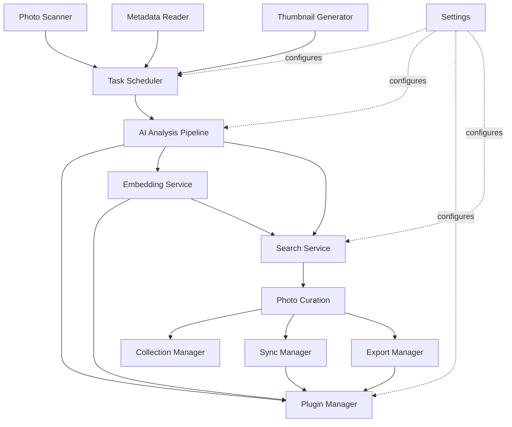

---

## 5. Database Design

### 5.1 Principles

- The database stores **references, metadata, and derived intelligence** — never original image bytes.
- Every AI-derived row is tagged with `provider_id` + `model_version`, so multiple providers/versions coexist (per PRD) and nothing is silently overwritten by a model upgrade.
- The schema is intentionally **append-friendly** for AI results (new rows per version) and **update-friendly** for user data (ratings, notes) and file index state.

### 5.2 Entity-relationship diagram

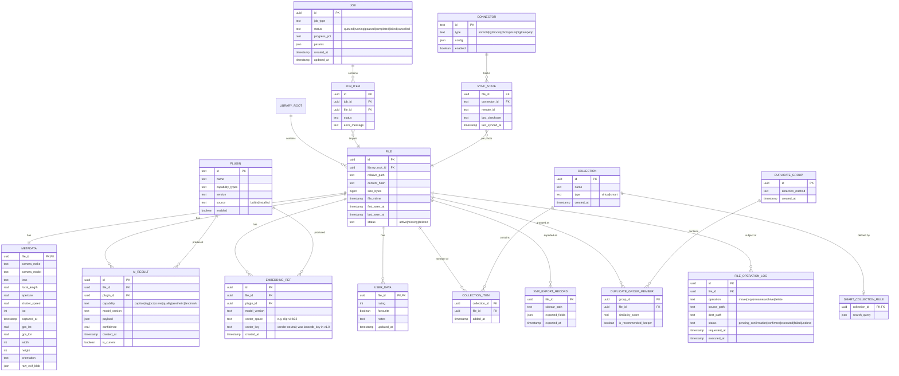

### 5.3 Indexing strategy

| Table | Index | Purpose |
|---|---|---|
| `file` | `(library_root_id, relative_path)` unique | fast path lookup, dedupe scans |
| `file` | `(content_hash)` | duplicate/move detection |
| `file` | `(status)` | filter active files quickly |
| `metadata` | `(captured_at)` | date-range browsing/search |
| `metadata` | `(gps_lat, gps_lon)` | map search (R-tree via SQLite `rtree` module) |
| `ai_result` | `(file_id, capability, is_current)` | fetch current result per capability fast |
| `ai_result` | `(plugin_id, model_version)` | reprocessing/migration queries |
| `embedding_ref` | `(photo_id, vector_space)` unique | one current embedding per space per photo |
| `metadata` | `(captured_at_local)` | date-range search uses the authoritative local time (§16.2) |
| `collection_item` | `(collection_id, file_id)` unique | membership checks |
| `duplicate_group_member` | `(file_id)` | "what group is this photo in" |
| `job_item` | `(job_id, status)` | resume/progress queries |

Full-text (FTS5) virtual tables shadow `ai_result.payload` (captions/tags text) and `metadata` (camera/filename text), kept in sync via SQL triggers on insert/update of `is_current` rows.

### 5.4 Versioning & migration strategy

- **Schema versioning**: Alembic migrations, linear history, one migration per PR that changes schema. Every migration must be a no-op on an empty DB (fresh install) and correct on an N-1 version DB (upgrade path) — both tested in CI.
- **Data versioning (AI results)**: never `UPDATE` an `ai_result` row in place when a new model version runs — `INSERT` a new row and flip `is_current` on the old row to `false`. This preserves full history for comparison/rollback and satisfies "multiple providers and versions coexist."
- **Destructive schema changes**: guarded by a pre-migration automatic backup (copy the SQLite file) before any migration that drops/renames a column, restorable if the migration fails partway (SQLite migrations run inside a transaction where DDL allows; the file-copy is the belt-and-suspenders for the cases where it doesn't).

### 5.5 Write concurrency strategy

*Rewritten in v1.1 — the queue machinery specified in v1.0 has been removed.*

SQLite in WAL mode permits concurrent readers alongside a single writer. v1 satisfies the single-writer requirement **structurally rather than with machinery**: all writes execute on the asyncio event loop through one write connection, and `PRAGMA busy_timeout` is set so any incidental contention waits rather than failing. Reads use separate pooled read-only connections, which WAL permits safely.

Because every write already funnels through one event loop, no queue, actor, or future-resolution layer is required. v1.0 specified that layer ahead of any measured contention; it is removed. Writes are batched by **transaction boundary at the use-case level** — one transaction per scan chunk or per AI batch, rather than per row — which is where batching actually pays.

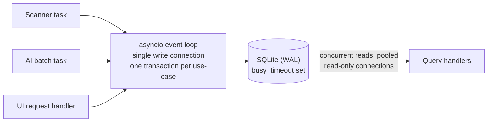

**Deferred (v2):** if profiling under a real multi-worker AI load shows the single event-loop writer is a bottleneck, reintroduce an explicit write queue with request coalescing (TD-05). Do not build it before that measurement exists.

---

## 6. AI Architecture

### 6.1 Provider & model abstraction

Two distinct abstraction levels are used deliberately:

- **Provider** = a plugin exposing one or more **capabilities** (`caption`, `tag`, `ocr`, `embedding`, `scene`, `landmark`, `color`, `duplicate`, `quality`/`aesthetic`). A provider is what the Plugin Manager loads/unloads/permissions.
- **Model** = the specific weights + runtime a provider uses internally to fulfill a capability (e.g., the `local-blip2` provider's `caption` capability is backed by a specific ONNX model file + version). Model choice is a provider implementation detail exposed only as metadata (`model_version`) for result versioning — the rest of the system never depends on which model a provider uses.

```python
class CaptionProvider(Protocol):
    async def caption(self, image: ImageRef, options: CaptionOptions) -> CaptionResult: ...

class EmbeddingProvider(Protocol):
    async def embed_image(self, image: ImageRef) -> Vector: ...
    async def embed_text(self, text: str) -> Vector: ...   # same space, for NL search

class TagProvider(Protocol):
    async def tag(self, image: ImageRef, options: TagOptions) -> list[TagResult]: ...

class OCRProvider(Protocol):
    async def read_text(self, image: ImageRef) -> OCRResult: ...

class QualityProvider(Protocol):
    async def assess(self, image: ImageRef) -> QualityResult: ...  # sharpness, exposure, aesthetic score
```

Every `*Result` DTO carries `provider_id`, `model_version`, `confidence`, and `raw_payload` (JSON) so the Analysis Pipeline can persist it generically without knowing capability-specific shapes.

**v1 capability set (revised in v1.1).** v1 implements five capabilities from **two** model downloads:

| Capability | v1 implementation | Model needed |
|---|---|---|
| `embedding` | CLIP-family via ONNX Runtime; image and text into one space | CLIP |
| `tag` | **Derived from the CLIP embedding**, scored against a precomputed label-vocabulary embedding set (ADR-0006) | none additional |
| `caption` | Vision-language model, opt-in, versioned prompt templates (§6.5) | captioner |
| `duplicate` | Perceptual hash (pHash/dHash) via OpenCV, grouped into `duplicate_group` | none |
| `quality` | Laplacian-variance sharpness + exposure statistics | none |

Deferring a dedicated tagging model means tags and semantic search share one inference pass per photo. `OCRProvider`, scene classification, landmark recognition, colour analysis, and aesthetic scoring are defined interfaces with **no v1 implementation** — see the PRD's release tiering. Adding any of them later requires no schema change, because `ai_result` is keyed by capability and provider version rather than by a column per capability.

### 6.2 Pipeline execution

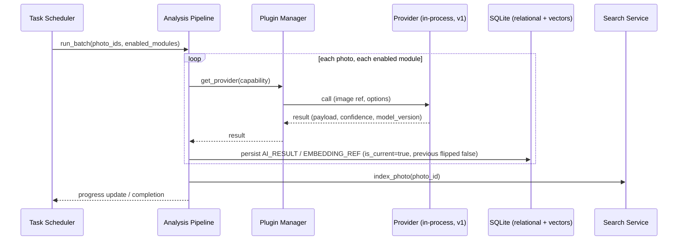

### 6.3 Scheduling and device selection

*Rewritten in v1.1 — see ADR-0009.*

v1 selects a device **once at startup**: ONNX Runtime's available execution providers are enumerated and the best available is chosen (CUDA → DirectML → CPU), overridable in Settings. **Concurrency control is a single global `asyncio.Semaphore(1)` around inference calls**, so at most one inference runs at a time regardless of device. CPU-bound preprocessing continues in threads (§3.9) alongside it.

This is intentionally not a scheduler. Batch size per provider call remains the provider's own concern, since providers know their memory footprint.

CPU-only operation is **not a fallback path** in v1 — it is the same code path with a different execution provider, so it is exercised by default in CI where no GPU exists. That is a stronger guarantee of the PRD's CPU-only requirement than a fallback branch that only runs when a GPU is absent.

#### 6.3.1 Resource manager (deferred — v2 design)

v1.0 specified a Resource Manager tracking GPU devices, enforcing per-device exclusive slots, tagging job items with resource classes (`cpu`, `gpu-preferred`, `gpu-required`), and applying CPU-fallback policy. It is deferred: the target machine is a single-user desktop with one GPU, where per-device slot scheduling has nothing to schedule and the resource-class taxonomy has one meaningful value. Build it when TD-04's trigger is met — a multi-GPU user, or batch throughput becoming the dominant complaint — at which point add multi-GPU awareness, per-device slots, resource classes, and idle/AC-power policies.

### 6.4 Model versioning & caching

*Revised in v1.1 — the composite hash is replaced by a declared version string.*

- Model weight files live in a local cache under the platform data directory (§16.1), downloaded on first enable of a provider that needs them, with an offline-import path for air-gapped installs (§16.4). Both paths produce identical results.
- **Each provider declares its own version string** — for example `clip-vit-b32@1` or `blip2-base@2` — recorded on every `ai_result`/`embedding_ref` row. A change of weights, runtime, or prompt template is a version-string change the provider author makes deliberately. v1.0 specified a composite hash of `(provider_id, weights_hash, runtime_version)`; that computed a precise answer to a question a declared string answers well enough, and required hashing multi-gigabyte model files at startup. Recorded as TD-07: if provider authorship ever extends beyond the core team, revisit — a third party can forget to bump a string in a way a content hash would have caught.
- Re-running a capability with a new version is an explicit user action ("Reprocess with updated model") that creates new rows rather than mutating old ones (see [Section 5.4](#54-versioning--migration-strategy)); the UI can then compare old and new results or bulk-adopt the new version. This mechanism is unchanged from v1.0 and is what satisfies the PRD's coexistence requirement.

### 6.5 Prompt management (for LLM/VLM-based providers)

For providers backed by vision-language models (captioning, natural-language-adjacent tagging), prompts are treated as **versioned provider assets**, not hardcoded strings: stored as templates (Jinja2) within the provider's own package, with a `prompt_version` field also folded into `model_version`'s hash so a prompt tweak is tracked exactly like a weights change. This keeps prompt engineering iteration auditable — a required property when results feed a searchable index that photographers will rely on for years.

### 6.6 Multi-provider coexistence

Because `AI_RESULT` and `EMBEDDING_REF` are keyed by `(file_id, capability/vector_space, provider_id, model_version)` rather than a single column per photo, the schema natively supports: running two captioning providers side by side (e.g., a fast local model for immediate feedback and a slower, higher-quality model as a background "upgrade pass"), per the PRD requirement that multiple providers/versions coexist.

---

## 7. Search Architecture

### 7.1 Query model

A single `SearchQuery` DTO unifies all search modes so the UI has one contract regardless of query complexity:

```python
@dataclass
class SearchQuery:
    text: str | None = None                 # natural language or keyword text
    filters: MetadataFilters | None = None  # date range, camera, rating, GPS bbox, etc.
    mode: Literal["metadata", "text", "semantic", "hybrid", "similar_to"] = "hybrid"
    reference_photo_id: PhotoID | None = None  # for "similar image" search
    limit: int = 100
    offset: int = 0
```

### 7.2 Hybrid retrieval & ranking

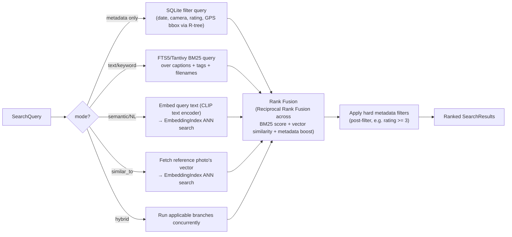

- **Ranking**: Reciprocal Rank Fusion (RRF) combines BM25 rank (text) and cosine-similarity rank (vector) without needing to normalize incomparable raw scores — a well-established, simple, tunable technique for hybrid search.
- **Filtering**: hard filters (date range, camera model, rating threshold, GPS bounding box) are applied as a SQL `WHERE` on the metadata/user_data tables and intersected with the candidate ID set from text/vector retrieval *before* final ranking, keeping filtered queries fast (filter first when selective, e.g., a narrow date range; retrieve-then-filter when the filter is broad).
- **Natural language search**: the query text is embedded with the same provider/model used for image embeddings (CLIP-style joint text/image space) — no separate LLM call needed for the common case; a future `NLQueryParserProvider` plugin can additionally translate "photos from last summer with my dog at the beach" into structured filters (date range + tag filters) layered on top of the semantic vector query.

### 7.3 Incremental indexing

- Every write to `ai_result`/`metadata`/`user_data` for a file enqueues a lightweight `index_photo(file_id)` task (debounced — rapid successive edits to the same photo coalesce into one re-index) rather than triggering a full rebuild.
- FTS5 triggers keep the text shadow table current at the SQL level for metadata/caption/tag changes; vector-index updates are explicit (`upsert` by `vector_key`) since the vector table isn't trigger-capable.
- A **full reindex** (rebuild the FTS and vector tables from `ai_result`/`metadata` current rows) is available as an explicit maintenance action for recovery after corruption or index-format upgrades — consistent with "the index is derived and rebuildable."

### 7.4 Search Provider plugin point

`SearchService` delegates actual retrieval to registered `SearchProvider` plugins per mode, so a third-party plugin could add e.g. a face-recognition-based "search by person" mode without modifying `SearchService` itself — it registers a new `mode` value and its own retrieval implementation, participating in the same RRF fusion stage.

---

## 8. Plugin System

*Scope rewritten in v1.1 — see ADR-0004. Sections 8.3–8.6 are **deferred v2 design**; do not implement them.*

### 8.0 v1 scope

**v1 has one plugin category and one loading mechanism.** AI capability providers are plain Python classes implementing the `Protocol`s in §6.1, declared in a `plugin.toml` manifest and instantiated in-process by a small registry. All v1 providers are first-party and ship with the application.

There is **no gRPC, no protobuf, no subprocess host, no health-checking, no idle recycling, and no permission model in v1**, because there is no untrusted code to isolate and nothing to negotiate permissions with. A provider that raises is caught by the Analysis Pipeline, which marks the affected `job_item` failed with an error code (§16.3) and continues — that is the whole of v1's fault isolation, and it is adequate for first-party code. The exposure it accepts (a native-library crash takes the process down) is recorded as TD-02, with the first observed occurrence as the trigger to build §8.3–8.6.

What v1 *does* keep is the **seam**: capability `Protocol`s, manifest-declared providers, and a registry resolving capability → provider. Adding out-of-process execution later means adding a second host behind that registry, not restructuring callers.

| Extension point | Tier | Note |
|---|---|---|
| AI capability providers (in-process) | **v1** | The only one built |
| Exporters | v1.1 | v1 ships XMP and copy-to-folder as ordinary modules, not plugins |
| Connectors | v1.1 (Immich) / v2 (others) | Interface defined when the second connector exists, not before |
| Out-of-process provider host + gRPC/protobuf | v2 | Required only for third-party code |
| Third-party plugin permissions and sandboxing | v2 | Ships with out-of-process hosting; neither is useful alone |
| Importers, Search providers, Metadata providers, File-operation extensions | v2 | No v1 consumer |

Deferring these is not a loss of extensibility. Extensibility is delivered by the `Protocol` seam, which exists in v1; the deferred material is *transport and isolation*, which only matters once code the user did not install with the application is executing.

### 8.1 Plugin categories (v2 target state)

| Category | Interface | Examples |
|---|---|---|
| AI Provider | `CaptionProvider`, `TagProvider`, `EmbeddingProvider`, `OCRProvider`, `QualityProvider`, `SceneProvider`, `DuplicateDetector` | local ONNX BLIP-2 captioner, CLIP embedder, PaddleOCR |
| Connector | `Connector` | Immich, Lightroom, PhotoPrism, digiKam, XMP filesystem |
| Importer | `Importer` | folder scan (built-in), mobile-device import, other DAM export import |
| Exporter | `ExporterProvider` | XMP sidecar (built-in), static gallery, CSV/JSON metadata dump |
| Search Provider | `SearchProvider` | metadata/text/semantic (built-in), future face-search |
| Metadata Provider | `MetadataProvider` | drone flight-log enrichment, lens database |
| File Operation | `FileOperationExtension` | custom rename-pattern engine, custom archive-naming scheme |

### 8.2 Plugin manifest & discovery

Each plugin ships a manifest (`plugin.toml`):

```toml
[plugin]
id = "onnx-blip2-caption"
name = "BLIP-2 Local Captioner"
version = "1.2.0"
capability = "caption"
entry_point = "process"          # "process" (subprocess+gRPC) or "inproc" (trusted first-party only)
runtime = "python"
permissions = ["read:image_bytes"]   # no filesystem/network permission requested
model_source = "bundled"          # bundled | download | user_supplied

[compatibility]
core_api_version = ">=1.0,<2.0"
```

Discovery scans a `plugins/` directory (first-party + user-installed) at startup and on-demand ("refresh plugins" in Settings); manifests are schema-validated before load, and version compatibility (`core_api_version`) is checked to fail loudly rather than load an incompatible plugin silently.

### 8.3 Lifecycle (deferred — v2 design)

> **Not v1 scope.** v1's lifecycle is: discover manifests at startup → instantiate enabled providers in-process → catch exceptions per call. The state machine below applies once out-of-process hosting exists.

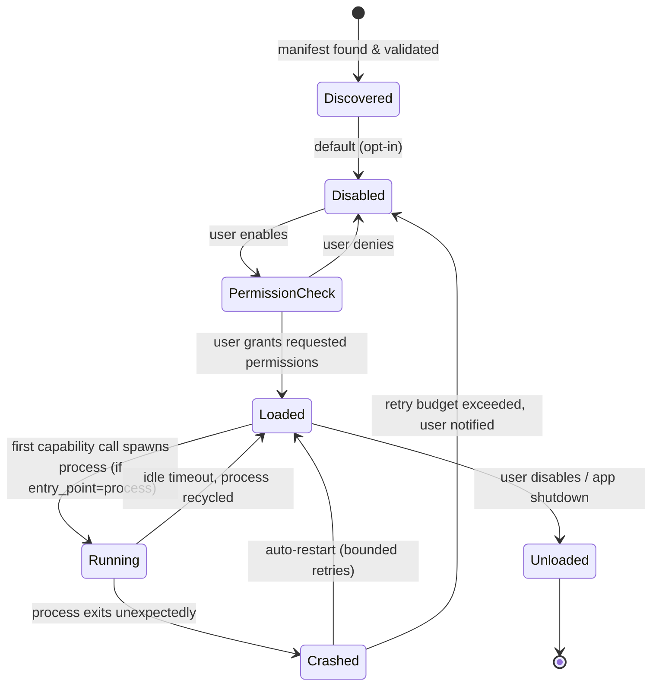

- **Trusted first-party providers** may run `inproc` (in the core service's own process) for lower latency where the provider ships with the app itself and has been through the same review as core code.
- **Third-party/community plugins** always run `process` (isolated OS process, gRPC transport) — this is a hard rule, not a default, because it is the sandboxing boundary (see [Section 13](#13-security)).
- Crash isolation: a provider process crashing mid-batch fails only the in-flight job items for that provider; the Task Scheduler marks them `failed` (retryable) and continues other work — it cannot bring down the core service.

### 8.4 RPC contract (deferred — v2 design)

> **Not v1 scope.** v1 calls providers as ordinary in-process methods; there is no serialization boundary. The contract below is the v2 target.

Plugin processes expose a small gRPC service per capability (schemas versioned via protobuf), e.g.:

```protobuf
service CaptionProvider {
  rpc Caption(CaptionRequest) returns (CaptionResponse);
  rpc HealthCheck(Empty) returns (HealthStatus);
}
message CaptionRequest {
  bytes image_bytes = 1;
  string options_json = 2;
}
message CaptionResponse {
  string caption = 1;
  float confidence = 2;
  string model_version = 3;
}
```

Batching is modeled as client-streaming RPCs to amortize the IPC overhead across many photos per provider process, rather than one call per photo.

### 8.5 Loading strategy (deferred — v2 design)

> **Not v1 scope.** v1 instantiates enabled providers lazily on first use within the process and holds them for the application's lifetime; a model is loaded when its provider is first invoked and released when the application exits. Idle recycling and warm pools below apply to out-of-process hosting.

- **Lazy load**: a provider process is only spawned the first time its capability is actually invoked in a running job — an installed-but-unused provider costs zero runtime resources.
- **Idle recycling**: provider processes shut down after a configurable idle period, freeing GPU/CPU memory back to the OS; the next call transparently respawns.
- **Warm pool (optional, advanced setting)**: for users running long unattended batch jobs, a provider can be pinned "always warm" to avoid respawn latency between batches.

---

## 9. Integration Layer

### 9.1 Principle

**The local AI database is always the source of truth for AI-derived data.** Connectors are one-directional-by-default exporters of that intelligence into other ecosystems' native formats/APIs; a small subset (ratings/collections a user already curated in another tool) support controlled inbound sync, always with the local DB winning conflicts on AI fields and the user notified on conflicting user-authored fields.

### 9.2 Connector interface

```python
class Connector(Protocol):
    async def export_photo(self, photo: PhotoIntelligence, target: ConnectorTarget) -> ExportResult: ...
    async def pull_updates(self, since: datetime) -> AsyncIterator[RemoteUpdate]: ...  # optional, connector-dependent
    def capabilities(self) -> ConnectorCapabilities: ...  # e.g. supports_pull=False for Lightroom
```

| Connector | Direction | Mechanism | Notes |
|---|---|---|---|
| XMP (filesystem) | out (default), in (read existing) | direct sidecar file read/write via ExifTool | the baseline, always available, no external service |
| Immich | out (and in for ratings/albums if API supports) | Immich REST API (local network, still "offline" relative to internet cloud) | maps captions/tags to Immich asset metadata, albums to Immich albums |
| Lightroom | out only (practically) | XMP sidecar / Lightroom keyword-hierarchy-compatible export (Lightroom has no writable local API) | this is really "XMP tuned for Lightroom's expectations," not a live API integration |
| PhotoPrism | out (and in where API supports) | PhotoPrism REST API | similar shape to Immich connector |
| digiKam | out (and in) | digiKam reads XMP natively + has a DBus/API on some platforms | primarily XMP-based, optionally direct API where available |

### 9.3 Synchronization strategy

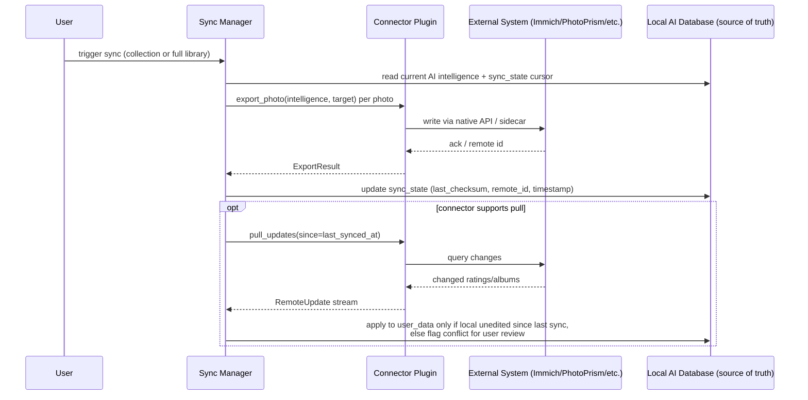

- **Conflict resolution rule**: AI-derived fields (caption, tags, scene, quality) are **never** overwritten by inbound sync — the local DB is authoritative by design. Only user-editable fields (rating, favourite, album/collection membership) are eligible for inbound sync, and only when the local value hasn't changed since the last sync cursor (`last_checksum`); otherwise the change is surfaced to the user as a conflict to resolve manually, never silently auto-resolved.
- **Incrementality**: `sync_state` per `(file_id, connector_id)` means re-running sync only touches photos changed since the last cursor — essential at multi-hundred-thousand-photo scale.

---

## 10. Photo Curation

*Scope rewritten in v1.1 — see ADR-0007.*

### 10.0 v1 scope: additive operations only

**v1 does not move, rename, or delete original files.** Curation in v1 is database-only organisation plus two additive filesystem writes:

| v1 capability | Filesystem effect |
|---|---|
| Virtual collections | None — database rows |
| Smart collections (saved queries) | None |
| Built-in smart filters (screenshots, blurry, duplicates, similar) | None |
| Recommendation review | None |
| Duplicate review with suggested keeper | None — review and selection only |
| XMP sidecar export | Creates new `.xmp` files; never modifies originals |
| Copy/export selected to folder | Creates new copies; never modifies or removes sources |

§10.2's staged-confirmation flow and §10.3's undo model remain the **normative v2 design** for move, rename, archive, and delete. They are deferred, not weakened. When implemented, they must be implemented exactly as specified:

1. Staging and execution live in separate modules; the staging module contains no reference to any filesystem-mutating call.
2. A `file_operation_log` row at `status=confirmed` is the only route to execution.
3. Confirmation displays exact source and destination paths, file count, and total size.
4. Deletion goes to the OS trash by default; hard delete is a separately-worded opt-in.
5. Every operation type has a tested execute-then-undo round trip before the feature ships.

The reason for deferral is that irreversible file mutation is the only place in this system where a defect destroys user data, and v1 delivers its core value — AI understanding, search, and organisation — without it. v1's guarantee is therefore literally true rather than merely enforced: no v1 code path can move, rename, or delete a photograph, and CI enforces this with a targeted check (see the AI Development Guide §4.6).

### 10.1 Virtual & smart collections

Already covered structurally in [Section 4.8](#48-collection-manager)/[5.2](#52-entity-relationship-diagram). Key point: collection membership is a database row (`collection_item`), never a filesystem operation — adding 10,000 photos to "Portfolio" is an instant, reversible DB write.

### 10.2 AI recommendation → user-confirmed action flow

> **Partially deferred.** The recommendation → review → collection/export branches are **v1**. The file-operation branches (staging, final confirmation, execution) are **v2 design** per §10.0. The diagram shows the complete flow so that the v1 subset is visibly the same flow with the destructive branch absent, not a different design.

This is the most safety-critical flow in the system given the PRD's hard constraint: **never automatically move, rename, or delete files.**

```mermaid
flowchart TD
    AI["AI Analysis Pipeline<br/>(duplicate detector, quality scorer, scene classifier)"] --> REC["Recommendation Engine<br/>groups results into actionable suggestions"]
    REC --> SURFACE["UI surfaces suggestion:<br/>'326 photos look like daily snapshots'<br/>'44 images are near-identical'"]
    SURFACE --> REVIEW["User reviews suggested set<br/>(can deselect individual items)"]
    REVIEW --> CONFIRM{"User confirms action?"}
    CONFIRM -->|No| DISMISS["Dismissed / snoozed<br/>no DB or file change"]
    CONFIRM -->|Yes, add to collection| DBWRITE["Collection Manager: write collection_item rows<br/>(no file I/O)"]
    CONFIRM -->|Yes, file operation<br/>(move/copy/rename/archive/delete)| STAGE["File Operation Executor:<br/>stage operation, log to file_operation_log<br/>status=pending_confirmation"]
    STAGE --> FINALCONFIRM["Explicit final confirmation dialog<br/>shows exact source→dest paths, count, total size"]
    FINALCONFIRM -->|Confirm| EXECUTE["Execute operation<br/>(atomic per-file: write to temp + rename)"]
    FINALCONFIRM -->|Cancel| CANCELLED["status=cancelled, no I/O performed"]
    EXECUTE --> LOGGED["file_operation_log updated:<br/>status=executed, executed_at set"]
    LOGGED --> UNDOAVAIL["Undo available<br/>(reverse operation from log, time-boxed)"]
```

- **Two-stage confirmation** for any real file operation: (1) accept the AI *grouping* suggestion into a working set, (2) a separate, explicit confirmation of the *file operation* itself showing exact paths — these are never collapsed into one click, precisely because grouping suggestions and destructive operations have very different reversibility.
- **Duplicate review**: the recommended keeper (`is_recommended_keeper`) is a suggestion (e.g., highest resolution + earliest capture time), never auto-applied; the user picks the keeper (or keeps all) before any operation is staged.
- **Archive workflow**: "archive" is modeled as a `move` to a user-designated archive root, not a special-cased deletion — same safety pipeline applies.

### 10.3 Undo strategy (deferred — v2 design)

> **Not v1 scope.** v1 performs no reversible-by-necessity operations: collection membership is a database row the user can remove, and both additive writes (sidecars, copies) leave the original untouched. Undo becomes mandatory the moment §10.2's destructive branch ships.


- Every executed file operation is logged in `file_operation_log` with enough information to reverse it (`source_path`, `dest_path`, operation type). Undo is available for a configurable window (default: until the next full library scan confirms the new state is stable, or a fixed time-box like 30 days, whichever the user configures).
- Undo for `move`/`rename`/`copy` is a straightforward reverse file operation. Undo for `delete` requires the file to have gone to the OS trash/recycle bin (default behavior) rather than a hard delete — hard delete is a separate, more strongly confirmed, opt-in setting (see [Section 13](#13-security)).
- Batch operations undo as a batch (all-or-nothing reversal offered first) or individually (per-file reversal list) — user's choice at undo time.

---

## 11. Background Processing

### 11.1 Job state machine

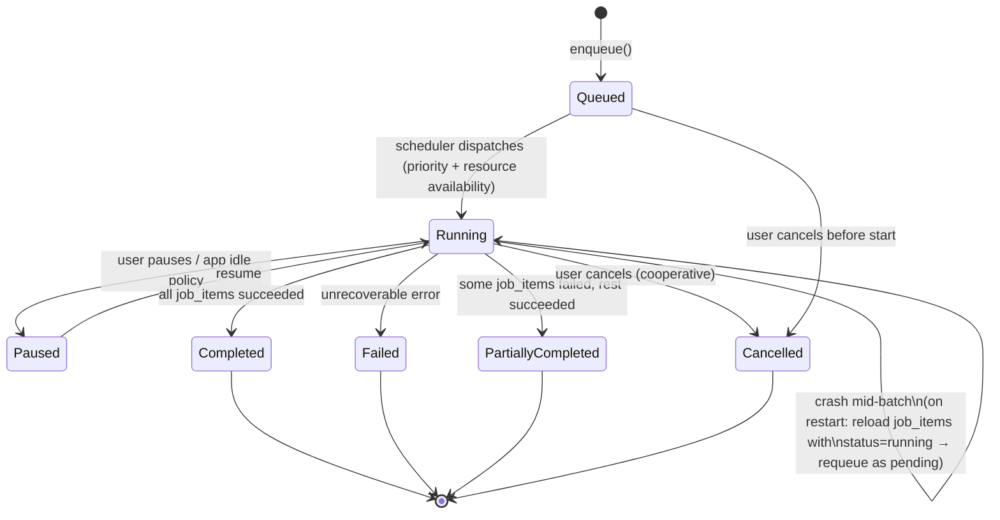

### 11.2 Durability & resume

- Every `job` decomposes into `job_item` rows (one per photo/file), each with its own `status`. This granularity is what makes resume-after-crash correct: on core service startup, any `job` in `Running` state has its `job_item`s re-evaluated — items already `completed` are skipped, `running`/`pending` items are re-enqueued. No work already durably persisted (an `AI_RESULT` row that committed) is redone; only in-flight, uncommitted items repeat.
- Idempotency is guaranteed by the write pattern in [Section 5.4](#54-versioning--migration-strategy): re-running an item that partially completed simply creates the same "new current version" row again — safe to repeat.

### 11.3 Cancellation

- Cooperative cancellation via an `asyncio.Event`/`CancellationToken` checked between provider calls (not mid-inference-call, which would require killing a provider process — acceptable granularity since individual inference calls are seconds, not minutes).
- Cancelling a job marks remaining `job_item`s `cancelled`; already-completed items keep their results (cancellation doesn't discard partial progress).

### 11.4 Progress reporting

- `JobProgress` events (percentage, current item, ETA estimate from rolling average item duration) stream to the UI over the existing WebSocket connection — no polling required.

### 11.5 Parallel processing & GPU scheduling

Already detailed in [Section 6.3](#63-scheduling--gpu-selection). Summary: CPU-bound stages parallelize across a process pool; GPU-bound provider calls are serialized per physical GPU device by the Resource Manager, with automatic CPU fallback when no GPU is available or the user prioritizes interactive responsiveness over batch throughput.

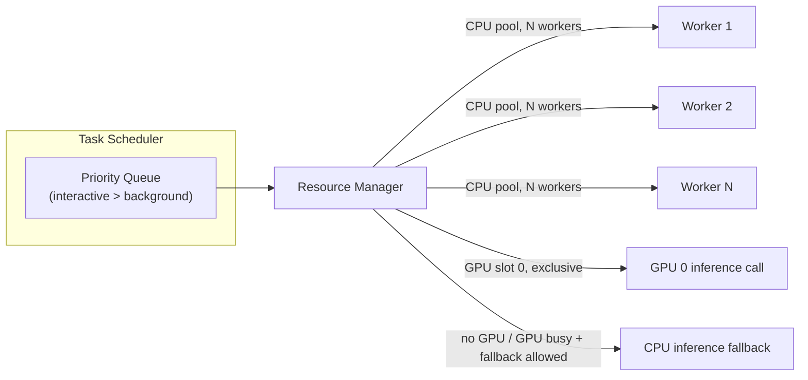

---

## 12. Performance Optimisation

| Concern | Strategy |
|---|---|
| Thumbnail cache | On-disk, content-hash-keyed, size-bucketed (e.g., 256px grid thumb, 1024px preview); LRU eviction with a user-configurable size cap; never stored in the DB (keeps DB small and backup-fast). |
| Preview cache | Same mechanism as thumbnails, larger size bucket, generated on-demand for full-screen view rather than eagerly for the whole library. |
| Memory management | Streaming/generator-based scan and batch APIs everywhere (`AsyncIterator`, not `list`) so a 5M-photo library scan never materializes a full in-memory list; provider processes are recycled (see [8.5](#85-loading-strategy)) to bound peak RSS. |
| Lazy loading | UI virtualizes the photo grid (renders only visible rows); thumbnails generated on first view if not already cached, with a background pre-warm job for recently-scanned folders. |
| Incremental indexing | Covered in [7.3](#73-incremental-indexing) — scans, AI runs, and index updates are all delta-based against `first_seen_at`/`last_seen_at`/content hash, never full-rebuild by default. |
| Batch DB operations | The single-writer actor ([5.5](#55-write-concurrency-strategy)) coalesces many pending writes into one transaction per flush interval (e.g., every 50ms or 200 items, whichever first) rather than one transaction per row. |
| GPU utilisation | Covered in [6.3](#63-scheduling--gpu-selection) / [11.5](#115-parallel-processing--gpu-scheduling). |
| Libraries exceeding 1M photos | **(v1)** Only item (4) is v1 scope and it is non-negotiable: all list views paginate or virtualise, and no query ever requests "all rows" — enforced as a review rule (AI Development Guide §4.5). **(deferred — v2)** (1) LanceDB's IVF-PQ index for sub-second ANN at multi-million scale ([3.5.1](#351-lancedb-migration-deferred--v2-design), TD-01); (2) a Tantivy swap behind `TextSearchIndex` if profiling shows FTS5 is the bottleneck ([3.6](#36-full-text-search), TD-09); (3) OS-level directory-change notification (`ReadDirectoryChangesW` / `inotify` / `FSEvents`) instead of full re-walks — v1 uses on-demand and on-startup rescan, since the watch APIs are the most platform-specific code in the project and rescan covers the need (TD-03). |
| Premature optimisation removed in v1.1 | The synthetic 1M/5M benchmark suite, CI performance-trend gating, and the cache/write/GPU/query tuning passes are deferred (TD-08). v1 does **one** manual scale check against a real library of roughly 100k photos. Optimising against synthetic data before any real library has been indexed cannot distinguish a real bottleneck from an artefact of the generator. |

---

## 13. Security

### 13.1 Plugin sandboxing

> **v1 status:** v1 ships no third-party plugin support, so there is nothing to sandbox — every provider is first-party code shipped with the application and reviewed like core code (ADR-0004). The controls below are **normative v2 design**, and they are the precondition for accepting third-party plugins at all: third-party plugin support and this sandboxing model ship together, never separately. v1's security surface is instead the loopback binding plus bearer token (§2.2), the read-only treatment of original files (§13.2, ADR-0007), and secrets in the OS credential store (§13.4).

- Third-party/community plugins **must** run out-of-process ([8.3](#83-lifecycle-deferred--v2-design)), communicating only via the defined gRPC contract — they cannot access the core service's memory, the SQLite connection, or arbitrary filesystem paths directly.
- Plugins declare required permissions in their manifest (`read:image_bytes`, `network:outbound` for a cloud-inference plugin, `filesystem:read:<scope>` for a connector needing sidecar access); the Plugin Manager enforces these by only handing the plugin process what it's scoped to receive (e.g., image bytes are passed in the RPC call, not a filesystem path, unless `filesystem` permission was explicitly granted) and by prompting the user to approve permissions on first enable — mirroring mobile-app permission models.
- A plugin requesting `network:outbound` is flagged distinctly in the UI ("this plugin can access the internet") since it's the one thing that could violate offline-first expectations if silently allowed.

### 13.2 File permissions & data integrity

- The application runs with the invoking user's own filesystem permissions — no privilege escalation, no running as admin/root.
- **In v1, original photo files are opened read-only by every module without exception.** No v1 code path can move, rename, or delete a file under a library root; CI enforces this with a targeted check (ADR-0007, AI Development Guide §4.6). The only filesystem writes v1 performs outside its own data directories are creating `.xmp` sidecars and copying photos into a user-chosen folder — both strictly additive.
- **(v2)** The File Operation Executor ([10.2](#102-ai-recommendation--user-confirmed-action-flow)) becomes the single code path with move/delete access, reachable only after two-stage confirmation.
- File operations are executed as atomically as the OS allows (write-to-temp-then-rename within the same volume; explicit cross-volume copy-then-verify-then-delete-source for moves across drives) to avoid partial-write corruption if interrupted mid-operation.

### 13.3 Database recovery & backup

- Because the database is a **derived index** ([1.1](#11-what-this-system-is)), the primary recovery strategy is: keep a rolling set of SQLite file-level snapshots (simple file copy, safe in WAL mode via SQLite's own backup API to avoid copying a torn write) on a schedule (e.g., daily) and before every schema migration ([5.4](#54-versioning--migration-strategy)); a corrupted DB can additionally always be fully rebuilt from source photos + XMP sidecars + re-running AI analysis (slower, but zero data loss for anything that matters — the photos themselves).
- `PRAGMA integrity_check` run on startup (fast path) with a full rebuild offered if it fails.
- The vector and FTS indexes are treated as pure caches of `ai_result`/`embedding_ref` data and are the first thing rebuilt (cheaper) before considering a full SQLite restore. In v1 they live inside the same file, so a rebuild is a table-level operation rather than a separate-store operation.

### 13.4 Secrets

- Connector credentials (Immich/PhotoPrism API keys, etc.) are stored via the OS credential store (`keyring` — Windows Credential Manager / macOS Keychain / Linux Secret Service), never in the plaintext TOML config file.

---

## 14. Testing Strategy

| Layer | Approach |
|---|---|
| Unit tests | `pytest` per module against interfaces (`Protocol`s), with fake/in-memory implementations (fake `EmbeddingProvider` returning deterministic vectors, in-memory SQLite for repository tests) — no real model inference in unit tests. |
| Property-based tests | Hypothesis for edge cases in metadata parsing (malformed/missing EXIF, unusual filename encodings, timezone-ambiguous timestamps) and file-operation path handling (path traversal edge cases, long paths on Windows). |
| Integration tests | Real SQLite (temp file, WAL mode) with real FTS5 and `sqlite-vec`, plus at least one real (small, fast) local model per capability — e.g. a tiny ONNX model — to verify the full pipeline wiring end-to-end without needing a GPU or large downloads in CI. |
| Plugin contract tests | A shared test suite every provider implementation must pass against its declared `Protocol`. **v1** runs it against the in-process host only; when out-of-process hosting arrives (v2), the same suite runs against both transports to catch serialization-only bugs. |
| Connector tests | Mocked external APIs (Immich/PhotoPrism) recorded via VCR-style cassettes; a manual/opt-in real-integration suite for maintainers to run against a live test instance before releases. |
| UI tests | Playwright driving the Tauri app (or the React app standalone in dev mode) for critical flows: search, collection creation, the curation confirm/undo flow. |
| Performance benchmarks | A dedicated benchmark suite (`pytest-benchmark` or custom harness) tracking: scan throughput (files/sec), AI pipeline throughput (photos/sec per provider, CPU vs GPU), search latency (p50/p95) at fixed synthetic library sizes, tracked over time in CI to catch regressions. |
| Large-library simulation | A **synthetic library generator** tool (not a test in itself, but test infrastructure) that produces N synthetic photo files with randomized-but-realistic EXIF/content-hash metadata (no need to generate real image content for most tests — a valid-but-minimal JPEG is enough) to exercise the scanner/DB/search at 100K/1M/5M-row scale without needing an actual multi-terabyte photo corpus in CI. |
| Crash/resume tests | Explicit tests that kill the core service process (or a provider process) mid-batch and assert the job resumes correctly with no duplicate or missing results, per [11.2](#112-durability--resume). |

---

## 15. Future Architecture

The following extension paths are explicitly designed for — none require a major redesign, only additive work behind existing interfaces:

| Future capability | How the current design supports it without rework |
|---|---|
| New AI models | Implement a new `Protocol` (e.g., new `CaptionProvider`), ship a manifest, drop into `plugins/` — zero changes to `AnalysisPipeline` or any other module ([Section 6](#6-ai-architecture), [Section 8](#8-plugin-system)). |
| Cloud inference (optional) | A `CloudCaptionProvider` implementing the same `CaptionProvider` interface, declaring `network:outbound` permission, user opts in explicitly per [13.1](#131-plugin-sandboxing) — offline-first is preserved because it's additive, not a replacement of the local default. |
| Distributed indexing | `EmbeddingIndex`/`TextSearchIndex` are already interfaces over LanceDB/FTS5; a future `DistributedEmbeddingIndex` backed by a clustered vector DB (e.g., Qdrant cluster) can implement the same interface for very large shared libraries, selected via Settings without touching `SearchService`. |
| Remote workers | The Task Scheduler's `Resource Manager` abstraction ([6.3](#63-scheduling--gpu-selection)) can be extended with a `RemoteWorkerPool` resource class alongside local CPU/GPU — job items dispatch over the network to a worker running the same provider gRPC contract; the AI Analysis Pipeline doesn't know or care whether a provider call executed locally or on a remote worker. |
| NAS deployment | Swap the SQLite repository implementation for a PostgreSQL one behind the same repository interfaces ([3.4](#34-relational-database)) — the domain/application layers, having no direct SQLite dependency (Dependency Inversion, [2.3](#23-layering--dependency-direction)), require no changes; the core service becomes a small always-on server process instead of a spawned child of the desktop shell. |
| Web interface | Because the UI already talks to the core service exclusively over HTTP/WebSocket (never in-process calls), a browser-based UI is "point a browser at the core service's port" plus auth hardening (the current localhost-only, random-token model would need to become a real auth story) — the API layer itself needs no redesign, only its exposure/security posture. |
| Mobile companion app | The same REST/WebSocket API (already versioned via FastAPI/OpenAPI) is directly consumable by a mobile client; a mobile app would primarily need a lightweight remote-access/tunneling story (e.g., connect to the NAS-deployed core service above) rather than a new backend. |

None of these are recommended for the initial build — they are documented here specifically so that early decisions (interfaces over concretions, a network-facing API even for a local-only v1, capability-scoped plugin permissions) are made with these paths open, per the instruction to avoid a future major redesign.

---

## 16. Platform, Failure, and Runtime Concerns

*New in v1.1. These are decisions v1.0 left unwritten, not new layers. Two of them (paths, timestamps) corrupt stored data if got wrong, and all four are cheaper to specify than to retrofit.*

### 16.1 Filesystem and data-directory conventions

*See ADR-0010.*

**Paths.** Paths are `pathlib.Path` in code and UTF-8 text in the database: `library_root.path` absolute, `photo.relative_path` relative to its root, always with `/` separators for portability. A root-relative path survives a drive-letter change or a remount; absolute per-photo paths would not. Windows specifics that must be handled from the first scanner commit:

- **Long paths (>260 characters).** Enable long-path support in the application manifest and prefix paths with `\\?\` when opening files on Windows. Untested long-path handling is the most likely cause of a scanner that *silently skips* files rather than failing visibly — test with a fixture path over 260 characters.
- **Case-insensitivity.** Windows and macOS are case-insensitive and case-preserving; Linux is neither. Store a case-folded comparison key alongside the original-case path, and use the folded key for the `(library_root_id, relative_path)` uniqueness constraint, so a library indexed on Windows behaves correctly if later opened on Linux. Display the original case.
- **UNC and network paths.** Supported for reading. Content hashing over a network share is slow, so change detection on non-local roots defaults to size+mtime, with content hashing available on demand.
- **Reparse points, symlinks, and junctions.** Not followed by default — a single self-referential junction turns a scan into an unbounded walk. Following them is an explicit per-root setting.
- **Reserved names and trailing dots or spaces** (`CON`, `NUL`, `foo.`) are tolerated on read and never generated on write.

**Data directories.** `platformdirs` provides correct locations on every OS with no Windows-specific branches:

| Content | Location (Windows) | Rebuildable |
|---|---|---|
| `library.sqlite` (+ WAL) | `%LOCALAPPDATA%\PhotoIntelligence\` | Yes, from originals |
| `config.toml` | `%APPDATA%\PhotoIntelligence\` | **No — user settings** |
| Thumbnail/preview cache | `%LOCALAPPDATA%\PhotoIntelligence\cache\` | Yes |
| Model weights | `%LOCALAPPDATA%\PhotoIntelligence\models\` | Yes, re-downloadable |
| Logs | `%LOCALAPPDATA%\PhotoIntelligence\logs\` | Yes |

A `--portable` flag places all of the above beside the executable for USB-stick use. Only `config.toml` and the user-data tables inside the database (`user_data`, `collection`, `collection_item`) are irreplaceable; everything else is derived, which is the same principle as [§1.1](#11-what-this-system-is) applied to on-disk layout.

### 16.2 Timestamp and timezone policy

*See ADR-0011.*

EXIF `DateTimeOriginal` records local wall-clock time at capture, with **no timezone**, and most cameras never record an offset. Storing naive local times as if they were UTC files a photograph taken at 2 p.m. in Tokyo under a different date for a user in London — and travel photography, this product's core subject, is exactly where the error concentrates.

| Column | Meaning |
|---|---|
| `captured_at_local` | Naive local wall-clock time exactly as recorded. **Authoritative** for all display and all date-range search. |
| `captured_at_offset_minutes` | Nullable. Populated only when a source genuinely supplies it (EXIF 2.31 `OffsetTimeOriginal`, GPS-derived time, an XMP field). **Never inferred.** |
| `captured_at_utc` | Nullable. Computed only when an offset is known. |
| `captured_at_source` | `exif` \| `xmp` \| `gps` \| `mtime` — distinguishes a recorded time from a fallback guess. |

Date-range queries and date display always use `captured_at_local`, so "photos from June 2024" matches the user's memory of the trip rather than a server's clock. Cross-timezone chronological sorting uses `captured_at_utc` where available and falls back to local — approximate, which is honest, because the information is genuinely absent from the file. Photos with no capture timestamp fall back to filesystem mtime with `captured_at_source='mtime'` so the UI never presents a guess as a fact.

All other timestamps in the schema (`created_at`, `updated_at`, `last_seen_at`) are UTC. Date filtering lives in one query-builder module so the "always use local" rule is enforced in one place rather than remembered at every call site.

### 16.3 Failure taxonomy, retry, and error surfacing

| Class | Examples | Retry | User surface |
|---|---|---|---|
| **Transient** | File locked by another process (common on Windows — viewers, sync clients, antivirus), temporary I/O error, network-share hiccup | Automatic, bounded: 3 attempts, exponential backoff | None unless retries exhaust |
| **Item-permanent** | Corrupt JPEG, unsupported RAW variant, zero-byte file | None | Listed in the Problems view with the reason |
| **Capability-permanent** | Model file missing or corrupt, unsupported execution provider, HEIC component absent | None; the capability is disabled and the reason recorded | Banner: "Captions unavailable — model not installed", with a fix action |
| **Fatal** | Database corruption, schema version newer than the application | None | Blocking dialog offering the recovery options in [§13.3](#133-database-recovery--backup) |

Every `job_item` failure records a machine-readable `error_code` alongside `error_message`; choosing the class is part of implementing a failure path, not an afterthought. A **Problems view** lists affected photos grouped by `error_code` with "retry these" and "ignore permanently" actions — without it, a 0.5% failure rate across 100,000 photos is 500 invisible gaps in the index. A partially-failed job completes as `PartiallyCompleted`, never silently as `Completed`.

### 16.4 Degraded mode and first run

The application is **fully usable with zero AI models installed.** Scanning, metadata extraction, thumbnails, browsing, metadata and keyword search, duplicate detection, and sharpness scoring all work, because none requires a downloaded model (§6.1). AI capabilities activate individually as their models become available.

First run therefore **starts a scan immediately** and offers model acquisition as a background, non-blocking step — a multi-gigabyte download before the application does anything reads as a broken install. Model acquisition supports downloading from a configured source and importing from a local directory for machines with no internet access; both paths produce identical results, which is what makes the offline-first claim testable rather than aspirational.

Capability availability is computed at startup and re-checked when models change. The UI shows each capability as available, downloading, or unavailable-with-reason — never as a silent no-op, which is the failure mode that makes users believe a feature is broken rather than absent.

### 16.5 Diagnostics

A "Create diagnostics bundle" action writes a zip containing recent logs, the effective configuration with secrets removed, schema and application versions, capability and provider status, pinned ExifTool and LibRaw versions, host details (OS build, CPU, GPU, available execution providers), and aggregate library statistics. **File paths are included only with explicit consent**, since paths contain names and are personal data. Offline software with no telemetry has no other route to an actionable bug report.

### 16.6 Cancellation semantics

Cancellation is cooperative and checked **between** work items, never inside a running inference call: v1 providers run in-process, so an in-flight call cannot be interrupted without unsafe thread termination. The contract is therefore explicit — **cancelling a job stops it within one item**, and a single item may take as long as one inference.

Providers whose single-item latency could exceed a few seconds must accept a progress callback so the UI can distinguish "slow" from "hung." Already-completed items retain their results; cancellation never discards durable progress.

### 16.7 Thumbnail delivery

Because the UI is a web client (§2.2), thumbnails reach it over loopback HTTP rather than direct file reads:

`GET /api/v1/thumbnails/{photo_id}?size={bucket}`

- Authenticated by the same bearer token as the rest of the API.
- Strong `ETag` derived from `content_hash + size_bucket`, with `Cache-Control: immutable` — the key changes whenever the content does, so cached entries can never go stale.
- A missing thumbnail is **generated on demand and returned in the same request**, so the grid needs no separate "generate first" round trip.
- Requests are coalesced per key, so a fast scroll cannot queue the same generation twice.

This is the one piece of machinery the `pywebview` decision (ADR-0002) adds relative to a native-widget UI. It is a single module, and it is the same approach Immich and PhotoPrism take.

---

## Appendix A — Glossary

- **Provider**: a plugin implementation of an AI capability interface.
- **Capability**: a category of AI analysis (caption, tag, embedding, OCR, scene, quality/aesthetic, landmark, duplicate detection).
- **Connector**: a plugin integrating with an external photo ecosystem (Immich, Lightroom, PhotoPrism, digiKam, XMP).
- **Virtual collection**: a database-only grouping of photos with no filesystem effect.
- **Smart collection**: a virtual collection whose membership is a live-evaluated saved search query.
- **Sidecar (XMP)**: an external file carrying metadata for a photo without modifying the original file, used as an export/sync format only, never the primary data store.

## Appendix B — Explicit non-goals for v1

*Expanded in v1.1 to match the PRD's release tiering.*

**Permanent constraints (not scope notes):**

- Cloud sync or storage of original photos.
- Automatic, unconfirmed file moves, renames, or deletes.
- **Any** move, rename, or delete of an original file in v1, confirmed or not (ADR-0007).

**Deferred to v1.1:**

- Immich connector; OCR; scene classification; live directory watching; macOS and Linux packaging; Tauri shell and a signed installer.

**Deferred to v2:**

- File operations (move/rename/archive/delete) with staged confirmation and undo; third-party plugins with process isolation, gRPC transport, and a permission model; PhotoPrism, digiKam and Lightroom connectors; inbound synchronisation and conflict resolution; landmark recognition; colour analysis; aesthetic scoring; the Photographer AI Assistant; `SearchProvider` plugin point; natural-language-to-structured-filter parsing; GPU resource manager; LanceDB and Tantivy migrations; synthetic 1M/5M benchmark suite.

**Future (architecture supports; build on demand):**

- Cloud inference; distributed indexing; remote workers; NAS/server deployment on PostgreSQL; web interface; mobile companion; face recognition and search.

Each deferral has a named tier and, where relevant, an entry in the technical-debt register with a trigger for revisiting it (`Architecture_Audit_v1.md` §5).
